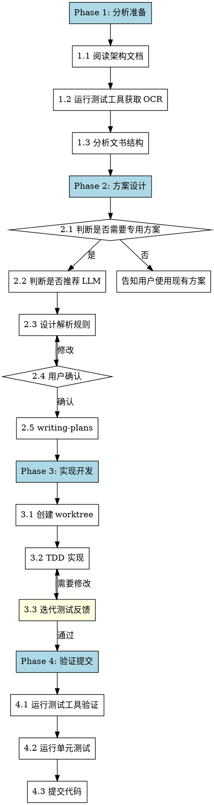

# Create Parser

## Overview

为新的文书类型创建专用解析方案的标准化流程。

**核心原则**：分析 → 设计 → TDD 实现 → **迭代测试** → 验证

**开始时声明**："I'm using the create-parser skill to design and implement a new document parser."

## When to Use

**使用条件**：
- 用户明确要求为某种文书创建专用解析方案
- 用户提供示例 PDF 文件

**不适用**：
- 用户只想了解现有 parser
- 用户要修改现有 parser

## Input Parameters

```
/create-parser <pdf_path> [--type <doc_type>] [--llm]
```

| 参数 | 必须 | 说明 |
|------|------|------|
| `pdf_path` | 是 | 示例 PDF 文件路径，或使用 `--sample <type>` |
| `--sample` | 否 | 使用内置样本文件（interrogation/indictment） |
| `--type` | 否 | 文书类型名称，默认从内容推断 |
| `--llm` | 否 | 强制启用 LLM 增强 |

## Process Flow



## 测试工具

**核心工具**：`test/test_plugin_dev.py` - 快速验证 Plugin 解析结果

```bash
# 使用样本文件（推荐）
uv run python test/test_plugin_dev.py --sample interrogation --doc-type interrogation_record

# 使用自定义 PDF
uv run python test/test_plugin_dev.py <pdf_path> --doc-type <doc_type>

# JSON 输出（便于 AI 分析）
uv run python test/test_plugin_dev.py --sample interrogation --doc-type interrogation_record --json

# 强制刷新 OCR 缓存
uv run python test/test_plugin_dev.py --sample interrogation --doc-type interrogation_record --refresh
```

**输出格式**：
- 默认：人类可读的 chunk 列表
- `--json`：结构化 JSON，便于 AI 解析和迭代

## Phase 1: 分析准备

### 1.1 阅读架构文档

```bash
# 阅读架构文档了解 Layer A/B 设计
Read: docs/criminal-parser-architecture.md
```

### 1.2 运行测试工具获取 OCR 结果

```bash
# 使用测试工具获取 OCR 结果（自动缓存）
# 首次运行会调用 PaddleOCR API，后续使用缓存

# 使用样本文件
uv run python test/test_plugin_dev.py --sample interrogation --doc-type interrogation_record --json

# 或使用用户提供的 PDF
uv run python test/test_plugin_dev.py <pdf_path> --doc-type <doc_type> --json

# OCR 缓存位置：<pdf_dir>/<pdf_stem>.ocr.json
```

### 1.3 分析文书结构

分析测试工具输出的 chunks，生成分析报告：

```markdown
# 文书结构分析报告

## 基本信息
- 文书类型：{推断的类型}
- 页数：X 页
- 结构复杂度：低/中/高

## 版面特征
- 固定表头：是/否
- 问答结构：是/否
- 编号列表：是/否
- 表格：是/否
- 印章区：是/否

## 语义结构
- 主要章节：{章节列表}
- 章节触发词：{触发词列表}
- 特殊字段：{需要提取的字段}

## 推荐方案
- 需要专用解析：是/否
- 推荐 LLM 增强：是/否
- 推荐 chunk 类型：{类型列表}
- 理由：{推荐理由}
```

## Phase 2: 方案设计

### 2.1 判断是否需要专用方案

| 条件 | 需要专用 | 可用 Layer A |
|------|----------|--------------|
| 有固定章节结构 | ✅ | ❌ |
| 需要合并/拆分 blocks | ✅ | ❌ |
| 有特殊 chunk 类型 | ✅ | ❌ |
| 结构简单无特殊需求 | ❌ | ✅ |

### 2.2 判断是否推荐 LLM 增强

| 场景 | 推荐 LLM | 纯规则足够 |
|------|----------|------------|
| 复杂字段提取 | ✅ | ❌ |
| 语义理解需求 | ✅ | ❌ |
| 结构清晰有固定触发词 | ❌ | ✅ |
| 数值/日期提取 | ❌ | ✅ |

### 2.5 生成实现计划

**REQUIRED SUB-SKILL:** 使用 `/writing-plans` 生成详细的 task-by-task 实现计划。

## Phase 3: 实现开发

### 3.1 创建 Worktree

**REQUIRED SUB-SKILL:** 使用 `/using-git-worktrees` 创建隔离工作区。

分支命名规则：
```bash
# 自动生成
feature/parser-{doc_type}

# 示例
feature/parser-qisu-shu
feature/parser-panjue-shu
```

### 3.2 TDD 实现

**REQUIRED SUB-SKILL:** 使用 `/test-driven-development` 进行实现。

**TDD 任务顺序**：
1. Plugin 基础结构测试 → 实现 `doc_type` 属性
2. Section 边界识别测试 → 实现 `_find_sections()`
3. Chunk 生成测试 → 实现 `_make_chunk()`
4. 实体合并测试 → 实现 `_merge_entities()`
5. 入口函数测试 → 实现 `chunk()`
6. 集成测试 → 验证完整 pipeline

### 3.3 迭代测试反馈循环 🔁

**每次代码修改后，运行测试工具验证：**

```bash
# 1. 运行测试工具查看 chunk 输出
uv run python test/test_plugin_dev.py <pdf_path> --doc-type <doc_type>

# 2. 分析输出，检查：
#    - chunk 数量是否合理
#    - chunk_type 是否正确
#    - 文本内容是否完整
#    - page_range 是否准确

# 3. 如果有问题，修改代码后重新运行

# 4. 使用 JSON 输出进行详细分析
uv run python test/test_plugin_dev.py <pdf_path> --doc-type <doc_type> --json | jq '.chunks[] | {chunk_type, page_range}'
```

**迭代检查清单**：
- [ ] chunk 数量合理（不是过多或过少）
- [ ] chunk_type 分类正确
- [ ] 每个chunk内容完整
- [ ] page_range 准确
- [ ] header_info 正确提取
- [ ] 问答对正确分组（如有）
- [ ] 章节边界正确识别

**文件输出**：
```
rag/app/criminal/plugins/
└── {doc_type}_plugin.py        # ParserPlugin 实现

rag/app/
└── {doc_type}.py               # 入口函数（如需要）

test/unit_test/rag/app/criminal/plugins/
├── test_{doc_type}_plugin.py   # 单元测试
```

## Phase 4: 验证提交

### 4.1 运行测试工具验证

```bash
# 使用样本文件进行最终验证
uv run python test/test_plugin_dev.py <pdf_path> --doc-type <doc_type> --json

# 检查输出是否符合预期
# - Total Chunks 数量合理
# - chunk_type 分布正确
# - 每个chunk内容完整
```

### 4.2 运行单元测试

```bash
# 运行新 Plugin 的单元测试
uv run pytest test/unit_test/rag/app/criminal/plugins/test_{doc_type}_plugin.py -v

# 运行所有 criminal 相关测试确保无回归
uv run pytest test/unit_test/rag/app/criminal/ -v
```

### 4.3 提交代码

```bash
# 更新架构文档
# 添加新文书类型到目录结构说明

git add rag/app/criminal/plugins/{doc_type}_plugin.py \
        test/unit_test/rag/app/criminal/plugins/test_{doc_type}_plugin.py \
        docs/criminal-parser-architecture.md

git commit -m "feat(criminal): add {doc_type} parser plugin

- Implement {DocType}Plugin for Layer B parsing
- Add unit tests
- Support section-based parsing with trigger phrases

Co-Authored-By: Claude Opus 4.6 <noreply@anthropic.com>"
```

## Required Skills

| Skill | Phase | Purpose |
|-------|-------|---------|
| `writing-plans` | 2.5 | 生成详细实现计划 |
| `using-git-worktrees` | 3.1 | 创建隔离工作区 |
| `test-driven-development` | 3.2 | TDD 流程实现 |
| `verification-before-completion` | 4.2 | 完成前验证 |

## Example Usage

```
用户: 我要为起诉书创建专用解析方案，示例文件在 SampleData/起诉书_sample.pdf

Claude: I'm using the create-parser skill to design and implement a new document parser.

Phase 1: 分析准备
- 阅读架构文档 ✓
- 运行测试工具获取 OCR... ✓
- 分析文书结构...

📋 文书结构分析报告

文书类型: 起诉书
页数: 5 页
结构复杂度: 中

版面特征:
- 固定表头: 是
- 问答结构: 否
- 编号列表: 是（证据项）

语义结构:
- 章节: 当事人信息、案件事实、证据清单、法律依据、诉讼请求
- 触发词: "经审理查明"、"上述事实有下列证据证实"、"本院认为"

推荐方案:
- 需要专用解析: ✅ 是
- 推荐 LLM 增强: ❌ 否（结构清晰，规则足够）
- Chunk 类型: header, section, evidence_item

是否确认此方案？[确认/修改]

用户: 确认

Claude: [Phase 2.5 - writing-plans]
        [Phase 3.1 - 创建 worktree]
        [Phase 3.2 - TDD 实现]

        [Phase 3.3 - 迭代测试]
        运行: uv run python test/test_plugin_dev.py SampleData/起诉书_sample.pdf --doc-type indictment_opinion

        输出:
        === Plugin Test Result ===
        PDF: 起诉书_sample.pdf
        Total Chunks: 8
        Using Cache: True

        --- Chunk 1 [header_info] ---
        Pages: 1
        Text: 起诉书...

        检查点:
        ✅ chunk 数量合理
        ✅ chunk_type 正确
        ✅ 内容完整

        [Phase 4 - verification + commit]
```

## Common Mistakes

| 错误 | 正确做法 |
|------|----------|
| 跳过架构文档阅读 | 必须先阅读了解 Layer A/B 设计 |
| 直接写代码 | 必须先分析、设计、生成计划 |
| 不用 TDD | 必须使用 test-driven-development |
| **写完不测试** | **每次修改后运行测试工具验证** |
| 忘记更新文档 | 提交前必须更新架构文档 |
| 忽视回归测试 | 必须运行原有 parser 测试 |

## Red Flags

**Never:**
- 不分析文书直接写代码
- 跳过用户确认直接实现
- 不用 worktree 隔离开发
- 跳过 TDD 直接实现
- **写完代码不运行测试工具**
- 不运行回归测试就提交

**Always:**
- 先阅读架构文档
- 生成分析报告并确认
- 使用 worktree 隔离
- 使用 TDD 流程
- **每次修改后运行测试工具验证 chunk 输出**
- 验证无回归后提交
