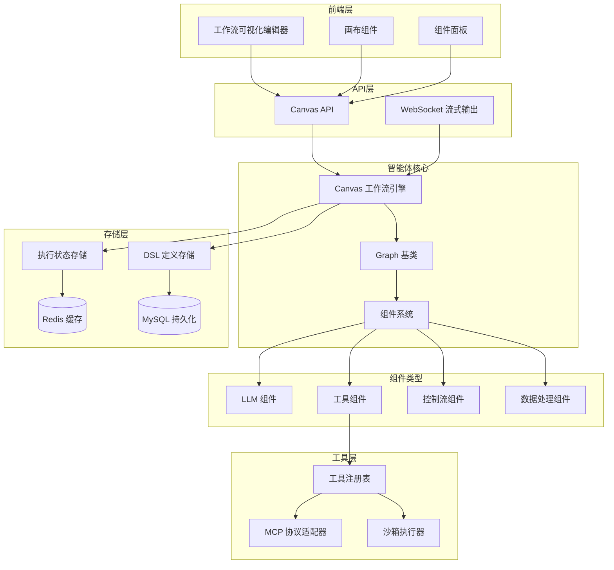
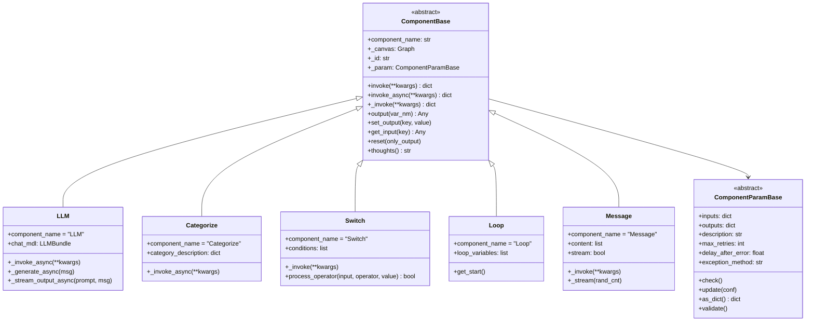
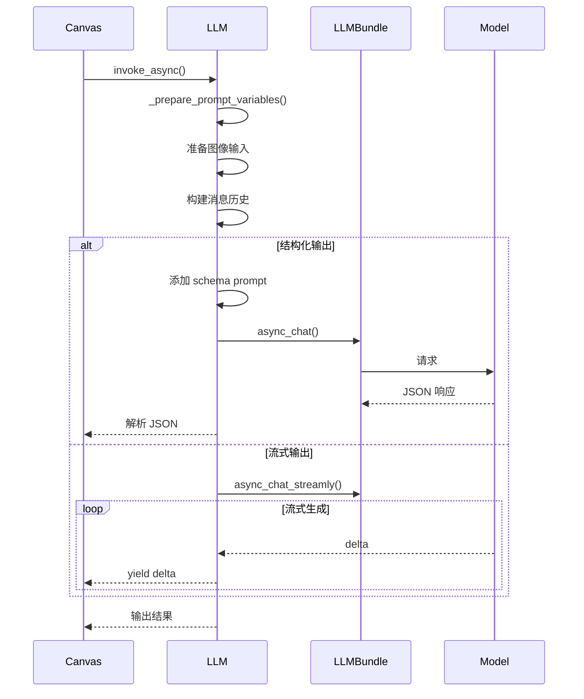
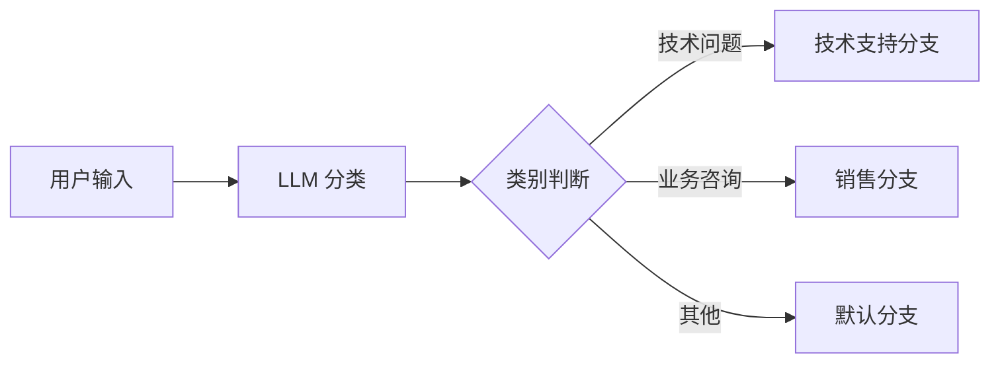
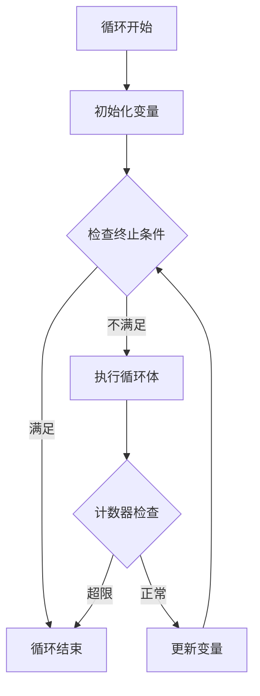
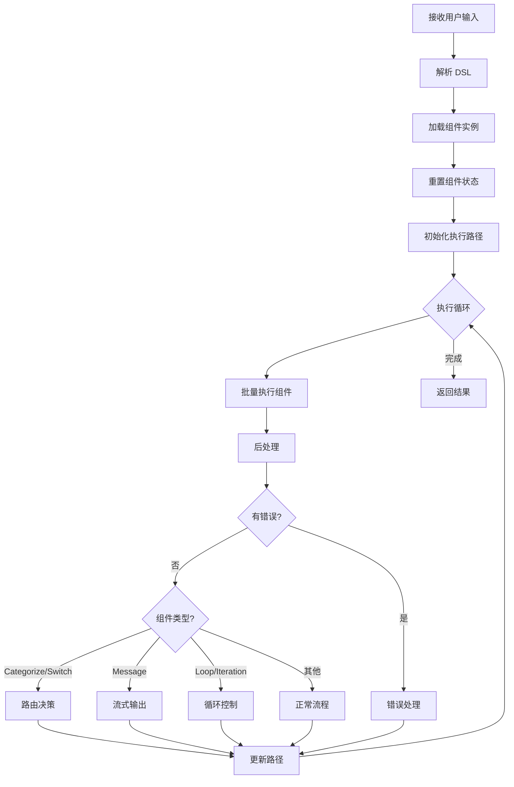
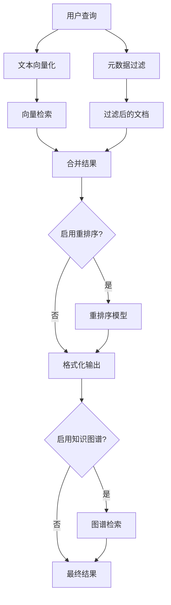
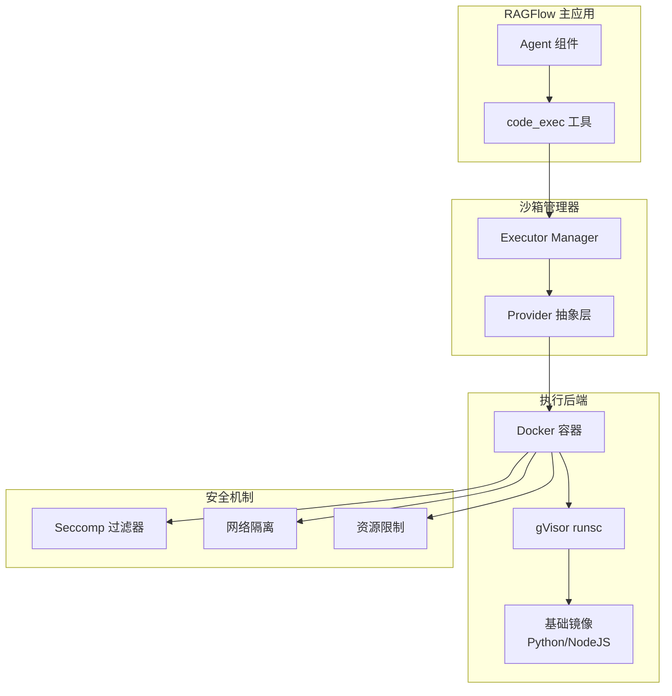
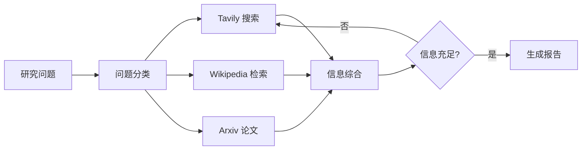

# RAGFlow 智能体系统深度分析

## 目录

1. [系统概述](#系统概述)
2. [组件系统架构](#组件系统架构)
3. [画布工作流引擎](#画布工作流引擎)
4. [工具集成系统](#工具集成系统)
5. [沙箱执行环境](#沙箱执行环境)
6. [插件架构](#插件架构)
7. [模板系统](#模板系统)
8. [数据流与状态管理](#数据流与状态管理)
9. [最佳实践与开发指南](#最佳实践与开发指南)

---

## 系统概述

RAGFlow 的智能体系统是一个基于工作流的可视化 AI Agent 构建平台，采用 DAG（有向无环图）架构设计，支持拖拽式组件编排、多模态数据处理和复杂的智能体协作。

### 核心特性

- **可视化工作流设计**：基于 Canvas 的图形化工作流编辑器
- **模块化组件系统**：20+ 内置组件，支持自定义扩展
- **异步执行引擎**：基于 asyncio 的高性能并发执行
- **工具调用框架**：统一的工具抽象和 MCP 协议支持
- **沙箱安全执行**：gVisor 容器隔离的代码执行环境
- **多模态支持**：文本、图像、文件等多种数据类型
- **流式输出**：支持实时流式响应和思考过程展示

### 系统架构图



---

## 组件系统架构

### 组件基类设计

组件系统采用面向对象设计，所有组件继承自 `ComponentBase` 基类：



### 核心组件实现

#### 1. LLM 组件

**位置**: `agent/component/llm.py`

**功能**：封装大语言模型调用，支持流式输出、结构化输出、多模态输入。

**关键参数**：
```python
class LLMParam(ComponentParamBase):
    llm_id: str                    # LLM 模型 ID
    sys_prompt: str                # 系统提示词
    prompts: list[dict]            # 用户提示词列表
    max_tokens: int                # 最大生成 token 数
    temperature: float             # 温度参数 (0-1)
    top_p: float                   # Top-p 采样
    presence_penalty: float        # 存在惩罚
    frequency_penalty: float       # 频率惩罚
    output_structure: dict         # 结构化输出 schema
    cite: bool                     # 是否启用引用
    visual_files_var: str          # 视觉文件变量
```

**执行流程**：


**特色功能**：

1. **思维链处理**：自动识别和处理 `<think>` 标签
2. **引用生成**：集成检索增强生成（RAG）引用
3. **结构化输出**：支持 JSON Schema 验证和重试
4. **多模态支持**：图像输入自动切换到视觉模型

#### 2. 分类组件（Categorize）

**位置**: `agent/component/categorize.py`

**功能**：基于 LLM 的文本分类器，自动路由到不同分支。

**配置示例**：
```python
category_description = {
    "技术问题": {
        "description": "涉及编程、技术实现的问题",
        "examples": [
            "如何使用 Python 实现快速排序？",
            "Docker 容器无法启动怎么办？"
        ],
        "to": ["technical_support_0"]
    },
    "业务咨询": {
        "description": "产品价格、功能介绍等业务问题",
        "examples": [
            "企业版多少钱？",
            "支持哪些文件格式？"
        ],
        "to": ["sales_0"]
    }
}
```

**工作流程**：


#### 3. 条件分支（Switch）

**位置**: `agent/component/switch.py`

**功能**：基于条件表达式的路由组件，支持复杂的逻辑判断。

**支持的运算符**：
- 字符串：`contains`, `not contains`, `start with`, `end with`, `empty`, `not empty`, `=`, `≠`
- 数值：`>`, `<`, `≥`, `≤`, `=`, `≠`
- 通用：`is`, `is not`

**条件配置示例**：
```json
{
  "conditions": [
    {
      "logical_operator": "and",
      "items": [
        {
          "cpn_id": "categorize_0",
          "operator": "contains",
          "value": "技术"
        },
        {
          "cpn_id": "user_info_0",
          "operator": "≠",
          "value": ""
        }
      ],
      "to": ["technical_support_0"]
    }
  ],
  "end_cpn_ids": ["default_handler_0"]
}
```

#### 4. 循环控制（Loop & LoopItem）

**位置**: `agent/component/loop.py`, `agent/component/loopitem.py`

**功能**：实现条件循环，支持最大迭代次数限制。

**循环终止条件示例**：
```json
{
  "loop_variables": [
    {
      "variable": "counter",
      "input_mode": "constant",
      "value": 0,
      "type": "number"
    }
  ],
  "loop_termination_condition": [
    {
      "variable": "counter@result",
      "operator": "≥",
      "value": 10,
      "input_mode": "constant"
    }
  ],
  "maximum_loop_count": 100,
  "logical_operator": "or"
}
```

**执行逻辑**：


#### 5. 消息组件（Message）

**位置**: `agent/component/message.py`

**功能**：格式化输出组件，支持 Jinja2 模板、流式输出、多格式转换。

**输出格式支持**：
- `markdown`（默认）
- `html`
- `pdf`
- `docx`
- `xlsx`

**模板示例**：
```jinja2
## 搜索结果


- {{ item.title }}
  {{ item.content }}



**总计**: {{ iteration_0@count }} 条结果
```

#### 6. Agent 组件（Agent with Tools）

**位置**: `agent/component/agent_with_tools.py`

**功能**：ReAct 模式的智能体，支持工具调用和多轮推理。

**核心方法**：
```python
async def _react_with_tools_streamly_async_simple(
    self, prompt, history, use_tools, user_defined_prompt
):
    """
    ReAct 循环实现

    流程：
    1. 分析任务 (analyze_task)
    2. 决定下一步 (next_step)
    3. 执行工具 (use_tool)
    4. 反思结果 (reflection)
    5. 重复直到完成或达到最大轮数
    """
    for round in range(max_rounds + 1):
        # 获取 LLM 响应（包含工具调用）
        response = await next_step_async(chat_mdl, history, tool_metas)

        # 解析工具调用
        functions = json_repair.loads(response)

        for func in functions:
            if func["name"] == "COMPLETE_TASK":
                # 完成任务，生成最终答案
                async for txt in complete():
                    yield txt
                return

            # 并发执行所有工具调用
            results = await asyncio.gather(*[
                use_tool_async(f["name"], f["arguments"])
                for f in functions
            ])

        # 构建观察结果
        observation = build_observation(results)
        history.append({"role": "user", "content": observation})
```

**工具调用示例**：
```json
[
  {
    "name": "tavily_search_0",
    "arguments": {
      "query": "RAGFlow 最新版本",
      "topic": "general"
    }
  },
  {
    "name": "wikipedia_0",
    "arguments": {
      "query": "RAG (Retrieval-Augmented Generation)"
    }
  }
]
```

---

## 画布工作流引擎

### Canvas 类设计

**位置**: `agent/canvas.py`

**核心职责**：
1. 工作流 DSL 解析和加载
2. 组件实例化和依赖管理
3. 执行路径规划和调度
4. 状态持久化和恢复
5. 变量作用域管理

### DSL 定义格式

```json
{
  "components": {
    "begin_0": {
      "obj": {
        "component_name": "Begin",
        "params": {
          "prologue": "你好！我是智能助手",
          "mode": "conversational"
        }
      },
      "downstream": ["categorize_0"],
      "upstream": []
    },
    "categorize_0": {
      "obj": {
        "component_name": "Categorize",
        "params": {
          "llm_id": "deepseek-chat",
          "category_description": {...}
        }
      },
      "downstream": ["answer_0"],
      "upstream": ["begin_0"]
    }
  },
  "graph": {
    "nodes": [...],
    "edges": [...]
  },
  "history": [],
  "path": ["begin_0", "categorize_0"],
  "retrieval": {"chunks": [], "doc_aggs": []},
  "globals": {
    "sys.query": "",
    "sys.user_id": "tenant_123",
    "sys.conversation_turns": 0,
    "sys.files": []
  },
  "variables": {},
  "memory": []
}
```

### 执行引擎工作流程



### 核心执行方法

```python
async def run(self, **kwargs):
    """
    异步执行工作流

    Args:
        query: 用户查询
        user_id: 用户 ID
        files: 上传文件列表

    Yields:
        dict: 执行事件
        - workflow_started
        - node_started
        - node_finished
        - message (流式消息)
        - message_end
        - workflow_finished
    """
    # 1. 初始化
    self.add_user_input(kwargs.get("query"))
    for cpn in self.components.values():
        cpn["obj"].reset(True)

    # 2. 设置全局变量
    self.globals["sys.query"] = kwargs.get("query")
    self.globals["sys.conversation_turns"] += 1

    # 3. 执行循环
    while idx < len(self.path):
        # 批量执行组件
        await _run_batch(idx, to)

        # 后处理（流式输出、路由等）
        for i in range(idx, to):
            cpn_obj = self.get_component_obj(self.path[i])

            # Message 组件流式输出
            if cpn_obj.component_name.lower() == "message":
                async for chunk in cpn_obj.output("content")():
                    yield decorate("message", {"content": chunk})

            # 路由决策
            if cpn_obj.component_name.lower() in ["categorize", "switch"]:
                self.path.extend(cpn_obj.output("_next"))

            # 循环控制
            elif cpn_obj.component_name.lower() == "loop":
                self.path.append(cpn_obj.get_start())

        idx = to

    # 4. 完成
    yield decorate("workflow_finished", {...})
```

### 变量引用系统

**引用格式**：
- `{component_id@variable_name}`: 组件输出变量
- `{sys.field}`: 系统全局变量
- `{env.variable}`: 环境变量

**示例**：
```python
# 在提示词中引用
"用户问题：{sys.query}\n检索结果：{retrieval_0@formalized_content}"

# 在配置中引用
"url": "{api_endpoint@base_url}/search"
"query": "{categorize_0@category_name}"
```

**解析实现**：
```python
def get_variable_value(self, exp: str) -> Any:
    """
    解析并获取变量值

    支持：
    - 简单变量: {sys.query}
    - 组件变量: {retrieval_0@formalized_content}
    - 嵌套访问: {data_0@result.items[0].title}
    """
    exp = exp.strip("{").strip("}")

    # 系统变量
    if exp.find("@") < 0:
        return self.globals[exp]

    # 组件变量
    cpn_id, var_nm = exp.split("@")
    cpn = self.get_component(cpn_id)
    root_val = cpn["obj"].output(var_nm)

    # 支持嵌套路径
    parts = var_nm.split(".", 1)
    if len(parts) > 1:
        return self.get_variable_param_value(root_val, parts[1])

    return root_val
```

---

## 工具集成系统

### 工具基类设计

**位置**: `agent/tools/base.py`

所有工具继承自 `ToolBase`：

```python
class ToolBase(ComponentBase):
    """
    工具组件基类

    特点：
    - 统一的元数据描述
    - 自动参数验证
    - OpenAI Function Calling 兼容
    - 检索结果自动格式化
    """

    def get_meta(self) -> dict[str, Any]:
        """
        返回工具元数据（OpenAI Function 格式）

        {
            "type": "function",
            "function": {
                "name": "tool_name",
                "description": "Tool description",
                "parameters": {
                    "type": "object",
                    "properties": {...},
                    "required": [...]
                }
            }
        }
        """

    def _retrieve_chunks(self, res_list, get_title, get_url, get_content):
        """
        将工具结果转换为检索块
        - 自动添加到引用列表
        - 生成格式化内容
        - 支持引用标注
        """
```

### 内置工具列表

#### 1. Tavily 搜索

**位置**: `agent/tools/tavily.py`

**功能**：Tavily 是专为 LLM 优化的搜索引擎。

**参数**：
```python
{
    "query": "搜索关键词",
    "topic": "general | news",
    "search_depth": "basic | advanced",
    "max_results": 6,
    "days": 14,
    "include_domains": [],
    "exclude_domains": []
}
```

**输出**：
- `formalized_content`: 格式化的搜索结果
- `json`: 原始 JSON 数据

#### 2. Wikipedia

**位置**: `agent/tools/wikipedia.py`

**功能**：维基百科知识检索。

**参数**：
```python
{
    "query": "搜索关键词"
}
```

#### 3. 检索工具（Retrieval）

**位置**: `agent/tools/retrieval.py`

**功能**：从知识库或记忆中检索相关内容。

**关键特性**：
- 多知识库检索
- 元数据过滤
- 重排序（Rerank）
- 跨语言检索
- TOC 增强
- 知识图谱检索

**参数**：
```python
{
    "query": "检索查询",
    "kb_ids": ["kb_1", "kb_2"],
    "similarity_threshold": 0.2,
    "top_n": 8,
    "rerank_id": "rerank_model",
    "use_kg": true,
    "toc_enhance": false,
    "meta_data_filter": {
        "method": "auto | manual | semi_auto",
        "conditions": [...]
    }
}
```

**检索流程**：


#### 4. SQL 执行

**位置**: `agent/tools/exesql.py`

**功能**：执行 SQL 查询并返回结果。

**安全特性**：
- 只读查询限制
- 查询超时控制
- 结果集大小限制
- SQL 注入防护

#### 5. 其他工具

| 工具 | 功能 | 位置 |
|------|------|------|
| `arxiv` | 学术论文检索 | `agent/tools/arxiv.py` |
| `github` | GitHub 代码搜索 | `agent/tools/github.py` |
| `google` | Google 搜索 | `agent/tools/google.py` |
| `duckduckgo` | DuckDuckGo 搜索 | `agent/tools/duckduckgo.py` |
| `searxng` | SearXNG 元搜索 | `agent/tools/searxng.py` |
| `jin10` | 金融数据 | `agent/tools/jin10.py` |
| `qweather` | 天气查询 | `agent/tools/qweather.py` |
| `yahoofinance` | 股票行情 | `agent/tools/yahoofinance.py` |
| `email` | 邮件发送 | `agent/tools/email.py` |
| `crawler` | 网页爬取 | `agent/tools/crawler.py` |
| `code_exec` | 代码执行 | `agent/tools/code_exec.py` |

### MCP 协议支持

**MCP (Model Context Protocol)** 是一个开放标准，用于 AI 应用与外部工具和数据源的集成。

**位置**: `common/mcp_tool_call_conn.py`

**实现**：
```python
class MCPToolCallSession(ToolCallSession):
    """
    MCP 工具调用会话

    功能：
    - 连接到 MCP 服务器
    - 列出可用工具
    - 调用工具并返回结果
    - 处理认证和授权
    """

    async def tool_call_async(self, name: str, arguments: dict) -> Any:
        """
        调用 MCP 工具

        Args:
            name: 工具名称
            arguments: 工具参数

        Returns:
            工具执行结果
        """
```

**配置示例**：
```python
# 在 Agent 组件中配置 MCP 工具
{
    "mcp": [
        {
            "mcp_id": "mcp_server_id",
            "tools": {
                "tool_name_1": {...},
                "tool_name_2": {...}
            }
        }
    ]
}
```

---

## 沙箱执行环境

### 架构设计

**位置**: `agent/sandbox/`

沙箱系统为代码执行提供安全的隔离环境，使用 gVisor 实现系统调用级别的沙箱。



### 核心组件

#### 1. Executor Manager

**位置**: `agent/sandbox/executor_manager/`

**功能**：
- 管理代码执行容器
- 提供 REST API 接口
- 处理并发请求
- 资源管理和清理

**API 端点**：
```
POST   /api/execute           # 执行代码
GET    /api/status/{task_id}  # 查询执行状态
DELETE /api/kill/{task_id}    # 终止执行
```

#### 2. Provider 抽象层

**位置**: `agent/sandbox/providers/`

支持的执行后端：

| Provider | 说明 | 配置 |
|----------|------|------|
| `SelfManaged` | 本地 Docker | `SANDBOX_PROVIDER=self_managed` |
| `E2B` | E2B 云服务 | `SANDBOX_PROVIDER=e2b` |
| `AliyunCodeInterpreter` | 阿里云 | `SANDBOX_PROVIDER=aliyun` |

**接口定义**：
```python
class BaseProvider(ABC):
    @abstractmethod
    async def execute(self, code: str, language: str) -> ExecutionResult:
        """
        执行代码并返回结果

        Args:
            code: 源代码
            language: 编程语言

        Returns:
            ExecutionResult:
                - stdout: 标准输出
                - stderr: 标准错误
                - exit_code: 退出码
                - execution_time: 执行时长
        """
```

#### 3. 基础镜像

**位置**: `agent/sandbox/sandbox_base_image/`

**Python 基础镜像**：
```dockerfile
FROM python:3.12-slim

# 安装常用包
RUN pip install numpy pandas matplotlib requests

# 安全配置
USER nobody
WORKDIR /workspace
```

**Node.js 基础镜像**：
```dockerfile
FROM node:20-alpine

# 安装常用包
RUN npm install -g axios lodash

# 安全配置
USER node
WORKDIR /workspace
```

### 安全机制

#### 1. gVisor 容器运行时

```bash
# 使用 gVisor 的 runsc 运行时
docker run --runtime=runsc \
           --security-opt seccomp=seccomp-profile.json \
           sandbox-base-python:latest
```

#### 2. Seccomp 配置

**位置**: `agent/sandbox/executor_manager/seccomp-profile-default.json`

限制危险系统调用：
- 禁止 `execve` (防止代码执行)
- 禁止 `fork`/`clone` (防止进程创建)
- 禁止网络相关调用
- 限制文件系统访问

#### 3. 资源限制

```dockerfile
# CPU 限制
--cpus="0.5"

# 内存限制
--memory="512m"

# 执行超时
--timeout=30s

# 磁盘配额
--storage-opt size=100M
```

### 使用示例

**在 Agent 中使用代码执行**：
```json
{
  "component_name": "Agent",
  "params": {
    "tools": [
      {
        "component_name": "CodeExec",
        "params": {
          "language": "python",
          "code": "import pandas as pd\ndf = pd.read_csv('data.csv')\ndf.head()"
        }
      }
    ]
  }
}
```

---

## 插件架构

### 插件管理器

**位置**: `agent/plugin/plugin_manager.py`

```python
class PluginManager:
    """
    插件管理器

    功能：
    - 自动发现插件
    - 加载和初始化插件
    - 插件生命周期管理
    - 工具注册和查询
    """

    def load_plugins(self) -> None:
        """
        从 embedded_plugins 目录加载插件
        """
        loader = pluginlib.PluginLoader(
            paths=[str(Path("agent/plugin/embedded_plugins"))]
        )

        for type, plugins in loader.plugins.items():
            for name, plugin in plugins.items():
                if type == PLUGIN_TYPE_LLM_TOOLS:
                    metadata = plugin.get_metadata()
                    self._llm_tool_plugins[metadata["name"]] = plugin
```

### LLM 工具插件

**位置**: `agent/plugin/llm_tool_plugin.py`

```python
class LLMToolPlugin(ABC):
    """
    LLM 工具插件基类

    所有工具插件必须实现此接口
    """

    @abstractmethod
    def get_metadata(self) -> dict:
        """
        返回插件元数据

        {
            "name": "tool_name",
            "version": "1.0.0",
            "description": "Tool description",
            "author": "Author name"
        }
        """

    @abstractmethod
    def get_tool(self) -> ToolBase:
        """
        返回工具实例
        """
```

### 内置插件

**位置**: `agent/plugin/embedded_plugins/llm_tools/`

| 插件 | 功能 |
|------|------|
| `bad_calculator` | 计算器示例插件 |

### 自定义插件开发

**步骤**：

1. **创建插件类**：

```python
# agent/plugin/embedded_plugins/llm_tools/my_tool.py
from agent.plugin.llm_tool_plugin import LLMToolPlugin
from agent.tools.base import ToolBase, ToolParamBase

class MyToolParam(ToolParamBase):
    def __init__(self):
        self.meta = {
            "name": "my_tool",
            "description": "My custom tool",
            "parameters": {
                "input": {
                    "type": "string",
                    "description": "Input value",
                    "required": True
                }
            }
        }
        super().__init__()

class MyTool(ToolBase):
    component_name = "MyTool"

    def _invoke(self, **kwargs):
        result = process(kwargs["input"])
        self.set_output("result", result)
        return result

class MyToolPlugin(LLMToolPlugin):
    def get_metadata(self):
        return {
            "name": "my_tool",
            "version": "1.0.0",
            "description": "My custom tool",
            "author": "Your Name"
        }

    def get_tool(self):
        return MyTool
```

2. **注册插件**：

插件会自动被 `PluginManager` 发现和加载。

3. **在 Agent 中使用**：

```python
# 工具会自动出现在可用工具列表中
agent_tools = plugin_manager.get_llm_tools()
```

---

## 模板系统

### 模板结构

**位置**: `agent/templates/`

模板是预构建的工作流配置，可以直接使用或作为起点进行定制。

### 内置模板列表

#### 1. 深度研究（Deep Research）

**文件**: `deep_research.json`

**功能**：多轮迭代的研究助手，支持深度信息检索和分析。

**工作流程**：


**特点**：
- 并行多源检索
- 自动信息验证
- 结构化报告生成
- 引用标注

#### 2. 客户服务（Customer Service）

**文件**: `customer_service.json`

**功能**：智能客服系统，支持 FAQ 检索和人工转接。

**组件流程**：
```
Begin → Categorize → [FAQ分支, 投诉分支, 查询分支] → Message
```

#### 3. SEO 博客生成（SEO Blog）

**文件**: `seo_blog.json`

**功能**：自动生成符合 SEO 优化的博客文章。

**特性**：
- 关键词研究
- 标题生成
- 内容大纲
- 全文生成
- SEO 评分

#### 4. 知识库报告（Knowledge Base Report）

**文件**: `knowledge_base_report.json`

**功能**：从知识库生成结构化报告。

**输出格式**：
- Markdown
- HTML
- PDF
- Excel

#### 5. 其他模板

| 模板 | 功能 |
|------|------|
| `trip_planner.json` | 旅行规划助手 |
| `stock_research_report.json` | 股票研究报告 |
| `cv_analysis.json` | 简历分析 |
| `technical_docs_qa.json` | 技术文档问答 |
| `web_search_assistant.json` | 网络搜索助手 |
| `sql_assistant.json` | SQL 查询助手 |
| `image_lingo.json` | 图像描述生成 |

### 模板使用

**方法 1：通过 API**
```python
# 加载模板
with open("agent/templates/deep_research.json") as f:
    dsl = json.load(f)

# 创建画布
canvas = Canvas(json.dumps(dsl), tenant_id="user_123")

# 执行
async for event in canvas.run(query="研究 RAGFlow 的技术架构"):
    print(event)
```

**方法 2：通过前端**
1. 在工作流编辑器中点击"从模板创建"
2. 选择模板
3. 根据需要修改
4. 保存并运行

### 模板定制

**基于模板创建新工作流**：
```python
# 1. 加载模板
template_dsl = json.load(open("agent/templates/customer_service.json"))

# 2. 修改配置
template_dsl["components"]["begin_0"]["obj"]["params"]["prologue"] = \
    "欢迎来到我们的在线服务！"

# 3. 添加新组件
template_dsl["components"]["email_0"] = {
    "obj": {
        "component_name": "Email",
        "params": {...}
    },
    "downstream": ["message_0"],
    "upstream": ["categorize_0"]
}

# 4. 使用新 DSL
canvas = Canvas(json.dumps(template_dsl), tenant_id="user_123")
```

---

## 数据流与状态管理

### 数据流转


### 变量作用域

**全局变量（sys.*）**：
- `sys.query`: 用户查询
- `sys.user_id`: 用户 ID
- `sys.conversation_turns`: 对话轮次
- `sys.files`: 上传文件
- `sys.history`: 对话历史

**组件变量（component_id@variable）**：
- 每个组件的输出
- 可被下游组件引用
- 支持嵌套访问

**环境变量（env.*）**：
- 用户自定义变量
- 在 DSL 的 `variables` 中定义
- 类型安全（string, number, boolean, object, array）

### 状态持久化

**Redis 存储**：
```python
# 执行日志
REDIS_CONN.set_obj(
    f"{task_id}-{message_id}-logs",
    log_entries,
    expire=600  # 10 分钟过期
)

# 取消标记
REDIS_CONN.set(f"{task_id}-cancel", "x")
```

**MySQL 存储**：
```python
# DSL 定义
CanvasDSL.objects.create(
    canvas_id=canvas_id,
    dsl=json.dumps(dsl),
    user_id=user_id
)

# 执行历史
ExecutionRecord.objects.create(
    task_id=task_id,
    status="completed",
    elapsed_time=10.5,
    result=json.dumps(outputs)
)
```

### 引用管理

**添加引用**：
```python
def add_reference(self, chunks, doc_aggs):
    """
    添加检索内容到引用列表

    Args:
        chunks: 检索块列表
        doc_aggs: 文档聚合信息
    """
    if not self.retrieval:
        self.retrieval = [{"chunks": {}, "doc_aggs": {}}]

    r = self.retrieval[-1]

    # 使用哈希避免重复
    for ck in chunks:
        cid = hash_str2int(ck["id"], 500)
        if cid not in r["chunks"]:
            r["chunks"][cid] = ck

    for doc in doc_aggs:
        if doc["doc_name"] not in r:
            r["doc_aggs"][doc["doc_name"]] = doc
```

**获取引用**：
```python
def get_reference(self):
    """
    获取当前引用列表

    Returns:
        {
            "chunks": {chunk_id: chunk_data},
            "doc_aggs": {doc_name: doc_info}
        }
    """
    if not self.retrieval:
        return {"chunks": {}, "doc_aggs": {}}
    return self.retrieval[-1]
```

---

## 最佳实践与开发指南

### 组件开发指南

#### 1. 创建新组件

**步骤**：

**Step 1: 定义参数类**

```python
# agent/component/my_component.py
from agent.component.base import ComponentBase, ComponentParamBase

class MyComponentParam(ComponentParamBase):
    def __init__(self):
        super().__init__()
        self.input_text = ""
        self.option = "default"
        self.max_length = 1000

    def check(self):
        """参数验证"""
        self.check_empty(self.input_text, "Input text")
        self.check_positive_integer(self.max_length, "Max length")
        self.check_valid_value(
            self.option,
            "Option",
            ["default", "option1", "option2"]
        )
```

**Step 2: 实现组件类**

```python
class MyComponent(ComponentBase):
    component_name = "MyComponent"

    def _invoke(self, **kwargs):
        """同步执行"""
        if self.check_if_canceled("MyComponent processing"):
            return

        # 获取输入
        text = self._param.input_text

        # 处理逻辑
        result = self._process_text(text)

        # 设置输出
        self.set_output("result", result)
        return result

    async def _invoke_async(self, **kwargs):
        """异步执行（可选）"""
        # 异步处理逻辑
        result = await self._process_text_async(input_text)
        self.set_output("result", result)
        return result

    def thoughts(self) -> str:
        """思考过程展示"""
        return f"Processing text with option: {self._param.option}"
```

**Step 3: 注册组件**

组件会自动被 `__init__.py` 发现和注册。

#### 2. 组件开发最佳实践

**错误处理**：
```python
def _invoke(self, **kwargs):
    try:
        # 组件逻辑
        result = process()
        self.set_output("result", result)
    except Exception as e:
        # 设置错误输出
        self.set_output("_ERROR", str(e))
        # 使用默认值（如果配置）
        if self.get_exception_default_value():
            self.set_exception_default_value()
        # 记录日志
        logging.exception("Component error")
```

**取消检查**：
```python
def _invoke(self, **kwargs):
    # 在长时间操作前检查
    if self.check_if_canceled("Component operation"):
        return

    # 长时间操作
    for item in large_list:
        if self.check_if_canceled("Component operation"):
            return
        process(item)
```

**重试机制**：
```python
def _invoke(self, **kwargs):
    last_error = None
    for attempt in range(self._param.max_retries + 1):
        try:
            if self.check_if_canceled("Component operation"):
                return

            result = unreliable_operation()
            self.set_output("result", result)
            return result

        except Exception as e:
            last_error = e
            logging.warning(f"Attempt {attempt + 1} failed: {e}")
            time.sleep(self._param.delay_after_error)

    # 所有重试都失败
    self.set_output("_ERROR", str(last_error))
```

**输入验证**：
```python
def check(self):
    """参数验证"""
    # 必填参数
    self.check_empty(self.required_field, "Field name")

    # 类型检查
    self.check_string(self.text_field, "Text field")
    self.check_positive_integer(self.count, "Count")

    # 范围检查
    self.check_decimal_float(self.rate, "Rate", 0, 1)
    self.check_nonnegative_number(self.value, "Value")

    # 枚举检查
    self.check_valid_value(self.mode, "Mode", ["mode1", "mode2"])
```

#### 3. 工具开发指南

**创建工具**：

```python
# agent/tools/my_tool.py
from agent.tools.base import ToolBase, ToolParamBase, ToolMeta

class MyToolParam(ToolParamBase):
    def __init__(self):
        self.meta: ToolMeta = {
            "name": "my_tool",
            "description": "My custom tool for...",
            "parameters": {
                "query": {
                    "type": "string",
                    "description": "Search query",
                    "required": True
                },
                "limit": {
                    "type": "integer",
                    "description": "Result limit",
                    "default": 10,
                    "required": False
                }
            }
        }
        super().__init__()
        self.api_key = ""
        self.timeout = 30

class MyTool(ToolBase):
    component_name = "MyTool"

    def _invoke(self, **kwargs):
        if self.check_if_canceled("MyTool processing"):
            return

        # 调用外部 API
        results = self._call_api(
            kwargs.get("query"),
            kwargs.get("limit", 10)
        )

        # 格式化为检索块
        self._retrieve_chunks(
            results,
            get_title=lambda r: r["title"],
            get_url=lambda r: r["url"],
            get_content=lambda r: r["content"],
            get_score=lambda r: r.get("score", 1.0)
        )

        return self.output("formalized_content")

    def thoughts(self) -> str:
        return f"Searching: {self.get_input().get('query', '')}"
```

### 工作流设计模式

#### 1. 顺序执行

```
Begin → Step1 → Step2 → Step3 → Message
```

#### 2. 条件分支

```
Begin → Categorize → [Branch1, Branch2, Branch3] → Message
```

#### 3. 循环处理

```
Begin → Loop → LoopItem → Process → LoopItem → ... → Exit → Message
```

#### 4. 并行执行

```
Begin → [Task1, Task2, Task3] → Merge → Message
```

#### 5. 智能体模式

```
Begin → Agent → [Tool1, Tool2, Tool3] → Message
```

### 性能优化建议

#### 1. 异步执行

```python
# 使用异步方法
async def _invoke_async(self, **kwargs):
    # 并发调用多个工具
    results = await asyncio.gather(*[
        tool.call_async(arg)
        for tool, arg in zip(tools, args)
    ])
```

#### 2. 缓存策略

```python
# 使用 Redis 缓存
cache_key = f"tool:{tool_name}:{hash(query)}"
cached = REDIS_CONN.get(cache_key)
if cached:
    return json.loads(cached)

# 执行工具
result = await tool.call(query)

# 缓存结果
REDIS_CONN.set_json(cache_key, result, expire=3600)
```

#### 3. 批量处理

```python
# 批量调用 API
async def batch_process(items, batch_size=10):
    results = []
    for i in range(0, len(items), batch_size):
        batch = items[i:i+batch_size]
        batch_results = await process_batch(batch)
        results.extend(batch_results)
    return results
```

#### 4. 流式输出

```python
# 提前返回流式输出
async def _stream_output(self):
    for chunk in large_content:
        if self.check_if_canceled():
            return
        yield chunk
```

### 调试技巧

#### 1. 启用调试日志

```python
import logging
logging.basicConfig(level=logging.DEBUG)
```

#### 2. 组件级调试

```python
# 在组件中添加日志
def _invoke(self, **kwargs):
    logging.info(f"Input: {kwargs}")
    result = process(kwargs)
    logging.info(f"Output: {result}")
    return result
```

#### 3. 使用 DSL 示例

```bash
# 测试 DSL
cd agent/test/dsl_examples
python test_retrieval.py
```

#### 4. 前端调试

1. 打开浏览器开发者工具
2. 查看 Console 日志
3. 检查 Network 请求
4. 使用 React DevTools

---

## 附录

### A. 组件完整列表

| 组件名称 | 文件 | 功能描述 |
|---------|------|---------|
| Begin | `begin.py` | 工作流入口，接收用户输入 |
| Message | `message.py` | 消息输出，支持多格式转换 |
| LLM | `llm.py` | 大语言模型调用 |
| Agent | `agent_with_tools.py` | ReAct 智能体 |
| Categorize | `categorize.py` | 文本分类路由 |
| Switch | `switch.py` | 条件分支 |
| Loop | `loop.py` | 条件循环 |
| LoopItem | `loopitem.py` | 循环体 |
| ExitLoop | `exit_loop.py` | 退出循环 |
| Iteration | `iteration.py` | 列表迭代 |
| IterationItem | `iterationitem.py` | 迭代体 |
| Invoke | `invoke.py` | HTTP 请求 |
| Retrieval | `tools/retrieval.py` | 知识库检索 |
| TavilySearch | `tools/tavily.py` | Tavily 搜索 |
| Wikipedia | `tools/wikipedia.py` | 维基百科 |
| Arxiv | `tools/arxiv.py` | 学术论文 |
| ExeSQL | `tools/exesql.py` | SQL 执行 |
| CodeExec | `tools/code_exec.py` | 代码执行 |
| VariableAssigner | `variable_assigner.py` | 变量赋值 |
| StringTransform | `string_transform.py` | 字符串转换 |
| DataOperations | `data_operations.py` | 数据操作 |
| ListOperations | `list_operations.py` | 列表操作 |
| ExcelProcessor | `excel_processor.py` | Excel 处理 |
| DocsGenerator | `docs_generator.py` | 文档生成 |
| FillUp | `fillup.py` | 用户输入 |
| VariableAggregator | `varaiable_aggregator.py` | 变量聚合 |

### B. 配置参数参考

#### LLM 组件参数

| 参数 | 类型 | 默认值 | 说明 |
|------|------|--------|------|
| `llm_id` | str | - | LLM 模型 ID（必填） |
| `sys_prompt` | str | "" | 系统提示词 |
| `prompts` | list | [] | 用户提示词列表 |
| `max_tokens` | int | 0 | 最大生成 token 数 |
| `temperature` | float | 0.0 | 温度参数 |
| `top_p` | float | 0.0 | Top-p 采样 |
| `presence_penalty` | float | 0.0 | 存在惩罚 |
| `frequency_penalty` | float | 0.0 | 频率惩罚 |
| `cite` | bool | true | 是否启用引用 |
| `max_retries` | int | 0 | 最大重试次数 |

#### Retrieval 工具参数

| 参数 | 类型 | 默认值 | 说明 |
|------|------|--------|------|
| `query` | str | - | 检索查询（必填） |
| `kb_ids` | list | [] | 知识库 ID 列表 |
| `similarity_threshold` | float | 0.2 | 相似度阈值 |
| `top_n` | int | 8 | 返回结果数 |
| `rerank_id` | str | "" | 重排序模型 ID |
| `use_kg` | bool | false | 是否使用知识图谱 |

### C. 常见问题解答

**Q1: 如何创建自定义组件？**

A: 参考"组件开发指南"章节，创建继承自 `ComponentBase` 的类，并实现 `_invoke` 方法。

**Q2: 如何实现流式输出？**

A: 在 Message 组件下游，LLM 组件会自动返回流式生成器。对于自定义组件，可以返回 `partial` 函数。

**Q3: 如何处理长上下文？**

A: 使用 `message_history_window_size` 参数控制历史窗口大小，或使用 Iteration 组件分批处理。

**Q4: 如何调试工作流？**

A: 使用 `debug_inputs` 参数设置调试输入，检查日志和中间输出。

**Q5: 如何优化性能？**

A: 参考"性能优化建议"章节，使用异步执行、缓存和批量处理。

---

## 总结

RAGFlow 智能体系统是一个功能强大、设计优雅的工作流引擎，具有以下优势：

1. **模块化设计**：组件独立、可复用、易扩展
2. **可视化编辑**：拖拽式操作，降低开发门槛
3. **高性能执行**：异步并发、流式输出、资源优化
4. **安全可靠**：沙箱隔离、错误处理、状态恢复
5. **丰富的生态**：20+ 组件、多种工具、模板库

通过深入理解组件系统、工作流引擎和工具集成，开发者可以快速构建复杂的 AI 应用。

---

**文档版本**: 1.0
**最后更新**: 2026-02-09
**作者**: RAGFlow 分析团队
