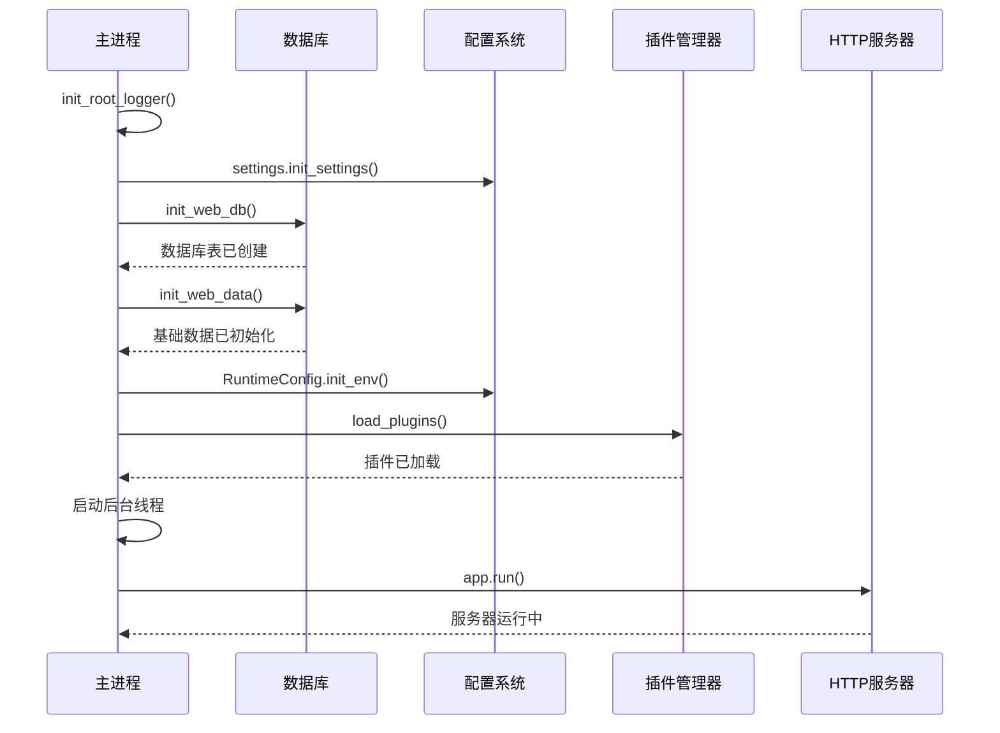
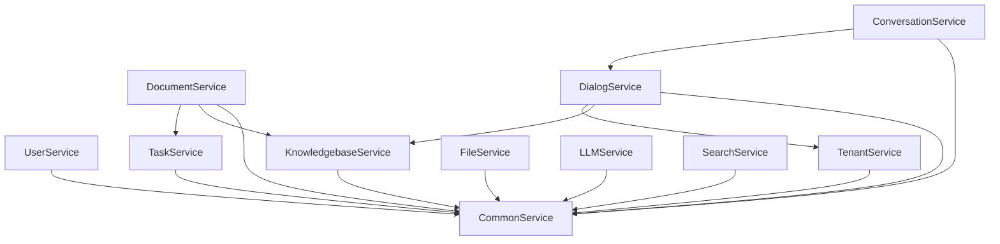
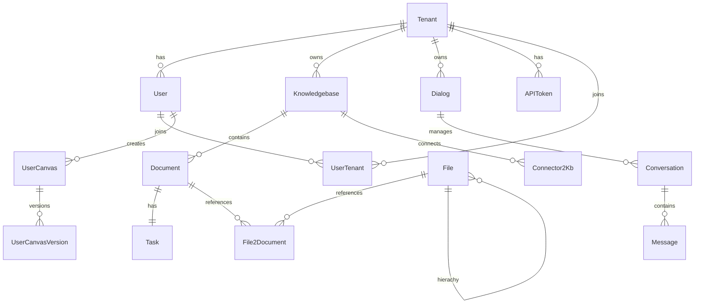
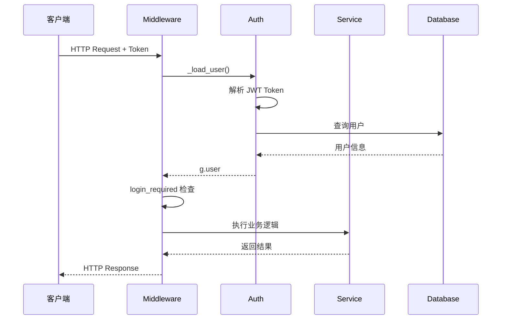
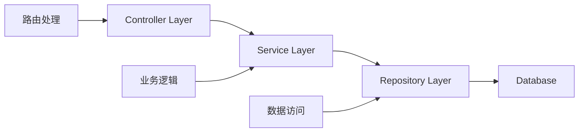

# RAGFlow 后端 API 架构分析

## 目录

1. [架构概览](#架构概览)
2. [Flask 应用结构](#flask-应用结构)
3. [应用模块分析](#应用模块分析)
4. [服务层架构](#服务层架构)
5. [数据库模型](#数据库模型)
6. [认证和权限机制](#认证和权限机制)
7. [请求处理流程](#请求处理流程)
8. [API 端点清单](#api-端点清单)
9. [中间件和拦截器](#中间件和拦截器)
10. [设计模式和最佳实践](#设计模式和最佳实践)

---

## 架构概览

RAGFlow 后端采用 **Flask (Quart)** 框架构建，是一个异步的 RESTful API 服务。整体架构遵循经典的分层设计模式：

```
┌─────────────────────────────────────────────────────────────┐
│                     客户端层 (Frontend/SDK)                  │
└─────────────────────────────────────────────────────────────┘
                              │
                              ▼
┌─────────────────────────────────────────────────────────────┐
│                   API 路由层 (api/apps/)                     │
│  ┌──────────┐  ┌──────────┐  ┌──────────┐  ┌──────────┐   │
│  │user_app  │  │kb_app    │  │document  │  │dialog    │   │
│  │canvas_app│  │chat_app  │  │search    │  │SDK APIs  │   │
│  └──────────┘  └──────────┘  └──────────┘  └──────────┘   │
└─────────────────────────────────────────────────────────────┘
                              │
                              ▼
┌─────────────────────────────────────────────────────────────┐
│                   服务层 (api/db/services/)                 │
│  ┌──────────────────┐  ┌──────────────────┐                │
│  │ UserService      │  │ DocumentService  │                │
│  │ DialogService    │  │ LLMService       │                │
│  │ KnowledgebaseService│ TaskService      │                │
│  └──────────────────┘  └──────────────────┘                │
└─────────────────────────────────────────────────────────────┘
                              │
                              ▼
┌─────────────────────────────────────────────────────────────┐
│                   数据访问层 (Peewee ORM)                    │
│              (api/db/db_models.py)                           │
└─────────────────────────────────────────────────────────────┘
                              │
                              ▼
┌─────────────────────────────────────────────────────────────┐
│                   数据存储层                                  │
│  ┌──────────┐  ┌──────────┐  ┌──────────┐  ┌──────────┐   │
│  │  MySQL   │  │  Redis   │  │Infinity/ES│  │  MinIO   │   │
│  └──────────┘  └──────────┘  └──────────┘  └──────────┘   │
└─────────────────────────────────────────────────────────────┘
```

### 技术栈

- **Web 框架**: Quart (异步 Flask) - 支持 async/await
- **ORM**: Peewee - 轻量级 Python ORM
- **数据库**: MySQL / PostgreSQL (主数据库), Redis (缓存/会话)
- **文档存储**: Elasticsearch / Infinity (向量数据库)
- **对象存储**: MinIO (文件存储)
- **认证**: JWT + Session (Redis)
- **API 版本**: v1

---

## Flask 应用结构

### 应用启动流程

主入口文件: `api/ragflow_server.py`

```python
# 启动流程
1. 初始化日志系统 (init_root_logger)
2. 显示版本信息和配置
3. 初始化数据库 (init_web_db)
4. 初始化基础数据 (init_web_data)
5. 初始化运行时配置 (RuntimeConfig)
6. 加载插件 (GlobalPluginManager)
7. 注册信号处理器 (SIGINT, SIGTERM)
8. 启动后台进度更新线程 (update_progress)
9. 启动 HTTP 服务器 (app.run)
```

**启动时序图**:



### 蓝图注册机制

应用使用**动态蓝图注册**系统，位于 `api/apps/__init__.py`:

```python
# 蓝图自动发现和注册
def register_page(page_path):
    """
    动态注册蓝图
    - 从 *_app.py 文件自动发现路由
    - SDK 路由: /api/v1/*
    - 应用路由: /v1/{module}/*
    """
    page_name = page_path.stem.removesuffix("_app")
    module_name = ".".join([
        *page_path.parts[page_path.parts.index("api"): -1],
        page_name
    ])

    spec = spec_from_file_location(module_name, page_path)
    page = module_from_spec(spec)
    page.app = app
    page.manager = Blueprint(page_name, module_name)

    # 注册蓝图
    url_prefix = f"/api/{API_VERSION}" if "/sdk/" in path else f"/{API_VERSION}/{page_name}"
    app.register_blueprint(page.manager, url_prefix=url_prefix)
```

**蓝图注册流程**:

```mermaid
graph TD
    A[扫描 apps/ 目录] --> B{文件类型判断}
    B -->|*_app.py| C[应用蓝图]
    B -->|sdk/*.py| D[SDK 蓝图]
    C --> E[URL: /v1/{module}]
    D --> F[URL: /api/v1/{endpoint}]
    E --> G[注册到 Flask App]
    F --> G
    G --> H[路由表已构建]
```

### 应用配置

```python
# Quart 配置 (api/apps/__init__.py)
app = Quart(__name__)
app = cors(app, allow_origin="*")  # CORS 支持
app.url_map.strict_slashes = False  # 宽松 URL 匹配
app.json_encoder = CustomJSONEncoder  # 自定义 JSON 编码

# 超时配置 (适配慢速 LLM)
app.config["RESPONSE_TIMEOUT"] = 600  # 10 分钟
app.config["BODY_TIMEOUT"] = 600

# Session 配置
app.config["SESSION_TYPE"] = "redis"
app.config["SESSION_REDIS"] = settings.decrypt_database_config(name="redis")
app.config["MAX_CONTENT_LENGTH"] = 1GB  # 最大上传
app.config["SECRET_KEY"] = settings.SECRET_KEY
```

---

## 应用模块分析

### 模块清单 (api/apps/)

| 模块 | 文件 | 主要功能 | 核心端点 |
|------|------|---------|---------|
| **用户管理** | `user_app.py` | 用户认证、注册、登录 | `/login`, `/register`, `/logout` |
| **知识库** | `kb_app.py` | 知识库 CRUD | `/create`, `/update`, `/delete` |
| **文档管理** | `document_app.py` | 文档上传、解析、检索 | `/upload`, `/parse`, `/search` |
| **对话管理** | `dialog_app.py` | 对话配置、提示词管理 | `/set`, `/get`, `/list` |
| **会话管理** | `conversation_app.py` | 会话 CRUD、消息管理 | `/set`, `/get`, `/history` |
| **Agent 画布** | `canvas_app.py` | Agent 工作流编排 | `/set`, `/completion`, `/run` |
| **Chunk 管理** | `chunk_app.py` | 文档块管理 | `/get`, `/delete`, `/batch_get` |
| **连接器** | `connector_app.py` | 外部数据源连接 | `/create`, `/sync`, `/list` |
| **LLM 管理** | `llm_app.py` | 模型配置管理 | `/set`, `/list`, `/delete` |
| **文件管理** | `file_app.py` | 文件上传下载 | `/upload`, `/download`, `/delete` |
| **搜索** | `search_app.py` | 全文搜索接口 | `/search` |
| **评估** | `evaluation_app.py` | 评估数据集管理 | `/create`, `/run`, `/result` |
| **MCP 服务器** | `mcp_server_app.py` | MCP 协议支持 | `/create`, `/list`, `/delete` |
| **系统配置** | `system_app.py` | 系统级配置 | `/set`, `/get` |

### SDK 模块 (api/apps/sdk/)

提供外部 SDK 集成接口：

| 模块 | 功能 | 端点前缀 |
|------|------|---------|
| **chat.py** | 聊天对话接口 | `/api/v1/chats` |
| **dataset.py** | 数据集管理 | `/api/v1/datasets` |
| **doc.py** | 文档操作 | `/api/v1/documents` |
| **session.py** | 会话管理 | `/api/v1/sessions` |
| **agents.py** | Agent 管理 | `/api/v1/agents` |
| **files.py** | 文件操作 | `/api/v1/files` |
| **memories.py** | 记忆管理 | `/api/v1/memories` |

### 关键模块详解

#### 1. 用户认证模块 (user_app.py)

```python
# 登录流程
@manager.route("/login", methods=["POST"])
async def login():
    """
    1. 获取 email 和 password
    2. 验证用户凭证
    3. 生成 access_token (UUID)
    4. 返回 JWT token
    """
    json_body = await get_request_json()
    email = json_body.get("email", "")
    password = json_body.get("password", "")

    # 验证用户
    user = UserService.query_user(email, password)
    if not user:
        return get_json_result(data=False, code=RetCode.AUTHENTICATION_ERROR)

    # 生成 token
    jwt = Serializer(secret_key=settings.SECRET_KEY)
    access_token = jwt.dumps(str(user.access_token))

    # 登录用户
    login_user(user)

    return get_json_result(data={"token": access_token, "email": user.email})
```

#### 2. 知识库模块 (kb_app.py)

```python
# 创建知识库
@manager.route('/create', methods=['POST'])
@login_required
@validate_request("name")
async def create():
    """
    创建新知识库:
    - 验证名称长度 (<= 128 bytes)
    - 设置解析器 (parser_id)
    - 配置分块方法
    - 保存到数据库
    """
    req = await get_request_json()
    e, res = KnowledgebaseService.create_with_name(
        name=req.pop("name", None),
        tenant_id=current_user.id,
        parser_id=req.pop("parser_id", None),
        **req
    )
    if not e:
        return res

    if not KnowledgebaseService.save(**res):
        return get_data_error_result()

    return get_json_result(data={"kb_id": res["id"]})
```

#### 3. 文档上传模块 (document_app.py)

```python
@manager.route("/upload", methods=["POST"])
@login_required
@validate_request("kb_id")
async def upload():
    """
    文档上传流程:
    1. 验证知识库权限
    2. 接收文件 (支持多文件)
    3. 验证文件类型和大小
    4. 保存到 MinIO
    5. 创建 File 记录
    6. 触发解析任务
    """
    form = await request.form
    kb_id = form.get("kb_id")
    files = await request.files
    file_objs = files.getlist("file")

    # 权限检查
    e, kb = KnowledgebaseService.get_by_id(kb_id)
    if not check_kb_team_permission(kb, current_user.id):
        return get_json_result(data=False, message="No authorization.",
                              code=RetCode.AUTHENTICATION_ERROR)

    # 上传文件
    err, files = await thread_pool_exec(
        FileService.upload_document, kb, file_objs, current_user.id
    )

    return get_json_result(data=files)
```

#### 4. Agent 画布模块 (canvas_app.py)

```python
@manager.route('/completion', methods=["POST"])
@login_required
async def completion():
    """
    Agent 执行流程:
    1. 加载 Canvas DSL
    2. 验证访问权限
    3. 构建执行流水线
    4. 运行 Agent 工作流
    5. 返回结果
    """
    req = await get_request_json()
    canvas_id = req.get("canvas_id")

    # 加载 Canvas
    canvas = UserCanvasService.get_by_id(canvas_id)
    if not canvas:
        return get_data_error_result(message="Canvas not found")

    # 权限检查
    if not UserCanvasService.accessible(canvas_id, current_user.id):
        return get_json_result(data=False, message="No permission.",
                              code=RetCode.AUTHENTICATION_ERROR)

    # 执行 Agent
    result = await agent_completion(
        canvas_id=canvas_id,
        dsl=json.loads(canvas.dsl),
        message=req.get("message", "")
    )

    return get_json_result(data=result)
```

---

## 服务层架构

### 基础服务类 (CommonService)

所有服务类继承自 `CommonService`，提供标准 CRUD 操作：

```python
class CommonService:
    """基础服务类，提供通用数据库操作"""

    model = None  # 子类必须指定模型

    @classmethod
    def query(cls, cols=None, reverse=None, order_by=None, **kwargs):
        """灵活查询，支持列选择、排序、过滤"""
        return cls.model.query(cols=cols, reverse=reverse, order_by=order_by, **kwargs)

    @classmethod
    def get_by_id(cls, pid):
        """根据 ID 查询"""
        try:
            obj = cls.model.get_or_none(cls.model.id == pid)
            if obj:
                return True, obj
        except Exception:
            pass
        return False, None

    @classmethod
    def save(cls, **kwargs):
        """保存新记录"""
        sample_obj = cls.model(**kwargs).save(force_insert=True)
        return sample_obj

    @classmethod
    def update_by_id(cls, pid, data):
        """根据 ID 更新"""
        data["update_time"] = current_timestamp()
        data["update_date"] = datetime_format(datetime.now())
        num = cls.model.update(data).where(cls.model.id == pid).execute()
        return num

    @classmethod
    def delete_by_id(cls, pid):
        """根据 ID 删除"""
        return cls.model.delete().where(cls.model.id == pid).execute()
```

### 核心服务类

#### 1. UserService

```python
class UserService(CommonService):
    """用户服务"""

    @classmethod
    def query_user(cls, email, password):
        """验证用户登录"""
        user = cls.model.select().where(
            (cls.model.email == email),
            (cls.model.status == StatusEnum.VALID.value)
        ).first()
        if user and check_password_hash(str(user.password), password):
            return user
        return None

    @classmethod
    def query(cls, cols=None, reverse=None, order_by=None, **kwargs):
        """增强查询，带 access_token 验证"""
        if 'access_token' in kwargs:
            access_token = kwargs['access_token']

            # 拒绝空 token
            if not access_token or not str(access_token).strip():
                return cls.model.select().where(cls.model.id == "INVALID_EMPTY_TOKEN")

            # 拒绝短 token
            if len(str(access_token).strip()) < 32:
                return cls.model.select().where(cls.model.id == "INVALID_SHORT_TOKEN")

            # 拒绝已注销 token
            if str(access_token).startswith("INVALID_"):
                return cls.model.select().where(cls.model.id == "INVALID_LOGOUT_TOKEN")

        return super().query(cols=cols, reverse=reverse, order_by=order_by, **kwargs)
```

#### 2. DocumentService

```python
class DocumentService(CommonService):
    """文档服务，处理文档解析和管理"""

    @classmethod
    def doc_upload_and_parse(cls, file_objs, kb, parser_id, user_id):
        """
        文档上传和解析流程:
        1. 保存文件到对象存储
        2. 创建 Document 记录
        3. 创建解析任务
        4. 触发异步解析
        """
        documents = []
        for file_obj in file_objs:
            # 保存文件
            file_id = FileService.save_file(file_obj)

            # 创建文档记录
            doc = cls.insert(
                id=get_uuid(),
                kb_id=kb.id,
                name=file_obj.filename,
                type=file_obj.content_type,
                size=file_obj.content_length,
                parser_id=parser_id,
                tenant_id=user_id
            )
            documents.append(doc)

            # 创建解析任务
            TaskService.create_parse_task(doc.id, parser_id)

        return documents

    @classmethod
    def update_progress(cls):
        """更新文档处理进度 (后台任务)"""
        docs = cls.query(status=TaskStatus.PROCESSING.value)
        for doc in docs:
            progress = TaskService.get_progress(doc.id)
            doc.progress = progress
            cls.update_by_id(doc.id, {"progress": progress})
```

#### 3. DialogService

```python
class DialogService(CommonService):
    """对话服务，管理对话配置"""

    @classmethod
    async def async_ask(cls, dialog_id, question, user_id):
        """
        异步问答流程:
        1. 加载对话配置
        2. 检索相关知识
        3. 构建 prompt
        4. 调用 LLM
        5. 返回答案
        """
        # 加载对话
        dialog = cls.get_by_id(dialog_id)

        # 检索知识
        chunks = []
        if dialog.kb_ids:
            chunks = await cls.retrieve_chunks(
                kb_ids=dialog.kb_ids,
                question=question,
                top_n=dialog.top_n
            )

        # 构建 prompt
        prompt = cls.build_prompt(dialog.prompt_config, chunks, question)

        # 调用 LLM
        llm = LLMBundle(dialog.tenant_id, LLMType.CHAT, dialog.llm_setting)
        answer = await llm.generate(prompt)

        return answer, chunks
```

### 服务层依赖关系



---

## 数据库模型

### 模型层次结构

```python
# 基础模型
class BaseModel(Model):
    """所有模型的基类"""
    create_time = BigIntegerField(index=True)
    create_date = DateTimeField(index=True)
    update_time = BigIntegerField(index=True)
    update_date = DateTimeField(index=True)

# 数据库模型
class DataBaseModel(BaseModel):
    """数据库实体模型基类"""
    pass
```

### 核心数据模型

#### 用户和租户

```python
# 租户 (Tenant)
class Tenant(DataBaseModel):
    """租户/组织"""
    id = CharField(primary_key=True)
    name = CharField()
    logo = TextField()
    language = CharField()
    timezone = CharField()
    llm_id = CharField()  # 默认 LLM
    embedding_id = CharField()  # 默认 Embedding
    asr_id = CharField()  # 默认 ASR
    img2txt_id = CharField()  # 默认 OCR
    email = CharField()

# 用户 (User)
class User(DataBaseModel):
    """用户"""
    id = CharField(primary_key=True)
    tenant_id = CharField()  # 所属租户
    nickname = CharField()
    email = CharField(unique=True)
    password = CharField()  # 哈希密码
    access_token = CharField(unique=True)  # UUID
    is_superuser = BooleanField()
    language = CharField()
    status = CharField()  # VALID/INVALID

# 用户-租户关联 (UserTenant)
class UserTenant(DataBaseModel):
    """用户租户多对多关系"""
    id = CharField(primary_key=True)
    user_id = CharField()
    tenant_id = CharField()
    role = CharField()  # OWNER/ADMIN/USER
    status = CharField()
```

#### 知识库和文档

```python
# 知识库 (Knowledgebase)
class Knowledgebase(DataBaseModel):
    """知识库"""
    id = CharField(primary_key=True)
    tenant_id = CharField()
    name = CharField()
    description = TextField()
    parser_id = CharField()  # 解析器配置
    permission = CharField()  # 权限设置
    chunk_method = CharField()  # 分块方法
    chunk_num = IntegerField()  # chunk 数量
    similarity_threshold = FloatField()
    vector_similarity_weight = FloatField()
    pagerank = IntegerField()

# 文档 (Document)
class Document(DataBaseModel):
    """文档"""
    id = CharField(primary_key=True)
    kb_id = CharField()  # 所属知识库
    name = CharField()
    type = CharField()  # 文件类型
    size = BigIntegerField()
    token_num = IntegerField()  # token 数量
    chunk_num = IntegerField()  # chunk 数量
    progress = FloatField()  # 解析进度
    status = CharField()  # 任务状态
    parser_id = CharField()
    source_uri = CharField()
    meta_data = JSONField()  # 元数据

# 文件 (File)
class File(DataBaseModel):
    """文件"""
    id = CharField(primary_key=True)
    parent_id = CharField()  # 父文件夹
    name = CharField()
    type = CharField()
    size = BigIntegerField()
    location = CharField()  # MinIO 路径
    owner_id = CharField()

# 文件-文档关联 (File2Document)
class File2Document(DataBaseModel):
    """文件和文档的关联"""
    id = CharField(primary_key=True)
    file_id = CharField()
    document_id = CharField()
    position = IntegerField()  # 页码/位置
```

#### 任务和对话

```python
# 任务 (Task)
class Task(DataBaseModel):
    """异步任务"""
    id = CharField(primary_key=True)
    kb_id = CharField()
    doc_id = CharField()
    type = CharField()  # 任务类型
    status = CharField()  # 任务状态
    progress = FloatField()
    error_msg = TextField()
    create_time = BigIntegerField()

# 对话 (Dialog)
class Dialog(DataBaseModel):
    """对话配置"""
    id = CharField(primary_key=True)
    tenant_id = CharField()
    name = CharField()
    description = TextField()
    icon = CharField()
    prompt_config = JSONField()  # 提示词配置
    kb_ids = ListField()  # 关联知识库
    llm_setting = JSONField()  # LLM 配置
    similarity_threshold = FloatField()
    vector_similarity_weight = FloatField()

# 会话 (Conversation)
class Conversation(DataBaseModel):
    """会话"""
    id = CharField(primary_key=True)
    dialog_id = CharField()
    user_id = CharField()
    name = CharField()
    message = JSONField()  # 消息历史
    reference = ListField()  # 引用文档

# API Token (APIToken)
class APIToken(DataBaseModel):
    """API 访问令牌"""
    id = CharField(primary_key=True)
    tenant_id = CharField()
    token = CharField(unique=True)
    name = CharField()
    status = CharField()
```

#### Agent 和 Canvas

```python
# User Canvas (UserCanvas)
class UserCanvas(DataBaseModel):
    """用户 Agent 画布"""
    id = CharField(primary_key=True)
    user_id = CharField()
    title = CharField()
    description = TextField()
    dsl = JSONField()  # DSL 配置
    canvas_category = CharField()  # AGENT/WORKFLOW
    avatar = TextField()

# Canvas Template (CanvasTemplate)
class CanvasTemplate(DataBaseModel):
    """Canvas 模板"""
    id = CharField(primary_key=True)
    title = CharField()
    description = TextField()
    dsl = JSONField()
    avatar = TextField()

# Canvas Version (UserCanvasVersion)
class UserCanvasVersion(DataBaseModel):
    """Canvas 版本历史"""
    id = CharField(primary_key=True)
    user_canvas_id = CharField()
    dsl = JSONField()
    title = CharField()
```

### 数据库关系图



### 索引设计

```python
# 关键索引
class BaseModel:
    create_time = BigIntegerField(index=True)  # 时间范围查询
    update_time = BigIntegerField(index=True)

class User:
    email = CharField(unique=True)  # 唯一索引
    access_token = CharField(unique=True)

class Document:
    kb_id = CharField(index=True)  # 知识库查询
    status = CharField(index=True)  # 状态过滤

class Task:
    doc_id = CharField(index=True)
    status = CharField(index=True)

class Conversation:
    dialog_id = CharField(index=True)
    user_id = CharField(index=True)
```

---

## 认证和权限机制

### 认证流程

RAGFlow 使用 **双重认证机制**:

1. **Session 认证** (Web 界面)
2. **JWT Token 认证** (API/SDK)

```python
# 用户加载 (api/apps/__init__.py)
def _load_user():
    """
    从请求中加载用户:
    1. 尝试 Session 认证
    2. 尝试 JWT Token 认证
    3. 尝试 API Token 认证
    """
    jwt = Serializer(secret_key=settings.SECRET_KEY)
    authorization = request.headers.get("Authorization")
    g.user = None

    if not authorization:
        return None

    try:
        # JWT Token 认证
        access_token = str(jwt.loads(authorization))

        # Token 格式验证
        if len(access_token.strip()) < 32:
            logging.warning("Invalid token format")
            return None

        # 查询用户
        user = UserService.query(
            access_token=access_token,
            status=StatusEnum.VALID.value
        )
        if user:
            g.user = user[0]
            return user[0]

    except Exception:
        # API Token 认证 (SDK)
        try:
            if len(authorization.split()) == 2:
                objs = APIToken.query(token=authorization.split()[1])
                if objs:
                    user = UserService.query(
                        id=objs[0].tenant_id,
                        status=StatusEnum.VALID.value
                    )
                    if user:
                        g.user = user[0]
                        return user[0]
        except Exception:
            pass

# 装饰器
current_user = LocalProxy(_load_user)
```

### 登录认证装饰器

```python
def login_required(func):
    """
    登录验证装饰器
    """
    @wraps(func)
    async def wrapper(*args, **kwargs):
        # API 计时
        timing_enabled = os.getenv("RAGFLOW_API_TIMING")
        t_start = time.perf_counter() if timing_enabled else None

        # 获取当前用户
        user = current_user

        if timing_enabled:
            logging.info(
                "api_timing login_required auth_ms=%.2f path=%s",
                (time.perf_counter() - t_start) * 1000,
                request.path,
            )

        # 验证用户
        if not user:
            raise QuartAuthUnauthorized()

        return await current_app.ensure_async(func)(*args, **kwargs)

    return wrapper
```

### 权限控制

#### 团队权限检查

```python
# api/common/check_team_permission.py
def check_kb_team_permission(kb, user_id):
    """
    检查用户对知识库的权限:
    1. 检查知识库所属租户
    2. 检查用户是否在该租户中
    3. 检查用户角色权限
    """
    # 获取用户的租户
    user_tenants = UserTenantService.query(user_id=user_id)
    tenant_ids = [ut.tenant_id for ut in user_tenants]

    # 检查知识库所属租户
    if kb.tenant_id not in tenant_ids:
        return False

    # 检查权限
    user_tenant = UserTenantService.query(
        user_id=user_id,
        tenant_id=kb.tenant_id
    )[0]

    if user_tenant.role == UserTenantRole.OWNER.value:
        return True

    # 检查知识库权限设置
    if kb.permission == "TEAM":
        return True
    elif kb.permission == "PRIVATE":
        return kb.created_by == user_id

    return False
```

#### Canvas 访问控制

```python
# api/db/services/canvas_service.py
class UserCanvasService(CommonService):
    @classmethod
    def accessible(cls, canvas_id, user_id):
        """
        检查用户是否可访问 Canvas:
        - OWNER: 完全控制
        - 其他: 只读
        """
        canvas = cls.get_by_id(canvas_id)
        if not canvas[0]:
            return False

        canvas = canvas[1]
        if canvas.user_id == user_id:
            return True

        # 检查共享权限
        # TODO: 实现共享机制

        return False
```

### 认证流程图



---

## 请求处理流程

### 标准请求处理链

```mermaid
graph TD
    A[HTTP Request] --> B[Quart 路由匹配]
    B --> C{蓝图路由}
    C --> D[认证中间件]
    D --> E{login_required?}
    E -->|是| F[_load_user]
    E -->|否| G[直接执行]
    F --> H{用户有效?}
    H -->|是| I[设置 g.user]
    H -->|否| J[401 Unauthorized]
    I --> K[参数验证]
    G --> K
    K --> L{@validate_request}
    L --> M{参数有效?}
    M -->|是| N[执行业务逻辑]
    M -->|否| O[400 Bad Request]
    N --> P[服务层处理]
    P --> Q[数据库操作]
    Q --> R[返回结果]
    R --> S[JSON 序列化]
    S --> T[HTTP Response]
```

### 错误处理机制

```python
# api/apps/__init__.py
@app.errorhandler(404)
async def not_found(error):
    """404 错误处理"""
    logging.error(f"The requested URL {request.path} was not found")
    message = f"Not Found: {request.path}"
    response = {
        "code": RetCode.NOT_FOUND,
        "message": message,
        "data": None,
        "error": "Not Found",
    }
    return jsonify(response), RetCode.NOT_FOUND

@app.errorhandler(401)
async def unauthorized(error):
    """401 错误处理"""
    logging.warning("Unauthorized request")
    return get_json_result(
        code=RetCode.UNAUTHORIZED,
        message=_unauthorized_message(error)
    ), RetCode.UNAUTHORIZED

@app.errorhandler(Exception)
async def server_error_response(error):
    """通用异常处理"""
    logging.error("Unhandled exception", exc_info=error)

    # 检查是否为认证错误
    try:
        msg = repr(error).lower()
        if "unauthorized" in msg or "401" in msg:
            return get_json_result(
                code=RetCode.UNAUTHORIZED,
                message="Unauthorized"
            ), 401
    except Exception:
        pass

    # 特定错误处理
    if "index_not_found_exception" in repr(error):
        return get_json_result(
            code=RetCode.EXCEPTION_ERROR,
            message="No chunk found, please upload file and parse it."
        )

    return get_json_result(
        code=RetCode.EXCEPTION_ERROR,
        message=repr(error)
    )
```

### 请求验证

```python
# api/utils/api_utils.py
def validate_request(*args, **kwargs):
    """
    请求参数验证装饰器
    """
    def decorator(func):
        @wraps(func)
        async def wrapper(*args, **kwargs):
            # 获取请求参数
            req = await get_request_json()

            # 验证必需参数
            for arg in args:
                if arg not in req:
                    return get_data_error_result(
                        message=f"Missing required parameter: {arg}"
                    )

            # 验证参数类型
            for key, value in kwargs.items():
                if key in req and not isinstance(req[key], value):
                    return get_data_error_result(
                        message=f"Parameter {key} must be {value.__name__}"
                    )

            return await func(*args, **kwargs)

        return wrapper

    return decorator

def not_allowed_parameters(*args):
    """
    拒绝特定参数的装饰器
    """
    def decorator(func):
        @wraps(func)
        async def wrapper(*args, **kwargs):
            req = await get_request_json()

            for param in args:
                if param in req:
                    return get_data_error_result(
                        message=f"Parameter {param} is not allowed"
                    )

            return await func(*args, **kwargs)

        return wrapper

    return decorator
```

### 响应格式

```python
# 统一响应格式
def get_json_result(data=None, code=RetCode.SUCCESS, message="success"):
    """
    标准响应格式:
    {
        "code": 0,
        "message": "success",
        "data": {...}
    }
    """
    return jsonify({
        "code": code,
        "message": message,
        "data": data
    })

# 错误响应
def get_data_error_result(message="Sorry! Data missing!"):
    return jsonify({
        "code": RetCode.DATA_ERROR,
        "message": message
    })
```

---

## API 端点清单

### 核心 API 端点

#### 用户管理 (`/v1/user`)

```
POST   /v1/user/login          # 用户登录
POST   /v1/user/register       # 用户注册
GET    /v1/user/info           # 获取用户信息
PUT    /v1/user/info           # 更新用户信息
POST   /v1/user/logout         # 用户登出
```

#### 知识库管理 (`/v1/kb`)

```
POST   /v1/kb/create           # 创建知识库
PUT    /v1/kb/update           # 更新知识库
DELETE /v1/kb/delete           # 删除知识库
GET    /v1/kb/list             # 列出知识库
GET    /v1/kb/detail           # 知识库详情
```

#### 文档管理 (`/v1/document`)

```
POST   /v1/document/upload     # 上传文档
POST   /v1/document/parse      # 解析文档
GET    /v1/document/list       # 列出文档
DELETE /v1/document/delete     # 删除文档
GET    /v1/document/chunks     # 获取文档块
```

#### 对话管理 (`/v1/dialog`)

```
POST   /v1/dialog/set          # 创建/更新对话
GET    /v1/dialog/get          # 获取对话配置
GET    /v1/dialog/list         # 列出对话
DELETE /v1/dialog/delete       # 删除对话
```

#### 会话管理 (`/v1/conversation`)

```
POST   /v1/conversation/set    # 创建/更新会话
GET    /v1/conversation/get    # 获取会话
POST   /v1/conversation/ask    # 提问
GET    /v1/conversation/history # 历史记录
```

#### Agent Canvas (`/v1/canvas`)

```
POST   /v1/canvas/set          # 保存 Canvas
GET    /v1/canvas/get          # 获取 Canvas
DELETE /v1/canvas/rm           # 删除 Canvas
GET    /v1/canvas/templates    # 获取模板
POST   /v1/canvas/completion   # 执行 Agent
POST   /v1/canvas/debug        # 调试 Agent
```

#### LLM 管理 (`/v1/llm`)

```
POST   /v1/llm/set             # 设置 LLM
GET    /v1/llm/list            # 列出 LLM
DELETE /v1/llm/delete          # 删除 LLM
POST   /v1/llm/factory         # 添加模型工厂
```

#### 文件管理 (`/v1/file`)

```
POST   /v1/file/upload         # 上传文件
GET    /v1/file/download       # 下载文件
DELETE /v1/file/delete         # 删除文件
GET    /v1/file/list           # 列出文件
```

### SDK API 端点 (`/api/v1`)

#### 聊天接口

```
POST   /api/v1/chats           # 创建聊天
POST   /api/v1/chats/{id}/completions # 发送消息
GET    /api/v1/chats           # 列出聊天
```

#### 数据集接口

```
POST   /api/v1/datasets        # 创建数据集
GET    /api/v1/datasets        # 列出数据集
GET    /api/v1/datasets/{id}   # 获取数据集
PUT    /api/v1/datasets/{id}   # 更新数据集
DELETE /api/v1/datasets/{id}   # 删除数据集
```

#### 文档接口

```
POST   /api/v1/documents       # 上传文档
GET    /api/v1/documents       # 列出文档
GET    /api/v1/documents/{id}  # 获取文档
DELETE /api/v1/documents/{id}  # 删除文档
```

### API 版本控制

```python
# api/constants.py
API_VERSION = "v1"  # 当前 API 版本

# 路由前缀
# 应用路由: /v1/{module}/*
# SDK 路由:  /api/v1/{endpoint}/*
```

---

## 中间件和拦截器

### CORS 中间件

```python
# api/apps/__init__.py
from quart_cors import cors

app = cors(app, allow_origin="*")
```

### 数据库连接管理

```python
# api/apps/__init__.py
@app.teardown_request
def _db_close(exception):
    """
    请求结束后关闭数据库连接
    """
    if exception:
        logging.exception(f"Request failed: {exception}")
    close_connection()
```

### 请求日志中间件

```python
# 可选的 API 计时
if os.getenv("RAGFLOW_API_TIMING"):
    @app.before_request
    async def log_request():
        request._start_time = time.perf_counter()

    @app.after_request
    async def log_response(response):
        if hasattr(request, '_start_time'):
            duration = (time.perf_counter() - request._start_time) * 1000
            logging.info(
                "api_timing path=%s method=%s status=%d duration_ms=%.2f",
                request.path,
                request.method,
                response.status_code,
                duration
            )
        return response
```

### Session 管理

```python
# Redis Session 配置
app.config["SESSION_TYPE"] = "redis"
app.config["SESSION_REDIS"] = settings.decrypt_database_config(name="redis")
app.config["SESSION_PERMANENT"] = False

# Session 操作
def login_user(user):
    """登录用户，设置 session"""
    session["_user_id"] = user.id
    session["_fresh"] = True
    session["_id"] = get_uuid()
    return True

def logout_user():
    """登出用户，清除 session"""
    if "_user_id" in session:
        session.pop("_user_id")
    if "_fresh" in session:
        session.pop("_fresh")
    if "_id" in session:
        session.pop("_id")
    return True
```

---

## 设计模式和最佳实践

### 1. 分层架构



**实践**:
- **Controller** (`*_app.py`): 处理 HTTP 请求，参数验证
- **Service** (`*_service.py`): 实现业务逻辑
- **Model** (`db_models.py`): 定义数据模型

### 2. 依赖注入

```python
# 使用 LocalProxy 实现延迟加载
from werkzeug.local import LocalProxy

def _load_user():
    """延迟加载用户"""
    jwt = Serializer(secret_key=settings.SECRET_KEY)
    authorization = request.headers.get("Authorization")
    # ... 加载逻辑
    return user

current_user = LocalProxy(_load_user)

# 使用
@manager.route("/profile")
@login_required
async def profile():
    user = current_user  # 自动加载
    return get_json_result(data=user.to_dict())
```

### 3. 装饰器模式

```python
# 认证装饰器
@manager.route("/protected")
@login_required
async def protected():
    return get_json_result(data="Protected data")

# 验证装饰器
@manager.route("/create")
@login_required
@validate_request("name", "description")
async def create():
    req = await get_request_json()
    # name 和 description 已经验证

# 拒绝参数装饰器
@manager.route("/update")
@login_required
@not_allowed_parameters("id", "create_time")
async def update():
    req = await get_request_json()
    # id 和 create_time 被拒绝
```

### 4. 策略模式

```python
# 解析器策略
class ParserStrategy:
    """解析器基类"""
    def parse(self, file_path):
        raise NotImplementedError

class PDFParser(ParserStrategy):
    def parse(self, file_path):
        # PDF 解析逻辑
        pass

class DocxParser(ParserStrategy):
    def parse(self, file_path):
        # DOCX 解析逻辑
        pass

# 使用
parser = ParserFactory.get_parser(document.type)
chunks = parser.parse(file_path)
```

### 5. 工厂模式

```python
# LLM 工厂
class LLMFactory:
    @staticmethod
    def create(llm_type, model_config):
        if llm_type == LLMType.OPENAI:
            return OpenAILLM(model_config)
        elif llm_type == LLMType.LLAMA:
            return LlamaLLM(model_config)
        elif llm_type == LLMType.TONGYI:
            return TongyiLLM(model_config)
        else:
            raise ValueError(f"Unknown LLM type: {llm_type}")
```

### 6. 异步处理

```python
# 异步文件上传
@manager.route("/upload", methods=["POST"])
@login_required
async def upload():
    files = await request.files

    # 使用线程池执行同步操作
    err, files = await thread_pool_exec(
        FileService.upload_document,
        kb, file_objs, current_user.id
    )

    return get_json_result(data=files)

# 异步对话
@manager.route("/ask", methods=["POST"])
@login_required
async def ask():
    req = await get_request_json()

    # 异步检索和生成
    answer, chunks = await DialogService.async_ask(
        dialog_id=req["dialog_id"],
        question=req["question"],
        user_id=current_user.id
    )

    return get_json_result(data={"answer": answer, "chunks": chunks})
```

### 7. 错误处理最佳实践

```python
# 统一错误响应
def get_json_result(data=None, code=RetCode.SUCCESS, message="success"):
    """统一响应格式"""
    return jsonify({
        "code": code,
        "message": message,
        "data": data
    })

# 异常捕获
@manager.route("/action")
@login_required
async def action():
    try:
        # 业务逻辑
        result = await some_operation()
        return get_json_result(data=result)
    except ValueError as e:
        return get_data_error_result(message=str(e))
    except Exception as e:
        return server_error_response(e)
```

### 8. 数据库操作最佳实践

```python
# 使用连接上下文
@DB.connection_context()
def query_users(cls, **kwargs):
    """自动管理数据库连接"""
    return cls.model.select().where(**kwargs)

# 事务操作
@DB.atomic()
def transfer_data(cls, from_id, to_id):
    """原子性事务"""
    cls.delete_by_id(from_id)
    cls.insert(id=to_id, data=...)

# 批量操作
def batch_insert(cls, data_list, batch_size=100):
    """批量插入，提高性能"""
    with DB.atomic():
        for i in range(0, len(data_list), batch_size):
            cls.model.insert_many(data_list[i:i+batch_size]).execute()
```

### 9. 缓存策略

```python
# Redis 缓存
from rag.utils.redis_conn import REDIS_CONN

def get_document(doc_id):
    """带缓存的文档查询"""
    # 尝试从缓存获取
    cache_key = f"document:{doc_id}"
    cached = REDIS_CONN.get(cache_key)
    if cached:
        return json.loads(cached)

    # 从数据库查询
    doc = DocumentService.get_by_id(doc_id)

    # 写入缓存
    REDIS_CONN.setex(cache_key, 3600, json.dumps(doc))

    return doc
```

### 10. 配置管理

```python
# 环境变量配置
import os
from common import settings

# 配置项
MAX_CONTENT_LENGTH = int(os.environ.get("MAX_CONTENT_LENGTH", 1024 * 1024 * 1024))
QUART_RESPONSE_TIMEOUT = int(os.environ.get("QUART_RESPONSE_TIMEOUT", 600))

# 条件配置
if settings.DOC_ENGINE_INFINITY:
    # Infinity 特定配置
    pass
else:
    # Elasticsearch 特定配置
    pass
```

---

## 性能优化

### 1. 数据库连接池

```python
# Peewee 连接池
from playhouse.pool import PooledMySQLDatabase

DB = PooledMySQLDatabase(
    database=settings.MYSQL_DATABASE,
    user=settings.MYSQL_USER,
    password=settings.MYSQL_PASSWORD,
    host=settings.MYSQL_HOST,
    port=settings.MYSQL_PORT,
    max_connections=20,  # 最大连接数
    stale_timeout=300,   # 连接超时
)
```

### 2. 异步 I/O

```python
# 使用异步框架
from quart import Quart

app = Quart(__name__)

# 异步路由
@manager.route("/async-endpoint")
async def async_handler():
    # 异步操作
    result = await async_operation()
    return get_json_result(data=result)
```

### 3. 线程池

```python
from common.misc_utils import thread_pool_exec

# 同步操作异步化
@manager.route("/heavy-operation")
async def heavy():
    # 在线程池中执行同步操作
    result = await thread_pool_exec(heavy_sync_function, arg1, arg2)
    return get_json_result(data=result)
```

### 4. 批量操作

```python
# 批量插入
def bulk_insert_documents(docs):
    DocumentService.insert_many(docs, batch_size=100)

# 批量更新
def bulk_update_documents(updates):
    DocumentService.update_many_by_id(updates)
```

---

## 安全最佳实践

### 1. 密码哈希

```python
from werkzeug.security import generate_password_hash, check_password_hash

# 创建用户
password = "user_password"
hashed_password = generate_password_hash(password)
user.password = hashed_password

# 验证密码
if check_password_hash(user.password, input_password):
    # 密码正确
    pass
```

### 2. Token 管理

```python
# 生成安全 Token
import secrets

access_token = secrets.token_urlsafe(32)  # 生成 32 字节随机 Token

# Token 验证
def validate_token(token):
    if not token or len(token) < 32:
        return False
    if token.startswith("INVALID_"):
        return False
    return True
```

### 3. SQL 注入防护

```python
# 使用 ORM (自动防护)
users = UserService.query(email=user_input)

# 避免原生 SQL
# 不安全: cursor.execute(f"SELECT * FROM users WHERE email = '{email}'")
# 安全: User.select().where(User.email == email)
```

### 4. XSS 防护

```python
# JSON 响应自动转义
return jsonify(data=user_input)

# 避免 HTML 直接渲染
# 不安全: return render_template_string(user_input)
# 安全: return jsonify(data=user_input)
```

---

## 监控和日志

### 1. 结构化日志

```python
import logging

# 日志配置
logging.basicConfig(
    level=logging.INFO,
    format='%(asctime)s - %(name)s - %(levelname)s - %(message)s'
)

# 使用日志
logging.info("User logged in", extra={
    "user_id": user.id,
    "ip": request.remote_addr
})

# 错误日志
logging.exception("Error processing request")
```

### 2. API 计时

```python
# 启用 API 计时
os.environ["RAGFLOW_API_TIMING"] = "1"

# 自动记录
@manager.route("/endpoint")
@login_required
async def endpoint():
    # 自动记录认证时间
    # 自动记录总请求时间
    pass
```

### 3. 健康检查

```python
@manager.route("/health", methods=["GET"])
def health():
    """健康检查端点"""
    checks = {
        "database": check_database(),
        "redis": check_redis(),
        "elasticsearch": check_elasticsearch()
    }

    if all(checks.values()):
        return jsonify({"status": "healthy", "checks": checks})
    else:
        return jsonify({"status": "unhealthy", "checks": checks}), 503
```

---

## 总结

RAGFlow 后端 API 架构是一个设计良好的、可扩展的微服务架构，具有以下特点:

### 优势

1. **清晰的分层架构**: Controller → Service → Model
2. **异步支持**: 基于 Quart 的异步处理能力
3. **灵活的认证**: 支持 Session、JWT、API Token 多种方式
4. **模块化设计**: 蓝图自动发现和注册
5. **完善的错误处理**: 统一的错误响应格式
6. **良好的扩展性**: 插件系统、策略模式

### 关键技术

- **框架**: Quart (异步 Flask)
- **ORM**: Peewee
- **数据库**: MySQL/PostgreSQL + Redis + Elasticsearch/Infinity
- **认证**: JWT + Session
- **存储**: MinIO

### API 设计原则

- RESTful 风格
- 版本控制 (/v1)
- 统一响应格式
- 完善的错误处理
- 详细的日志记录

这个架构为 RAGFlow 的核心功能提供了坚实的技术基础，支持文档管理、知识库构建、对话交互、Agent 编排等复杂业务场景。

---

**文档版本**: v1.0
**最后更新**: 2026-02-09
**作者**: RAGFlow Analysis Team
