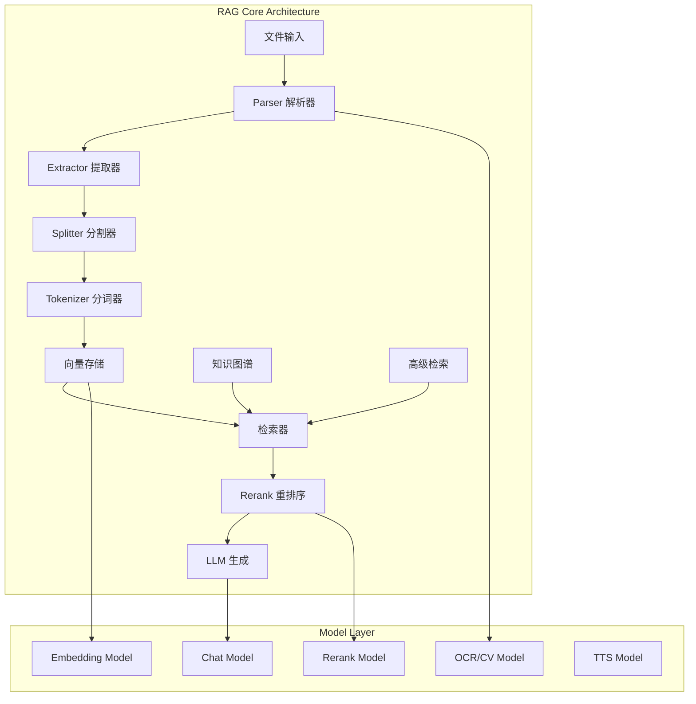
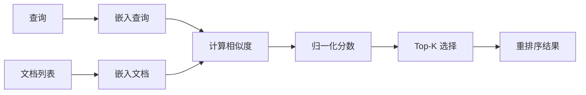
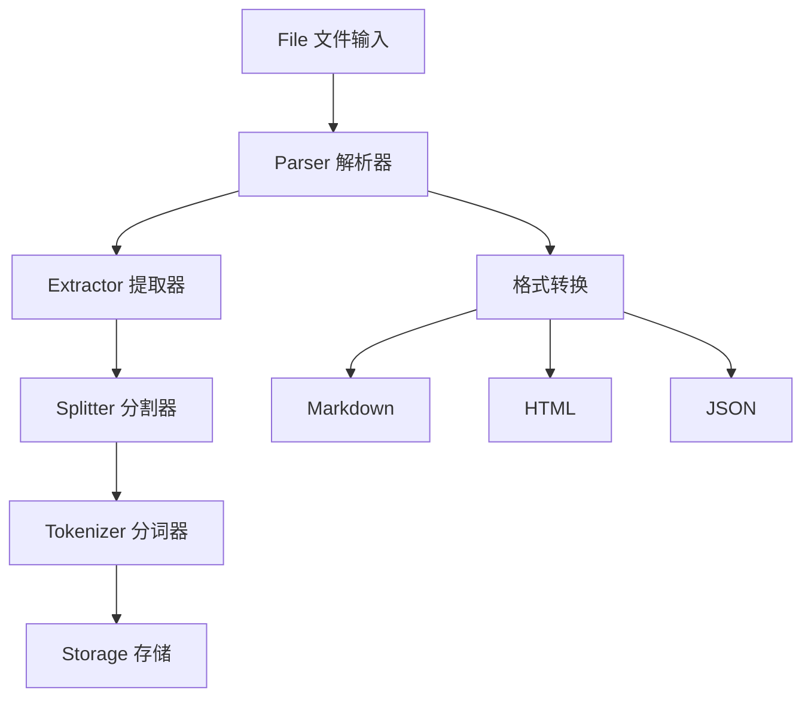
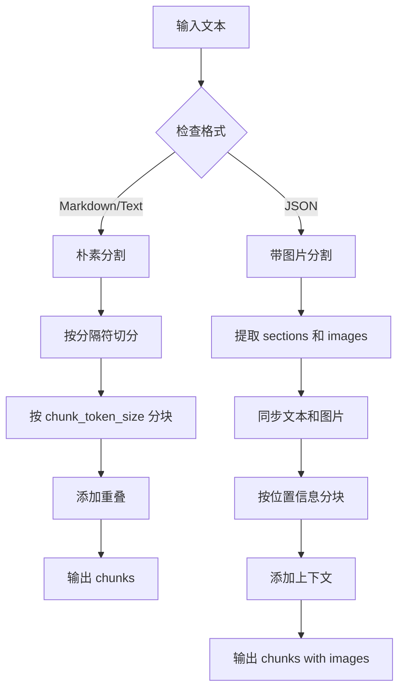
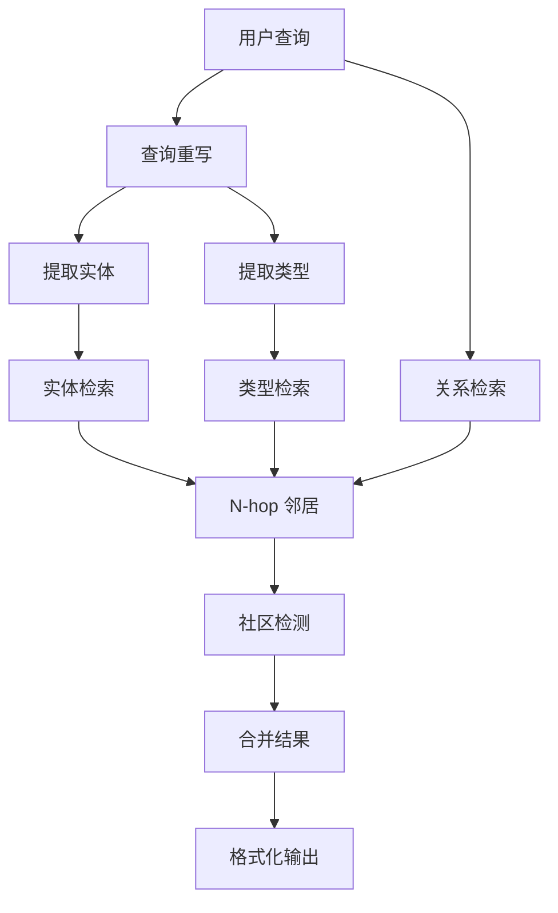
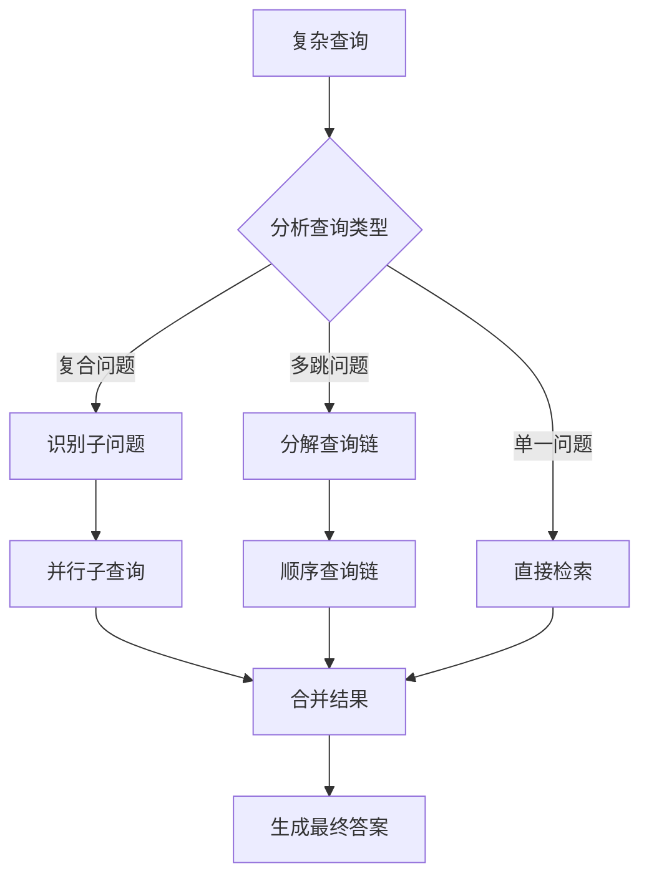
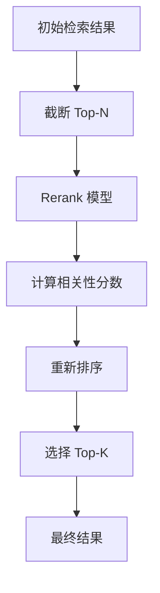

# RAGFlow 核心 RAG 处理模块深度分析

## 目录

1. [概述](#概述)
2. [LLM 集成层](#llm-集成层)
3. [RAG 流水线](#rag-流水线)
4. [图 RAG (GraphRAG)](#图-rag-graphrag)
5. [高级 RAG](#高级-rag)
6. [NLP 处理](#nlp-处理)
7. [性能优化建议](#性能优化建议)

---

## 概述

RAGFlow 的核心 RAG (Retrieval-Augmented Generation) 处理模块位于 `rag/` 目录下，是一个模块化、可扩展的检索增强生成框架。该系统支持多种文档处理流程、知识图谱构建和高级检索策略。

### 核心架构图



---

## LLM 集成层

### 1. 模型抽象接口设计

RAGFlow 通过 `rag/llm/` 目录实现了统一的大模型接口抽象，支持多种模型类型和供应商。

#### 支持的模型类型

| 模型类型 | 说明 | 主要文件 |
|---------|------|---------|
| **Chat** | 对话生成模型 | `chat_model.py` |
| **Embedding** | 文本嵌入模型 | `embedding_model.py` |
| **Rerank** | 重排序模型 | `rerank_model.py` |
| **OCR** | 光学字符识别 | `ocr_model.py` |
| **CV** | 计算机视觉 | `cv_model.py` |
| **TTS** | 语音合成 | `tts_model.py` |
| **Sequence2Text** | 序列到文本 | `sequence2txt_model.py` |

#### 核心接口设计

```python
# 基础抽象类
class Base(ABC):
    def __init__(self, key, model_name, base_url, **kwargs):
        self.client = OpenAI(api_key=key, base_url=base_url)
        self.model_name = model_name
        self.max_retries = kwargs.get("max_retries", 5)
        self.base_delay = kwargs.get("retry_interval", 2.0)

    # 异步聊天接口
    async def async_chat(self, system, history, gen_conf={}, **kwargs):
        """异步对话生成"""
        pass

    # 流式聊天接口
    async def async_chat_streamly(self, system, history, gen_conf={}, **kwargs):
        """异步流式对话生成"""
        yield ans, total_tokens

    # 工具调用接口
    async def async_chat_with_tools(self, system: str, history: list, gen_conf: dict = {}):
        """带工具调用的对话生成"""
        pass
```

### 2. 供应商集成

#### 支持的主要供应商

RAGFlow 通过 LiteLLM 和自定义适配器支持 40+ 个模型供应商：

**主流供应商：**
- OpenAI (GPT-4, GPT-3.5, o1)
- Anthropic (Claude 3.5, Claude 3)
- Google (Gemini Pro, Gemini Ultra)
- Azure OpenAI
- AWS Bedrock

**中国供应商：**
- 阿里云通义千问 (Tongyi Qianwen)
- 百度千帆 (Baidu Yiyan)
- 智谱 AI (Zhipu AI)
- 月之暗面 (Moonshot)
- DeepSeek
- 腾讯混元 (Hunyuan)

**开源平台：**
- Xinference
- Ollama
- LocalAI
- VLLM
- GPUStack

#### 供应商配置映射

```python
# 默认 Base URL 配置
FACTORY_DEFAULT_BASE_URL = {
    SupportedLiteLLMProvider.OpenAI: "https://api.openai.com/v1",
    SupportedLiteLLMProvider.Anthropic: "https://api.anthropic.com/",
    SupportedLiteLLMProvider.Tongyi_Qianwen: "https://dashscope.aliyuncs.com/compatible-mode/v1",
    # ... 更多供应商
}

# 模型前缀映射
LITELLM_PROVIDER_PREFIX = {
    SupportedLiteLLMProvider.OpenAI: "openai/",
    SupportedLiteLLMProvider.Gemini: "gemini/",
    SupportedLiteLLMProvider.DeepSeek: "deepseek/",
    # ... 更多前缀
}
```

### 3. 错误处理与重试机制

#### 错误分类系统

```python
class LLMErrorCode(StrEnum):
    ERROR_RATE_LIMIT = "RATE_LIMIT_EXCEEDED"      # 速率限制
    ERROR_AUTHENTICATION = "AUTH_ERROR"            # 认证错误
    ERROR_INVALID_REQUEST = "INVALID_REQUEST"      # 无效请求
    ERROR_SERVER = "SERVER_ERROR"                  # 服务器错误
    ERROR_TIMEOUT = "TIMEOUT"                      # 超时
    ERROR_CONNECTION = "CONNECTION_ERROR"          # 连接错误
    ERROR_MODEL = "MODEL_ERROR"                    # 模型错误
    ERROR_MAX_RETRIES = "MAX_RETRIES_EXCEEDED"     # 超过最大重试次数
    ERROR_CONTENT_FILTER = "CONTENT_FILTERED"      # 内容过滤
    ERROR_QUOTA = "QUOTA_EXCEEDED"                 # 配额超限
```

#### 智能重试策略

```python
def _should_retry(self, error_code: str) -> bool:
    """判断是否应该重试"""
    return error_code in self._retryable_errors

@property
def _retryable_errors(self) -> set[str]:
    return {
        LLMErrorCode.ERROR_RATE_LIMIT,    # 速率限制可重试
        LLMErrorCode.ERROR_SERVER,        # 服务器错误可重试
    }

def _get_delay(self):
    """指数退避延迟"""
    return self.base_delay * random.uniform(10, 150)
```

### 4. Embedding 模型架构

#### 嵌入模型接口

```python
class Base(ABC):
    def encode(self, texts: list) -> tuple[np.ndarray, int]:
        """
        编码文本列表为向量

        Returns:
            (embeddings, token_count)
        """
        raise NotImplementedError

    def encode_queries(self, text: str) -> tuple[np.ndarray, int]:
        """
        编码查询文本（通常与文档编码不同）

        Returns:
            (embedding, token_count)
        """
        raise NotImplementedError
```

#### 支持的嵌入模型

| 模型 | 供应商 | 向量维度 | 最大长度 |
|-----|--------|---------|---------|
| text-embedding-3-small/large | OpenAI | 1536/3072 | 8191 |
| bge-large-zh-v1.5 | BAAI | 1024 | 512 |
| bge-m3 | BAAI | 1024 | 8192 |
| jina-embeddings-v4 | Jina | 1024 | 8196 |
| voyage-large-3 | Voyage AI | 1024 | 32000 |

### 5. Rerank 模型架构

#### 重排序模型接口

```python
class Base(ABC):
    def similarity(self, query: str, texts: list) -> tuple[np.ndarray, int]:
        """
        计算查询与文本列表的相关性分数

        Args:
            query: 查询文本
            texts: 候选文本列表

        Returns:
            (scores, token_count) - 相关性分数数组和 token 消耗
        """
        raise NotImplementedError
```

#### 重排序流程



---

## RAG 流水线

### 1. 流水线架构

RAG 流水线 (`rag/flow/`) 实现了完整的文档处理流程，采用组件化设计。

#### Pipeline 核心类

```python
class Pipeline(Graph):
    def __init__(self, dsl: str|dict, tenant_id=None, doc_id=None, task_id=None, flow_id=None):
        """
        Args:
            dsl: DSL (Domain Specific Language) 配置
            tenant_id: 租户 ID
            doc_id: 文档 ID
            task_id: 任务 ID
            flow_id: 流程 ID
        """
        super().__init__(dsl, tenant_id, task_id)
        self._doc_id = doc_id
        self._flow_id = flow_id
        self._kb_id = DocumentService.get_knowledgebase_id(doc_id)

    async def run(self, **kwargs):
        """执行流水线"""
        # 初始化日志
        REDIS_CONN.set_obj(log_key, [], 60 * 10)

        # 遍历组件路径
        while idx < len(self.path) and not self.error:
            cpn_obj = self.get_component_obj(self.path[idx])
            await cpn_obj.invoke(**last_cpn.output())
            idx += 1
            self.path.extend(cpn_obj.get_downstream())
```

#### 流水线组件



### 2. 文件处理入口 (File.py)

```python
class File(ProcessBase):
    component_name = "File"

    async def _invoke(self, **kwargs):
        if self._canvas._doc_id:
            # 从数据库获取文档
            e, doc = DocumentService.get_by_id(self._canvas._doc_id)
            self.set_output("name", doc.name)
        else:
            # 从上传文件获取
            file = kwargs.get("file")[0]
            self.set_output("name", file["name"])
            self.set_output("file", file)
```

### 3. Parser 解析器

#### 支持的文件格式

| 格式类别 | 支持格式 | 输出格式 |
|---------|---------|---------|
| **PDF** | .pdf | JSON, Markdown |
| **表格** | .xls, .xlsx, .csv | JSON, Markdown, HTML |
| **文档** | .doc, .docx | JSON, Markdown |
| **演示** | .ppt, .pptx | JSON |
| **图片** | .jpg, .png, .gif | JSON |
| **邮件** | .eml, .msg | Text, JSON |
| **音频** | .mp3, .wav, .flac | Text |
| **视频** | .mp4, .avi, .mkv | Text |

#### PDF 解析方法

```python
# 解析方法配置
parse_methods = {
    "deepdoc": "RAGFlow 内置深度学习解析器",
    "plain_text": "纯文本提取",
    "mineru": "MinerU OCR 引擎",
    "paddleocr": "PaddleOCR 引擎",
    "tcadp_parser": "腾讯云 ADP 解析",
    "vlm": "视觉语言模型解析"
}
```

#### Parser 实现示例

```python
class Parser(ProcessBase):
    def _pdf(self, name, blob):
        conf = self._param.setups["pdf"]
        parse_method = conf.get("parse_method", "")

        if parse_method.lower() == "deepdoc":
            # 使用 RAGFlowPdfParser
            bboxes = RAGFlowPdfParser().parse_into_bboxes(blob)
        elif parse_method.lower() == "mineru":
            # 使用 MinerU OCR
            ocr_model = LLMBundle(tenant_id, LLMType.OCR, llm_name=model_name)
            lines, _ = ocr_model.mdl.parse_pdf(filepath=name, binary=blob)
        # ... 其他解析方法

        # 输出为 JSON 或 Markdown
        if conf.get("output_format") == "json":
            self.set_output("json", bboxes)
        elif conf.get("output_format") == "markdown":
            self.set_output("markdown", mkdn)
```

### 4. Splitter 分割器

#### 分割参数

```python
class SplitterParam(ProcessParamBase):
    chunk_token_size = 512        # 块大小（token 数）
    delimiters = ["\n"]           # 分隔符
    overlapped_percent = 0        # 重叠百分比 [0, 1)
    children_delimiters = []      # 子分隔符
    table_context_size = 0        # 表格上下文大小
    image_context_size = 0        # 图片上下文大小
```

#### 分割算法

```python
class Splitter(ProcessBase):
    async def _invoke(self, **kwargs):
        # 文本分割
        cks = naive_merge(
            payload,
            self._param.chunk_token_size,
            deli,
            overlapped_percent,
        )

        # 带图片的分割
        chunks, images = naive_merge_with_images(
            sections,
            section_images,
            self._param.chunk_token_size,
            deli,
            overlapped_percent,
        )
```

#### 分割流程图



### 5. Tokenizer 分词器

#### 分词参数

```python
class TokenizerParam(ProcessParamBase):
    search_method = ["full_text", "embedding"]  # 搜索方法
    filename_embd_weight = 0.1                   # 文件名嵌入权重
    fields = ["text"]                            # 要分词的字段
```

#### 分词处理流程

```python
class Tokenizer(ProcessBase):
    async def _invoke(self, **kwargs):
        # 全文搜索分词
        if "full_text" in self._param.search_method:
            for ck in chunks:
                ck["title_tks"] = rag_tokenizer.tokenize(name)
                ck["title_sm_tks"] = rag_tokenizer.fine_grained_tokenize(ck["title_tks"])
                ck["content_ltks"] = rag_tokenizer.tokenize(ck["text"])
                ck["content_sm_ltks"] = rag_tokenizer.fine_grained_tokenize(ck["content_ltks"])

        # 嵌入向量生成
        if "embedding" in self._param.search_method:
            chunks, token_count = await self._embedding(name, chunks)
```

#### 分词方法

```python
# 粗粒度分词
def tokenize(text):
    """使用jieba进行中文分词"""
    return list(jieba.cut(text))

# 细粒度分词
def fine_grained_tokenize(tokens):
    """进一步的细粒度分词"""
    # 实现细粒度分词逻辑
    pass
```

---

## 图 RAG (GraphRAG)

### 1. 知识图谱架构

RAGFlow 的 GraphRAG 实现位于 `rag/graphrag/`，支持知识图谱构建、实体关系抽取和图查询。

#### GraphRAG 组件

```
rag/graphrag/
├── search.py              # 图搜索
├── entity_resolution.py   # 实体解析
├── utils.py              # 工具函数
├── query_analyze_prompt.py  # 查询分析提示
├── light/                # 轻量级 GraphRAG
│   ├── graph_extractor.py
│   └── graph_prompt.py
└── general/              # 通用 GraphRAG
```

### 2. 知识图谱查询

#### KGSearch 类

```python
class KGSearch(Dealer):
    async def retrieval(
        self,
        question: str,
        tenant_ids: str | list[str],
        kb_ids: list[str],
        emb_mdl,
        llm,
        max_token: int = 8196,
        ent_topn: int = 6,
        rel_topn: int = 6,
        comm_topn: int = 1,
        ent_sim_threshold: float = 0.3,
        rel_sim_threshold: float = 0.3,
    ):
        """
        知识图谱检索

        Returns:
            {
                "content_with_weight": "实体+关系+社区报告",
                "docnm_kwd": "Related content in Knowledge Graph",
                ...
            }
        """
```

#### 图查询流程



#### 查询重写

```python
async def query_rewrite(self, llm, question, idxnms, kb_ids):
    """使用 LLM 重写查询，提取实体和类型"""

    # 获取实体类型样本
    ty2ents = await get_entity_type2samples(idxnms, kb_ids)

    # 构造提示
    hint_prompt = PROMPTS["minirag_query2kwd"].format(
        query=question,
        TYPE_POOL=json.dumps(ty2ents, ensure_ascii=False, indent=2)
    )

    # LLM 生成
    result = await self._chat(llm, hint_prompt, [{"role": "user", "content": "Output:"}], {})

    # 解析结果
    keywords_data = json_repair.loads(result)
    type_keywords = keywords_data.get("answer_type_keywords", [])
    entities_from_query = keywords_data.get("entities_from_query", [])[:5]

    return type_keywords, entities_from_query
```

### 3. 实体和关系抽取

#### 图提取器

```python
class GraphExtractor:
    async def extract_entities_and_relations(
        self,
        text: str,
        llm,
        entity_types: list[str] = None
    ):
        """
        从文本中提取实体和关系

        Returns:
            {
                "entities": [{"name": "...", "type": "..."}],
                "relations": [{"from": "...", "to": "...", "type": "..."}]
            }
        """
```

#### 实体解析

```python
class EntityResolution:
    """实体消歧和合并"""

    def resolve_entities(
        self,
        entities: list[dict],
        similarity_threshold: float = 0.85
    ) -> list[dict]:
        """
        合并相似实体

        Args:
            entities: 实体列表
            similarity_threshold: 相似度阈值

        Returns:
            合并后的实体列表
        """
```

### 4. 图检索算法

#### 实体检索

```python
def get_relevant_ents_by_keywords(
    self,
    keywords: list[str],
    filters: dict,
    idxnms: list[str],
    kb_ids: list[str],
    emb_mdl,
    sim_thr: float = 0.3,
    N: int = 56
):
    """通过关键词检索相关实体"""

    # 向量检索
    filters["knowledge_graph_kwd"] = "entity"
    matchDense = self.get_vector(", ".join(keywords), emb_mdl, 1024, sim_thr)

    # ES 搜索
    es_res = self.dataStore.search(
        ["content_with_weight", "entity_kwd", "rank_flt"],
        [], filters, [matchDense],
        OrderByExpr(), 0, N,
        idxnms, kb_ids
    )

    return self._ent_info_from_(es_res, sim_thr)
```

#### 关系检索

```python
def get_relevant_relations_by_txt(
    self,
    txt: str,
    filters: dict,
    idxnms: list[str],
    kb_ids: list[str],
    emb_mdl,
    sim_thr: float = 0.3,
    N: int = 56
):
    """通过文本检索相关关系"""

    filters["knowledge_graph_kwd"] = "relation"
    matchDense = self.get_vector(txt, emb_mdl, 1024, sim_thr)

    es_res = self.dataStore.search(
        ["content_with_weight", "_score", "from_entity_kwd", "to_entity_kwd", "weight_int"],
        [], filters, [matchDense],
        OrderByExpr(), 0, N, idxnms, kb_ids
    )

    return self._relation_info_from_(es_res, sim_thr)
```

#### PageRank 排序

```python
# 实体检索排序：P(E|Q) = P(E) * P(Q|E) = pagerank * sim
for ent in ents_from_types.keys():
    if ent in ents_from_query:
        ents_from_query[ent]["sim"] *= 2

# 关系检索排序
for (f, t) in rels_from_txt.keys():
    pair = tuple(sorted([f, t]))
    s = 0
    if pair in nhop_pathes:
        s += nhop_pathes[pair]["sim"]
    if f in ents_from_types:
        s += 1
    if t in ents_from_types:
        s += 1
    rels_from_txt[(f, t)]["sim"] *= s + 1
```

---

## 高级 RAG

### 1. 树结构查询分解

位于 `rag/advanced_rag/tree_structured_query_decomposition_retrieval.py`

#### 查询分解算法

```python
async def tree_decomposition(
    self,
    query: str,
    llm,
    max_depth: int = 3
) -> list[str]:
    """
    将复杂查询分解为树状子查询结构

    Args:
        query: 原始查询
        llm: LLM 模型
        max_depth: 最大分解深度

    Returns:
        子查询列表
    """
```

#### 查询分解流程



### 2. 混合检索模式

#### 检索策略组合

```python
class HybridRetrieval:
    async def hybrid_search(
        self,
        query: str,
        kb_ids: list[str],
        emb_mdl,
        methods: list[str] = ["vector", "keyword", "graph"]
    ):
        """
        混合检索：结合多种检索方式

        Args:
            query: 查询文本
            kb_ids: 知识库 ID 列表
            emb_mdl: 嵌入模型
            methods: 检索方法列表
                - "vector": 向量检索
                - "keyword": 关键词检索
                - "graph": 知识图谱检索
                - "fulltext": 全文检索
        """
```

#### 检索融合策略

```python
# RRF (Reciprocal Rank Fusion) 融合
def rrf_fusion(
    results_list: list[list[dict]],
    k: int = 60
) -> list[dict]:
    """
    使用 RRF 算法融合多个检索结果

    Args:
        results_list: 多个检索结果列表
        k: RRF 常数

    Returns:
        融合后的排序结果
    """
    score_map = defaultdict(float)

    for results in results_list:
        for rank, doc in enumerate(results):
            doc_id = doc["id"]
            score_map[doc_id] += 1 / (k + rank + 1)

    # 按融合分数排序
    sorted_docs = sorted(score_map.items(), key=lambda x: x[1], reverse=True)
    return sorted_docs
```

### 3. 重排序机制

#### Rerank 流程



#### Rerank 实现

```python
async def rerank_results(
    self,
    query: str,
    documents: list[dict],
    rerank_mdl,
    top_k: int = 10
) -> list[dict]:
    """
    使用 Rerank 模型重新排序

    Args:
        query: 查询文本
        documents: 文档列表
        rerank_mdl: Rerank 模型
        top_k: 返回的文档数量

    Returns:
        重排序后的文档列表
    """
    # 提取文本
    texts = [doc["text"] for doc in documents]

    # 计算 Rerank 分数
    scores, _ = rerank_mdl.similarity(query, texts)

    # 更新分数并排序
    for doc, score in zip(documents, scores):
        doc["rerank_score"] = float(score)

    # 按分数排序
    documents.sort(key=lambda x: x["rerank_score"], reverse=True)

    return documents[:top_k]
```

---

## NLP 处理

### 1. NLP 工具模块

位于 `rag/nlp/`，提供自然语言处理的基础工具。

#### 主要功能

```python
# 分词
def rag_tokenizer.tokenize(text: str) -> list[str]:
    """文本分词"""

# 细粒度分词
def rag_tokenizer.fine_grained_tokenize(tokens: list[str]) -> list[str]:
    """细粒度分词"""

# 语言检测
def is_chinese(text: str) -> bool:
    """检测是否为中文"""

def is_english(text: str) -> bool:
    """检测是否为英文"""

# 文本合并
def naive_merge(
    text: str,
    chunk_token_size: int,
    delimiters: str,
    overlapped_percent: float
) -> list[str]:
    """朴素文本分块"""

def naive_merge_with_images(
    sections: list,
    images: list,
    chunk_token_size: int,
    delimiters: str,
    overlapped_percent: float
) -> tuple[list[str], list]:
    """带图片的文本分块"""
```

### 2. 文本预处理

#### 清洗流程

```python
def preprocess_text(text: str) -> str:
    """
    文本预处理

    1. 去除特殊字符
    2. 标准化空白
    3. 去除 HTML 标签
    4. 处理连续字符
    """
    # 去除 HTML 标签
    text = re.sub(r'<[^>]+>', '', text)

    # 标准化空白
    text = re.sub(r'\s+', ' ', text)

    # 去除特殊字符
    text = re.sub(r'[\x00-\x1f\x7f-\x9f]', '', text)

    return text.strip()
```

### 3. 上下文附加

```python
def attach_media_context(
    chunks: list[dict],
    table_context_size: int,
    image_context_size: int
):
    """
    为表格和图片附加上下文

    Args:
        chunks: 文档块列表
        table_context_size: 表格上下文大小
        image_context_size: 图片上下文大小
    """
    for i, chunk in enumerate(chunks):
        # 表格上下文
        if chunk.get("doc_type_kwd") == "table" and table_context_size > 0:
            context_chunks = chunks[max(0, i-table_context_size):i]
            chunk["table_context"] = [c["text"] for c in context_chunks]

        # 图片上下文
        if chunk.get("doc_type_kwd") == "image" and image_context_size > 0:
            context_chunks = chunks[max(0, i-image_context_size):i]
            chunk["image_context"] = [c["text"] for c in context_chunks]
```

---

## 性能优化建议

### 1. 批处理优化

#### Embedding 批处理

```python
# 批量编码优化
batch_size = 16
for i in range(0, len(texts), batch_size):
    embeddings, token_count = embedding_model.encode(
        texts[i:i + batch_size]
    )
```

**建议：**
- 调整 `EMBEDDING_BATCH_SIZE` 环境变量（默认 16）
- 根据模型和硬件选择最优批大小
- 使用 GPU 加速时可以增大批大小

### 2. 缓存策略

#### LLM 缓存

```python
def get_llm_cache(llm_name, system, history, gen_conf):
    """获取 LLM 缓存"""
    cache_key = generate_cache_key(llm_name, system, history, gen_conf)
    return REDIS_CONN.get(cache_key)

def set_llm_cache(llm_name, response, history, gen_conf):
    """设置 LLM 缓存"""
    cache_key = generate_cache_key(llm_name, system, history, gen_conf)
    REDIS_CONN.set(cache_key, response, ex=3600)  # 1小时过期
```

**建议：**
- 对相似查询启用缓存
- 设置合理的缓存过期时间
- 使用 Redis 集群提高缓存可用性

### 3. 并发处理

#### 异步任务执行

```python
# 并发图片处理
tasks = []
for chunk in chunks:
    tasks.append(asyncio.create_task(
        image2id(chunk, storage_put_fn, get_uuid())
    ))

# 等待所有任务完成
await asyncio.gather(*tasks, return_exceptions=False)
```

**建议：**
- 使用 `asyncio.gather` 并发执行独立任务
- 控制并发数量避免资源耗尽
- 使用连接池管理数据库和外部 API 连接

### 4. 向量检索优化

#### 索引优化

```python
# 向量索引配置
vector_index_config = {
    "index_type": "hnsw",        # 使用 HNSW 算法
    "m": 16,                     # 连接数
    "ef_construction": 200,      # 构建时的搜索深度
    "ef_search": 100,            # 搜索时的深度
}
```

**建议：**
- 使用 HNSW 索引提高检索速度
- 调整 `ef_search` 平衡速度和精度
- 定期重建索引优化性能

### 5. 内存优化

#### 分块处理

```python
# 大文件分块处理
def process_large_file(file_path, chunk_size=1024*1024):
    """分块处理大文件"""
    with open(file_path, 'rb') as f:
        while True:
            chunk = f.read(chunk_size)
            if not chunk:
                break
            yield chunk
```

**建议：**
- 对大文件使用流式处理
- 及时释放不需要的内存
- 使用生成器而非列表存储中间结果

### 6. 模型选择优化

#### 模型性能对比

| 任务 | 推荐模型 | 速度 | 质量 |
|-----|---------|------|------|
| **Embedding** | bge-small-zh-v1.5 | ⚡⚡⚡ | ⭐⭐⭐ |
| **Embedding** | bge-large-zh-v1.5 | ⚡⚡ | ⭐⭐⭐⭐⭐ |
| **Rerank** | bge-reranker-v2-m3 | ⚡⚡ | ⭐⭐⭐⭐ |
| **Chat** | Qwen2.5-7B-Instruct | ⚡⚡⚡ | ⭐⭐⭐⭐ |
| **Chat** | GPT-4o | ⚡ | ⭐⭐⭐⭐⭐ |

**建议：**
- 根据场景选择合适的模型
- 使用量化模型减少显存占用
- 对实时性要求高的场景选择更快的小模型

### 7. 监控和调优

#### 性能监控指标

```python
# 关键指标监控
metrics = {
    "embedding_latency": "嵌入延迟",
    "retrieval_latency": "检索延迟",
    "rerank_latency": "重排序延迟",
    "llm_latency": "LLM 生成延迟",
    "total_latency": "总延迟",
    "token_consumption": "Token 消耗",
    "cache_hit_rate": "缓存命中率",
}
```

**建议：**
- 使用 Prometheus + Grafana 监控性能
- 设置告警阈值
- 定期分析性能瓶颈并优化

---

## 总结

RAGFlow 的核心 RAG 处理模块具有以下特点：

### 优势

1. **模块化设计**: 组件化架构，易于扩展和定制
2. **多模型支持**: 集成 40+ 个模型供应商，灵活切换
3. **完整流程**: 从文档解析到检索生成的完整 RAG 流程
4. **GraphRAG 支持**: 先进的知识图谱检索能力
5. **高性能**: 异步处理、批处理、缓存等优化策略

### 适用场景

- **企业知识库**: 大规模文档检索和问答
- **智能客服**: 基于知识库的自动问答
- **文档理解**: 复杂文档的解析和提取
- **知识图谱**: 实体关系抽取和图查询
- **RAG 应用**: 需要检索增强的各类应用

### 发展方向

1. **更多模型支持**: 持续集成新的模型供应商
2. **性能优化**: 更快的检索和生成速度
3. **多模态支持**: 图片、视频、音频的理解和检索
4. **分布式处理**: 支持大规模分布式部署
5. **自定义流程**: 更灵活的流程编排能力

---

**文档版本**: 1.0
**最后更新**: 2025-02-09
**作者**: RAGFlow 分析团队
