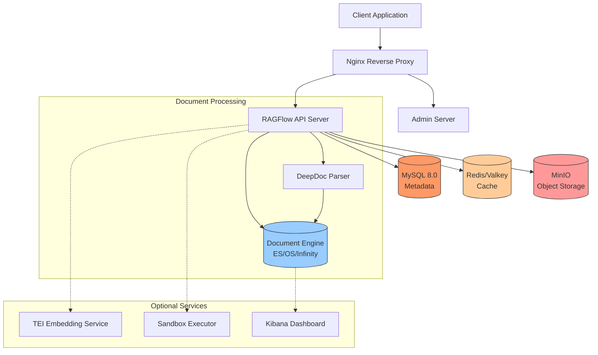
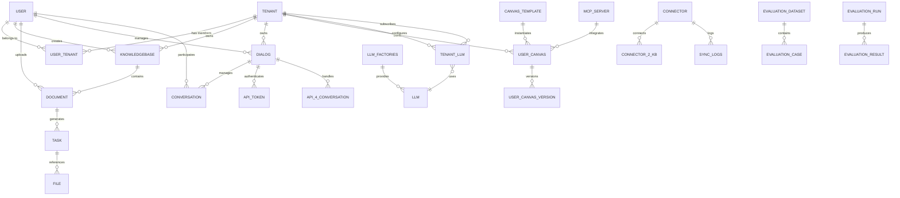
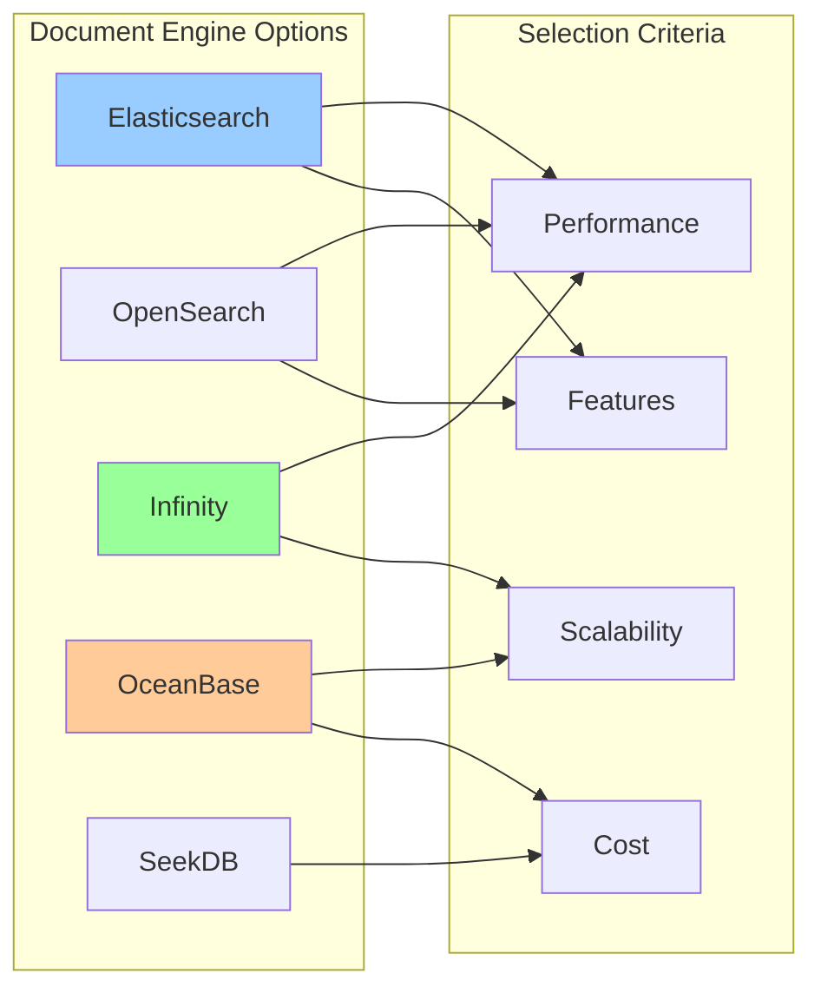
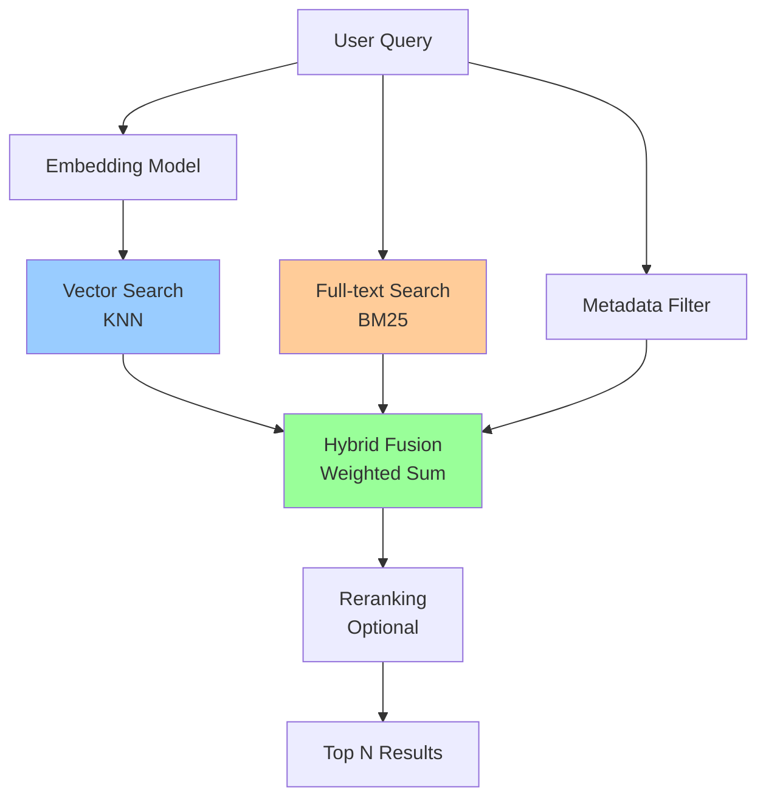
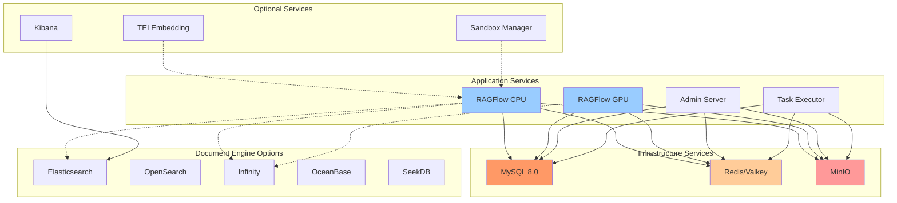
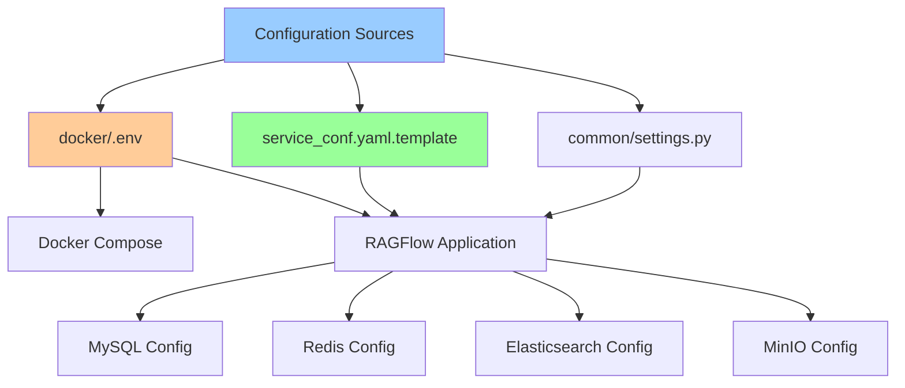
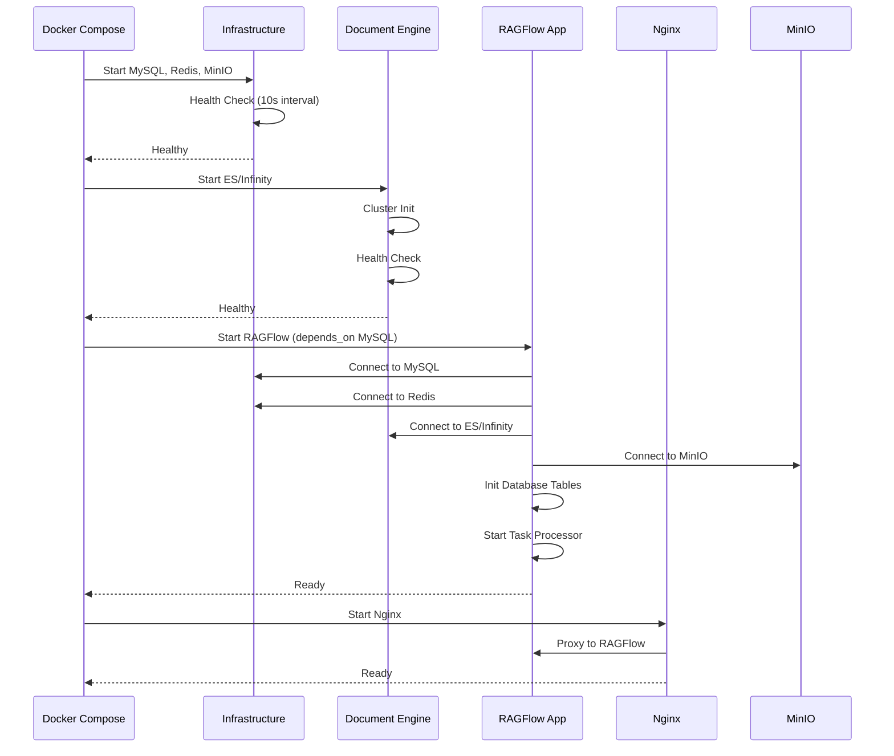

# RAGFlow Database and Deployment Analysis

**Author**: devops-analyst
**Date**: 2025-02-09
**Version**: 1.0

## Table of Contents

1. [Overview](#overview)
2. [Database Architecture](#database-architecture)
3. [MySQL Database Design](#mysql-database-design)
4. [Document Storage Systems](#document-storage-systems)
5. [Cache System](#cache-system)
6. [Object Storage](#object-storage)
7. [Docker Deployment](#docker-deployment)
8. [Service Configuration](#service-configuration)
9. [Startup and Health Check](#startup-and-health-check)
10. [Performance Optimization](#performance-optimization)
11. [Monitoring and Troubleshooting](#monitoring-and-troubleshooting)

---

## Overview

RAGFlow employs a sophisticated multi-database architecture designed for scalability, performance, and reliability. The system integrates:

- **MySQL 8.0**: Primary relational database for metadata and user data
- **Elasticsearch/OpenSearch/Infinity**: Document storage and vector search engine
- **Redis/Valkey**: Distributed caching and message queue
- **MinIO**: S3-compatible object storage for files



---

## Database Architecture

### Multi-Database Strategy

RAGFlow uses a polyglot persistence architecture, selecting the optimal database for each use case:

| Database | Purpose | Data Type | Performance |
|----------|---------|-----------|-------------|
| **MySQL** | Structured data, user management, metadata | Relational | ACID transactions |
| **Elasticsearch** | Full-text search, vector similarity | Document-oriented | Near real-time search |
| **Infinity** | High-performance vector search | Vector database | Optimized for embeddings |
| **Redis** | Caching, session management, rate limiting | Key-value | Sub-millisecond latency |
| **MinIO** | File storage, documents, images | Object storage | S3-compatible |

### Database Connection Management

RAGFlow implements a sophisticated connection pooling system with automatic retry logic:

```python
# Connection Pool Configuration
mysql:
  max_connections: 900
  stale_timeout: 300
  max_allowed_packet: 1073741824  # 1GB

# Retry Mechanism
class RetryingPooledMySQLDatabase:
    max_retries: 5
    retry_delay: 1  # seconds (exponential backoff)
```

**Key Features**:
- **Automatic Reconnection**: Handles connection loss gracefully
- **Exponential Backoff**: `delay * (2 ** attempt)`
- **Connection Pooling**: Reduces connection overhead
- **Health Monitoring**: Stale connection detection and cleanup

---

## MySQL Database Design

### Database Models

RAGFlow defines 32+ database models in `api/db/db_models.py`, covering all aspects of the system.

### Core Entity Relationships



### Table Structure Summary

#### User Management Tables

| Table | Purpose | Key Fields |
|-------|---------|------------|
| **user** | User accounts | `id`, `email`, `password`, `nickname`, `language`, `timezone` |
| **tenant** | Multi-tenant organizations | `id`, `name`, `llm_id`, `embd_id`, `credit`, `status` |
| **user_tenant** | User-tenant relationships | `user_id`, `tenant_id`, `role`, `invited_by` |
| **invitation_code** | Invitation system | `code`, `user_id`, `tenant_id`, `status` |

#### Knowledge Base Tables

| Table | Purpose | Key Fields |
|-------|---------|------------|
| **knowledgebase** | Knowledge base metadata | `id`, `tenant_id`, `name`, `embd_id`, `parser_id`, `similarity_threshold` |
| **document** | Document metadata | `id`, `kb_id`, `name`, `location`, `size`, `token_num`, `chunk_num`, `progress` |
| **task** | Processing tasks | `id`, `doc_id`, `task_type`, `priority`, `progress`, `status` |
| **file** | File system | `id`, `parent_id`, `tenant_id`, `name`, `location`, `size` |

#### Conversation Tables

| Table | Purpose | Key Fields |
|-------|---------|------------|
| **dialog** | Chat configuration | `id`, `tenant_id`, `llm_id`, `llm_setting`, `similarity_threshold`, `kb_ids` |
| **conversation** | Chat history | `id`, `dialog_id`, `message`, `reference`, `user_id` |
| **api_4_conversation** | API conversations | `id`, `dialog_id`, `message`, `tokens`, `duration`, `round` |

#### Agent/Canvas Tables

| Table | Purpose | Key Fields |
|-------|---------|------------|
| **user_canvas** | User workflows | `id`, `user_id`, `dsl`, `canvas_type`, `permission` |
| **canvas_template** | Reusable templates | `id`, `title`, `description`, `dsl`, `canvas_category` |
| **mcp_server** | MCP integrations | `id`, `tenant_id`, `url`, `server_type`, `config` |

### Database Indexing Strategy

#### Primary Indexes

```python
# Composite Primary Keys
class LLM(DataBaseModel):
    class Meta:
        primary_key = CompositeKey("fid", "llm_name")

class TenantLLM(DataBaseModel):
    class Meta:
        primary_key = CompositeKey("tenant_id", "llm_factory", "llm_name")

class APIToken(DataBaseModel):
    class Meta:
        primary_key = CompositeKey("tenant_id", "token")
```

#### Secondary Indexes

All tables include comprehensive indexing for query optimization:

```python
# Example: Knowledgebase table
id = CharField(max_length=32, primary_key=True)
tenant_id = CharField(max_length=32, null=False, index=True)
name = CharField(max_length=128, null=False, index=True)
language = CharField(max_length=32, null=True, index=True)
embd_id = CharField(max_length=128, null=False, index=True)
parser_id = CharField(max_length=32, null=False, index=True)
similarity_threshold = FloatField(default=0.2, index=True)
```

**Index Types**:
- **B-tree indexes**: Default for most fields
- **Composite indexes**: Multi-column queries
- **Timestamp indexes**: Time-based filtering

### Database Migration System

```python
def migrate_db():
    migrator = DatabaseMigrator[settings.DATABASE_TYPE.upper()].value(DB)

    # Add new columns
    alter_db_add_column(migrator, "table_name", "column_name", FieldType)

    # Alter column types
    alter_db_column_type(migrator, "table_name", "column_name", NewFieldType)

    # Rename columns
    alter_db_rename_column(migrator, "table_name", "old_name", "new_name")
```

**Supported Databases**:
- MySQL 8.0+
- PostgreSQL (via `PooledPostgresqlDatabase`)
- OceanBase (MySQL-compatible)

---

## Document Storage Systems

RAGFlow supports multiple document storage engines with a unified interface.

### Engine Comparison



### Elasticsearch Configuration

**docker/.env**:
```bash
DOC_ENGINE=elasticsearch
STACK_VERSION=8.11.3
ES_HOST=es01
ES_PORT=1200
ELASTIC_PASSWORD=infini_rag_flow
MEM_LIMIT=8073741824  # ~8GB
```

**docker/docker-compose-base.yml**:
```yaml
es01:
  image: elasticsearch:${STACK_VERSION}
  environment:
    - cluster.routing.allocation.disk.watermark.low=5gb
    - cluster.routing.allocation.disk.watermark.high=3gb
    - cluster.routing.allocation.disk.watermark.flood_stage=2gb
    - xpack.security.enabled=true
    - discovery.type=single-node
  mem_limit: ${MEM_LIMIT}
  healthcheck:
    test: ["CMD-SHELL", "curl http://localhost:9200"]
    retries: 120
```

**Index Structure**:
```python
# Document Index Mapping
{
  "mappings": {
    "properties": {
      "kb_id": {"type": "keyword"},
      "doc_id": {"type": "keyword"},
      "chunk_id": {"type": "keyword"},
      "available_int": {"type": "integer"},
      "page_num_int": {"type": "integer"},
      "top_int": {"type": "integer"},
      "q_%": {"type": "rank_feature"},
      "q_emo": {"type": "rank_feature"},
      "tag_fld": {"type": "flattened"},
      "important_kwd": {"type": "keyword"},
      "docnm_kwd": {"type": "keyword"},
      "title_tks": {"type": "text"},
      "content_ltks": {"type": "text"},
      "content_sm_ltks": {"type": "text"},
      "q_1024": {"type": "dense_vector", "dims": 1024}
    }
  }
}
```

### Infinity Configuration

**docker/.env**:
```bash
DOC_ENGINE=infinity
INFINITY_HOST=infinity
INFINITY_THRIFT_PORT=23817
INFINITY_HTTP_PORT=23820
INFINITY_PSQL_PORT=5432
```

**docker/docker-compose-base.yml**:
```yaml
infinity:
  image: infiniflow/infinity:v0.7.0-dev2
  command: ["-f", "/infinity_conf.toml"]
  ports:
    - ${INFINITY_THRIFT_PORT}:23817
    - ${INFINITY_HTTP_PORT}:23820
    - ${INFINITY_PSQL_PORT}:5432
  ulimits:
    nofile:
      soft: 500000
      hard: 500000
```

**Advantages**:
- Higher performance for vector operations
- Lower memory footprint
- PostgreSQL protocol support
- Better scalability

### Search Implementation

**Hybrid Search Architecture**:



**Query Example**:
```python
# Search with hybrid scoring
match_expressions = [
    MatchTextExpr(
        fields=["title_tks", "content_ltks"],
        matching_text=query_text,
        minimum_should_match=0.3
    ),
    MatchDenseExpr(
        vector_column_name="q_1024",
        embedding_data=embedding,
        topn=1024,
        similarity="cosine"
    ),
    FusionExpr(
        method="weighted_sum",
        fusion_params={"weights": f"{1-vector_weight},{vector_weight}"}
    )
]
```

---

## Cache System

### Redis/Valkey Configuration

**docker/.env**:
```bash
REDIS_HOST=redis
REDIS_PORT=6379
REDIS_PASSWORD=infini_rag_flow
```

**docker/docker-compose-base.yml**:
```yaml
redis:
  image: valkey/valkey:8
  command: [
    "redis-server",
    "--requirepass", "${REDIS_PASSWORD}",
    "--maxmemory", "128mb",
    "--maxmemory-policy", "allkeys-lru"
  ]
  healthcheck:
    test: ["CMD", "redis-cli", "-a", "${REDIS_PASSWORD}", "ping"]
    retries: 120
```

### Cache Usage Patterns

#### 1. Session Management

```python
# User sessions
redis.set(f"session:{user_id}", session_data, ex=3600)
```

#### 2. Rate Limiting

```python
# Token bucket algorithm (Lua script)
LUA_TOKEN_BUCKET_SCRIPT = """
    local capacity = tonumber(ARGV[1])
    local rate = tonumber(ARGV[2])
    local now = tonumber(ARGV[3])
    local cost = tonumber(ARGV[4])

    local data = redis.call("HMGET", key, "tokens", "timestamp")
    local tokens = tonumber(data[1])
    local last_ts = tonumber(data[2])

    if tokens == nil then
        tokens = capacity
        last_ts = now
    end

    local delta = math.max(0, now - last_ts)
    tokens = math.min(capacity, tokens + delta * rate)

    if tokens < cost then
        return {0, tokens}
    end

    tokens = tokens - cost
    redis.call("HMSET", key, "tokens", tokens, "timestamp", now)
    redis.call("EXPIRE", key, math.ceil(capacity / rate * 2))

    return {1, tokens}
"""
```

#### 3. Message Queue

```python
# Stream-based message queue
consumer_name = f"{service_name}-{uuid.uuid4()}"
consumer_group = "task_queue"

# Create consumer group
try:
    redis.xgroup_create(queue_name, consumer_group, id='0', mkstream=True)
except ResponseError:
    pass  # Group already exists

# Consume messages
messages = redis.xreadgroup(
    consumer_group,
    consumer_name,
    {queue_name: '>'},
    count=1,
    block=1000  # 1 second timeout
)
```

#### 4. Distributed Lock

```python
# Database-level locks (MySQL/PostgreSQL)
class MysqlDatabaseLock:
    def lock(self):
        cursor = db.execute_sql(
            "SELECT GET_LOCK(%s, %s)",
            (self.lock_name, self.timeout)
        )

    def unlock(self):
        cursor = db.execute_sql(
            "SELECT RELEASE_LOCK(%s)",
            (self.lock_name,)
        )

# Usage
with DB.lock("init_database_tables", 60):
    init_database_tables()
```

### Cache Key Naming Convention

```
# Pattern
{prefix}:{type}:{id}:{attribute}

# Examples
session:user:123:data
cache:embedding:model:qwen
lock:document:456:process
rate_limit:api:user:789
queue:task:processing
stream:task:worker:1
```

### Cache Expiration Strategy

| Data Type | TTL | Reason |
|-----------|-----|--------|
| User Sessions | 1 hour | Security |
| API Rate Limits | Dynamic | Based on rate |
| Embeddings | 24 hours | Stability |
| Search Results | 5 minutes | Freshness |
| Locks | Timeout | Prevent deadlock |

---

## Object Storage

### MinIO Configuration

**docker/.env**:
```bash
MINIO_HOST=minio
MINIO_PORT=9000
MINIO_CONSOLE_PORT=9001
MINIO_USER=rag_flow
MINIO_PASSWORD=infini_rag_flow
```

**docker/docker-compose-base.yml**:
```yaml
minio:
  image: quay.io/minio/minio:RELEASE.2025-06-13T11-33-47Z
  command: ["server", "--console-address", ":9001", "/data"]
  environment:
    - MINIO_ROOT_USER=${MINIO_USER}
    - MINIO_ROOT_PASSWORD=${MINIO_PASSWORD}
  volumes:
    - minio_data:/data
  healthcheck:
    test: ["CMD", "curl", "-f", "http://localhost:9000/minio/health/live"]
```

### File Storage Strategy

#### Storage Hierarchy

```
minio_data/
├── {bucket}/
│   ├── {tenant_id}/
│   │   ├── files/
│   │   │   └── {file_id}
│   │   ├── documents/
│   │   │   └── {doc_id}/
│   │   │       ├── original
│   │   │       ├── parsed
│   │   │       └── chunks/
│   │   └── avatars/
│   │       └── {user_id}
```

#### Storage Configuration

```python
# With default bucket (single-bucket mode)
MINIO = {
    "host": "minio:9000",
    "user": "rag_flow",
    "password": "infini_rag_flow",
    "bucket": "ragflow",  # Optional: Single bucket for all data
    "prefix_path": ""  # Optional: Add prefix to all objects
}

# Without default bucket (multi-bucket mode)
MINIO = {
    "host": "minio:9000",
    "user": "rag_flow",
    "password": "infini_rag_flow",
    "bucket": "",  # Empty = Multi-bucket mode
    "prefix_path": ""
}
```

#### File Operations

```python
@use_default_bucket
@use_prefix_path
def download(self, bucket, fnm):
    # With bucket="tenant_123" and prefix_path="production"
    # Downloads from: {bucket}/production/tenant_123/{fnm}
    response = self.conn.get_object(bucket, fnm)
    return response.read()

@use_default_bucket
@use_prefix_path
def upload(self, bucket, fnm, data):
    # Uploads to: {bucket}/production/tenant_123/{fnm}
    self.conn.put_object(bucket, fnm, data, length=len(data))
```

### Alternative Storage Backends

RAGFlow supports S3-compatible storage:

**service_conf.yaml.template**:
```yaml
# AWS S3
s3:
  access_key: 'your_access_key'
  secret_key: 'your_secret_key'
  region: 'us-east-1'
  endpoint_url: 'https://s3.amazonaws.com'
  bucket: 'ragflow-storage'
  prefix_path: 'production'
  signature_version: 'v4'
  addressing_style: 'virtual'

# Alibaba OSS
oss:
  access_key: '${ACCESS_KEY}'
  secret_key: '${SECRET_KEY}'
  endpoint_url: '${ENDPOINT}'
  region: '${REGION}'
  bucket: '${BUCKET}'
  prefix_path: '${OSS_PREFIX_PATH}'
  signature_version: 's3'
  addressing_style: 'virtual'

# Azure Storage
azure:
  auth_type: 'sas'  # or 'spn'
  container_url: 'https://account.blob.core.windows.net/container'
  sas_token: 'your_sas_token'
```

---

## Docker Deployment

### Docker Compose Architecture



### Service Dependencies

```yaml
# docker-compose.yml
ragflow-cpu:
  depends_on:
    mysql:
      condition: service_healthy

ragflow-gpu:
  depends_on:
    mysql:
      condition: service_healthy

kibana:
  depends_on:
    es01:
      condition: service_started
```

### Network Configuration

**docker/docker-compose-base.yml**:
```yaml
networks:
  ragflow:
    driver: bridge

services:
  mysql:
    networks:
      - ragflow

  redis:
    networks:
      - ragflow

  ragflow-cpu:
    networks:
      - ragflow
```

**Network Characteristics**:
- **Type**: Bridge network
- **Isolation**: Services can communicate by container name
- **External Access**: Ports exposed to host machine
- **DNS**: Built-in Docker DNS resolution

### Volume Management

```yaml
volumes:
  esdata01:
    driver: local
  osdata01:
    driver: local
  infinity_data:
    driver: local
  mysql_data:
    driver: local
  minio_data:
    driver: local
  redis_data:
    driver: local
```

**Volume Locations**:
- Docker managed: `/var/lib/docker/volumes/{volume_name}/_data`
- Bind mounts: `./oceanbase/data`, `./ragflow-logs`

### Resource Limits

```yaml
services:
  es01:
    mem_limit: ${MEM_LIMIT}  # 8GB
    ulimits:
      memlock:
        soft: -1
        hard: -1

  infinity:
    mem_limit: ${MEM_LIMIT}
    ulimits:
      nofile:
        soft: 500000
        hard: 500000

  ragflow-gpu:
    deploy:
      resources:
        reservations:
          devices:
            - driver: nvidia
              count: all
              capabilities: [gpu]
```

### Profile-Based Deployment

```bash
# docker/.env
DOC_ENGINE=elasticsearch  # or infinity, oceanbase, opensearch, seekdb
DEVICE=cpu  # or gpu

COMPOSE_PROFILES=${DOC_ENGINE},${DEVICE}

# Start services
docker compose --profile cpu --profile elasticsearch up -d

# GPU with Infinity
docker compose --profile gpu --profile infinity up -d

# With TEI embedding service
docker compose --profile gpu --profile infinity --profile tei-gpu up -d
```

---

## Service Configuration

### Configuration Hierarchy



### Environment Variables

**docker/.env** Structure:

```bash
# Database Engine
DOC_ENGINE=elasticsearch  # elasticsearch|infinity|oceanbase|opensearch|seekdb

# Device Type
DEVICE=cpu  # cpu|gpu
COMPOSE_PROFILES=${DOC_ENGINE},${DEVICE}

# MySQL Configuration
MYSQL_HOST=mysql
MYSQL_PORT=3306
MYSQL_DBNAME=rag_flow
MYSQL_PASSWORD=infini_rag_flow
MYSQL_MAX_PACKET=1073741824

# Redis Configuration
REDIS_HOST=redis
REDIS_PORT=6379
REDIS_PASSWORD=infini_rag_flow

# MinIO Configuration
MINIO_HOST=minio:9000
MINIO_PORT=9000
MINIO_CONSOLE_PORT=9001
MINIO_USER=rag_flow
MINIO_PASSWORD=infini_rag_flow

# Elasticsearch Configuration
ES_HOST=es01
ES_PORT=1200
ELASTIC_PASSWORD=infini_rag_flow
STACK_VERSION=8.11.3

# Infinity Configuration
INFINITY_HOST=infinity
INFINITY_THRIFT_PORT=23817
INFINITY_HTTP_PORT=23820
INFINITY_PSQL_PORT=5432

# Service Ports
SVR_WEB_HTTP_PORT=80
SVR_WEB_HTTPS_PORT=443
SVR_HTTP_PORT=9380
ADMIN_SVR_HTTP_PORT=9381
SVR_MCP_PORT=9382

# Image Configuration
RAGFLOW_IMAGE=infiniflow/ragflow:v0.23.1

# Processing Configuration
DOC_BULK_SIZE=4  # Documents per batch
EMBEDDING_BATCH_SIZE=16  # Embeddings per batch

# Feature Flags
REGISTER_ENABLED=1  # User registration
USE_DOCLING=false  # DocLing parser

# Memory Configuration
MEM_LIMIT=8073741824  # 8GB for ES/Infinity
```

### Service Configuration File

**docker/service_conf.yaml.template**:

```yaml
# RAGFlow Main Service
ragflow:
  host: 0.0.0.0
  http_port: 9380

# Admin Service
admin:
  host: 0.0.0.0
  http_port: 9381

# MySQL Database
mysql:
  name: 'rag_flow'
  user: 'root'
  password: 'infini_rag_flow'
  host: 'mysql'
  port: 3306
  max_connections: 900
  stale_timeout: 300
  max_allowed_packet: 1073741824

# MinIO Object Storage
minio:
  user: 'rag_flow'
  password: 'infini_rag_flow'
  host: 'minio:9000'
  bucket: ''
  prefix_path: ''

# Elasticsearch
es:
  hosts: 'http://es01:9200'
  username: 'elastic'
  password: 'infini_rag_flow'

# Infinity
infinity:
  uri: 'infinity:23817'
  postgres_port: 5432
  db_name: 'default_db'

# Redis
redis:
  db: 1
  username: ''
  password: 'infini_rag_flow'
  host: 'redis:6379'

# Default LLM Configuration
user_default_llm:
  default_models:
    embedding_model:
      api_key: 'xxx'
      base_url: 'http://tei:80'
```

### Nginx Configuration

**docker/nginx/nginx.conf**:
```nginx
user  root;
worker_processes  auto;

events {
    worker_connections  1024;
}

http {
    include       /etc/nginx/mime.types;
    default_type  application/octet-stream;

    sendfile        on;
    keepalive_timeout  65;

    client_max_body_size 1024M;  # 1GB max upload

    include /etc/nginx/conf.d/ragflow.conf;
}
```

**docker/nginx/ragflow.conf**:
```nginx
server {
    listen 80;
    server_name _;
    root /ragflow/web/dist;

    # Gzip compression
    gzip on;
    gzip_min_length 1k;
    gzip_comp_level 9;
    gzip_types text/plain application/javascript text/css application/xml;

    # Admin API
    location ~ ^/api/v1/admin {
        proxy_pass http://localhost:9381;
        include proxy.conf;
    }

    # Main API
    location ~ ^/(v1|api) {
        proxy_pass http://localhost:9380;
        include proxy.conf;
    }

    # Frontend (SPA)
    location / {
        index index.html;
        try_files $uri $uri/ /index.html;
    }

    # Static assets caching
    location ~ ^/static/(css|js|media)/ {
        expires 10y;
        access_log off;
    }
}
```

**docker/nginx/proxy.conf**:
```nginx
proxy_set_header Host $host;
proxy_set_header X-Real-IP $remote_addr;
proxy_set_header X-Forwarded-For $proxy_add_x_forwarded_for;
proxy_set_header X-Forwarded-Proto $scheme;

proxy_buffering off;
proxy_request_buffering off;
```

---

## Startup and Health Check

### Service Startup Order



### Health Check Configuration

```yaml
# MySQL Health Check
mysql:
  healthcheck:
    test: ["CMD", "mysqladmin", "ping", "-uroot", "-p${MYSQL_PASSWORD}"]
    interval: 10s
    timeout: 10s
    retries: 120

# Redis Health Check
redis:
  healthcheck:
    test: ["CMD", "redis-cli", "-a", "${REDIS_PASSWORD}", "ping"]
    interval: 10s
    timeout: 10s
    retries: 120

# MinIO Health Check
minio:
  healthcheck:
    test: ["CMD", "curl", "-f", "http://localhost:9000/minio/health/live"]
    interval: 10s
    timeout: 10s
    retries: 120

# Elasticsearch Health Check
es01:
  healthcheck:
    test: ["CMD-SHELL", "curl http://localhost:9200"]
    interval: 10s
    timeout: 10s
    retries: 120

# Infinity Health Check
infinity:
  healthcheck:
    test: ["CMD", "curl", "http://localhost:23820/admin/node/current"]
    interval: 10s
    timeout: 10s
    retries: 120
```

### Application Health Check Endpoint

**api/apps/system_app.py**:
```python
@app.route("/health", methods=["GET"])
def health_check():
    """
    Comprehensive health check endpoint
    Returns status of all critical services
    """
    result = {}

    # Check database
    db_ok = check_database_connection()
    result["database"] = "ok" if db_ok else "nok"

    # Check Redis
    redis_ok = check_redis()
    result["redis"] = "ok" if redis_ok else "nok"

    # Check document engine
    doc_engine_ok = check_doc_engine()
    result["doc_engine"] = "ok" if doc_engine_ok else "nok"

    # Check MinIO
    minio_ok = check_minio_alive()
    result["minio"] = "ok" if minio_ok else "nok"

    # Overall status
    all_ok = all([
        result.get("database") == "ok",
        result.get("redis") == "ok",
        result.get("doc_engine") == "ok",
        result.get("minio") == "ok"
    ])

    return jsonify({
        "status": "healthy" if all_ok else "unhealthy",
        "checks": result
    }), 200 if all_ok else 503
```

### Startup Scripts

**docker/entrypoint.sh**:
```bash
#!/bin/bash
set -e

echo "Starting RAGFlow..."

# Wait for MySQL
echo "Waiting for MySQL..."
while ! mysqladmin ping -h${MYSQL_HOST} -uroot -p${MYSQL_PASSWORD} --silent; do
    sleep 1
done
echo "MySQL is ready!"

# Wait for Redis
echo "Waiting for Redis..."
while ! redis-cli -h ${REDIS_HOST} -a ${REDIS_PASSWORD} ping > /dev/null 2>&1; do
    sleep 1
done
echo "Redis is ready!"

# Wait for document engine
echo "Waiting for document engine..."
case ${DOC_ENGINE} in
    elasticsearch)
        while ! curl -s http://${ES_HOST}:9200 > /dev/null; do
            sleep 2
        done
        ;;
    infinity)
        while ! curl -s http://${INFINITY_HOST}:23820/admin/node/current > /dev/null; do
            sleep 2
        done
        ;;
esac
echo "Document engine is ready!"

# Initialize database
echo "Initializing database..."
python -m api.db.db_models

# Start application
echo "Starting RAGFlow API server..."
exec python -m api.ragflow_server
```

---

## Performance Optimization

### Database Optimization

#### MySQL Tuning

```yaml
mysql:
  command:
    --max_connections=1000
    --character-set-server=utf8mb4
    --collation-server=utf8mb4_unicode_ci
    --default-authentication-plugin=mysql_native_password
    --binlog_expire_logs_seconds=604800  # 7 days
```

**Best Practices**:
1. **Connection Pooling**: Use `PooledMySQLDatabase`
2. **Index Optimization**: Composite indexes for common queries
3. **Query Optimization**: Use `EXPLAIN` for slow queries
4. **Partitioning**: Consider partitioning large tables by date
5. **Backup Strategy**: Regular backups with `mysqldump`

#### Elasticsearch Tuning

```yaml
es01:
  environment:
    # Memory settings
    - bootstrap.memory_lock=false
    - cluster.routing.allocation.disk.watermark.low=5gb
    - cluster.routing.allocation.disk.watermark.high=3gb
    - cluster.routing.allocation.disk.watermark.flood_stage=2gb

    # Security
    - xpack.security.enabled=true
    - xpack.security.http.ssl.enabled=false
    - xpack.security.transport.ssl.enabled=false

    # Single-node cluster
    - discovery.type=single-node
```

**Optimization Strategies**:
1. **Index Sharding**: Distribute across multiple shards
2. **Replica Management**: Balance read performance and storage
3. **Refresh Interval**: Increase for bulk indexing
4. **Translog Settings**: Tune for durability vs. performance
5. **Field Mappings**: Use appropriate field types

#### Redis Optimization

```bash
# Memory management
--maxmemory 128mb
--maxmemory-policy allkeys-lru

# Persistence (optional)
--save 900 1
--save 300 10
--save 60 10000
```

**Best Practices**:
1. **Key Expiration**: Set TTL for temporary data
2. **Memory Optimization**: Use appropriate data structures
3. **Pipeline Operations**: Batch commands
4. **Connection Pooling**: Reuse connections
5. **Lua Scripts**: Execute complex operations atomically

### Application Optimization

#### Batch Processing

```python
# Document processing
DOC_BULK_SIZE=4  # Process 4 documents at a time

# Embedding generation
EMBEDDING_BATCH_SIZE=16  # Generate 16 embeddings at a time
```

#### Caching Strategy

```python
# Multi-level caching
L1_CACHE = {}  # In-memory (process level)
L2_CACHE = redis  # Redis (distributed)
L3_CACHE = database  # Persistent storage

# Cache hierarchy
def get_data(key):
    # Check L1
    if key in L1_CACHE:
        return L1_CACHE[key]

    # Check L2 (Redis)
    data = redis.get(key)
    if data:
        L1_CACHE[key] = data
        return data

    # Fetch from L3 (Database)
    data = fetch_from_db(key)
    redis.set(key, data, ex=3600)
    L1_CACHE[key] = data
    return data
```

#### Connection Pooling

```python
# MySQL connection pool
mysql:
  max_connections: 900
  stale_timeout: 300

# Elasticsearch connection pool
es:
  http.max_retries: 3
  http.retry_on_timeout: true
```

---

## Monitoring and Troubleshooting

### Log Locations

```bash
# Application logs
./ragflow-logs/
├── ragflow-server.log
├── error.log
└── access.log

# Docker logs
docker logs ragflow-server
docker logs mysql
docker logs es01
docker logs redis
docker logs minio

# Nginx logs
/var/log/nginx/
├── access.log
├── error.log
```

### Monitoring Metrics

#### Database Metrics

```python
# MySQL metrics
- Connections: `SHOW STATUS LIKE 'Threads_connected'`
- Query performance: `SHOW PROCESSLIST`
- Slow queries: `/var/log/mysql/slow.log`
- Replication lag: `SHOW SLAVE STATUS`

# Elasticsearch metrics
- Cluster health: `GET /_cluster/health`
- Index stats: `GET /_stats`
- Node info: `GET /_nodes/stats`
- Search performance: `GET /_search`

# Redis metrics
- Memory usage: `INFO memory`
- Connections: `INFO clients`
- Operations: `INFO stats`
- Slow log: `SLOWLOG GET`
```

#### Application Metrics

```python
# API endpoints
GET /v1/system/health  # Health check
GET /v1/system/info    # System information
GET /v1/system/stats   # Usage statistics
```

### Common Issues and Solutions

#### Issue 1: MySQL Connection Timeout

**Symptoms**:
```
OperationalError: (2013, 'Lost connection to MySQL server during query')
```

**Solutions**:
1. Increase `wait_timeout` in MySQL
2. Enable connection pooling
3. Use automatic retry mechanism

```python
# Already implemented in RetryingPooledMySQLDatabase
max_retries=5
retry_delay=1  # Exponential backoff
```

#### Issue 2: Elasticsearch Circuit Breaker

**Symptoms**:
```
CircuitBreakingException: [parent] Data too large
```

**Solutions**:
1. Increase JVM heap size
2. Optimize field mappings
3. Use pagination
4. Reduce batch size

```yaml
es01:
  mem_limit: ${MEM_LIMIT}  # Increase from 8GB to 16GB
  environment:
    - "ES_JAVA_OPTS=-Xms12g -Xmx12g"
```

#### Issue 3: Redis Out of Memory

**Symptoms**:
```
OOM command not allowed when used memory > 'maxmemory'
```

**Solutions**:
1. Increase `maxmemory`
2. Set appropriate eviction policy
3. Add TTL to keys
4. Use connection pooling

```bash
--maxmemory 256mb  # Increase from 128mb
--maxmemory-policy allkeys-lru  # Evict least recently used
```

#### Issue 4: MinIO Slow Uploads

**Symptoms**:
- Slow file upload speeds
- Timeout errors

**Solutions**:
1. Check network bandwidth
2. Verify disk I/O performance
3. Increase client timeout
4. Use multipart uploads for large files

```python
# MinIO client configuration
from minio import Minio
from datetime import timedelta

client = Minio(
    endpoint,
    access_key=access_key,
    secret_key=secret_key,
    secure=False,
    http_client=None  # Custom HTTP client with timeout
)

# Multipart upload for large files
client.fput_object(
    bucket_name,
    object_name,
    file_path,
    part_size=10*1024*1024  # 10MB parts
)
```

### Backup and Recovery

#### MySQL Backup

```bash
# Full backup
docker exec mysql mysqldump \
  -uroot -p${MYSQL_PASSWORD} \
  --single-transaction \
  --routines \
  --triggers \
  --all-databases > backup.sql

# Restore
docker exec -i mysql mysql -uroot -p${MYSQL_PASSWORD} < backup.sql
```

#### Elasticsearch Backup

```bash
# Create snapshot repository
PUT /_snapshot/ragflow_backup
{
  "type": "fs",
  "settings": {
    "location": "/usr/share/elasticsearch/backup"
  }
}

# Create snapshot
PUT /_snapshot/ragflow_backup/snapshot_1?wait_for_completion=true

# Restore snapshot
POST /_snapshot/ragflow_backup/snapshot_1/_restore
```

#### MinIO Backup

```bash
# Using mc client
mc alias set minio http://localhost:9000 ${MINIO_USER} ${MINIO_PASSWORD}

# Mirror bucket
mc mirror minio/ragflow /backup/ragflow

# Restore
mc mirror /backup/ragflow minio/ragflow
```

---

## Conclusion

RAGFlow's database and deployment architecture demonstrates enterprise-grade design principles:

### Key Strengths

1. **Multi-Database Strategy**: Optimized database selection for each use case
2. **High Availability**: Health checks, automatic retries, connection pooling
3. **Scalability**: Horizontal scaling with Docker Compose profiles
4. **Flexibility**: Support for multiple document engines and storage backends
5. **Security**: Encrypted passwords, authentication, network isolation
6. **Monitoring**: Comprehensive health checks and logging
7. **Performance**: Connection pooling, caching, batch processing

### Deployment Best Practices

1. **Start with Development Profile**: `cpu + elasticsearch`
2. **Use Environment Variables**: All configuration via `.env`
3. **Monitor Health Checks**: All services have health endpoints
4. **Backup Regularly**: Automated backups for all data stores
5. **Scale Horizontally**: Add more services as needed
6. **Use Resource Limits**: Prevent resource exhaustion
7. **Log Aggregation**: Centralize logs for debugging

### Next Steps

For production deployment:

1. **Change Default Passwords**: All default passwords must be changed
2. **Enable HTTPS**: Configure SSL certificates
3. **External Database**: Use managed database services
4. **Load Balancer**: Add HAProxy/Nginx for high availability
5. **Monitoring Stack**: Integrate Prometheus/Grafana
6. **Log Management**: Use ELK/Loki for log aggregation
7. **Disaster Recovery**: Implement backup and restore procedures

---

**Document Version**: 1.0
**Last Updated**: 2025-02-09
**Maintained By**: devops-analyst
