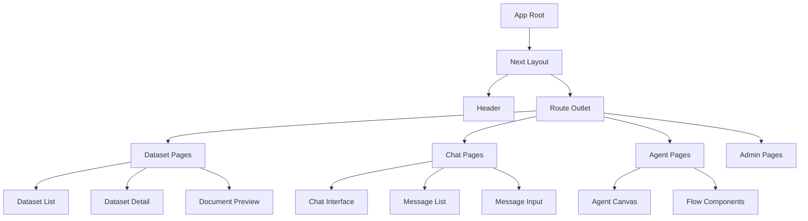

# RAGFlow Frontend Architecture Analysis

**Generated:** 2025-02-09
**Version:** 1.0.0
**Analyst:** Frontend Architecture Analysis Team

---

## Table of Contents

1. [Executive Summary](#executive-summary)
2. [Technology Stack](#technology-stack)
3. [Application Framework](#application-framework)
4. [Directory Structure](#directory-structure)
5. [Routing Architecture](#routing-architecture)
6. [State Management](#state-management)
7. [Component Architecture](#component-architecture)
8. [API Service Layer](#api-service-layer)
9. [Style System](#style-system)
10. [Key Functional Modules](#key-functional-modules)
11. [Development Workflow](#development-workflow)
12. [Best Practices & Patterns](#best-practices--patterns)
13. [Performance Optimizations](#performance-optimizations)

---

## Executive Summary

RAGFlow's frontend is a **modern React-based application** built with **Vite** (migrated from UmiJS). It implements a sophisticated architecture combining:

- **React Router v7** for routing
- **Zustand** for state management
- **Ant Design + shadcn/ui** for UI components
- **Tailwind CSS** for styling
- **React Query** for server state management
- **@xyflow/react** for agent canvas workflow

The application serves as a comprehensive interface for:
- Knowledge base management
- AI agent workflow design
- Document processing and retrieval
- Chat/conversation interfaces
- System administration

---

## Technology Stack

### Core Framework

```json
{
  "framework": "React 18.2.0",
  "build_tool": "Vite 7.2.7",
  "language": "TypeScript 5.9.3",
  "router": "React Router 7.10.1"
}
```

### State Management

```json
{
  "client_state": "Zustand 4.5.2",
  "server_state": "@tanstack/react-query 5.40.0",
  "forms": "react-hook-form 7.56.4"
}
```

### UI Components

```json
{
  "primary_library": "Ant Design 5.12.7",
  "secondary_library": "shadcn/ui (Radix UI primitives)",
  "graph_canvas": "@xyflow/react 12.3.6",
  "charts": "@antv/g2 5.2.10, @antv/g6 5.0.10"
}
```

### Styling

```json
{
  "css_framework": "Tailwind CSS 3.x",
  "preprocessor": "Less",
  "plugins": [
    "tailwindcss-animate",
    "@tailwindcss/line-clamp",
    "tailwind-scrollbar",
    "@tailwindcss/container-queries"
  ]
}
```

### Key Libraries

| Category | Library | Purpose |
|----------|---------|---------|
| HTTP | `umi-request 1.4.0` | Request interception |
| Utilities | `lodash 4.17.21`, `dayjs 1.11.10` | Helper functions |
| Editor | `@monaco-editor/react 4.6.0` | Code editing |
| Markdown | `react-markdown 9.0.1`, `@uiw/react-markdown-preview 5.1.3` | Markdown rendering |
| Forms | `@hookform/resolvers 3.9.1`, `zod 3.23.8` | Form validation |
| Internationalization | `i18next 23.7.16`, `react-i18next 14.0.0` | i18n support |

---

## Application Framework

### Application Entry Point

**File:** `web/src/main.tsx`

```typescript
// Entry point setup
ReactDOM.createRoot(document.getElementById('root')!).render(
  <React.StrictMode>
    <Inspector keys={['alt', 'c']} onInspectElement={gotoVSCode} />
    <App />
  </React.StrictMode>
);
```

### Application Root

**File:** `web/src/app.tsx`

The root component provides:
1. **React Query Provider** - Server state management
2. **Theme Provider** - Dark/light theme switching
3. **ConfigProvider** (Ant Design) - Component theming
4. **SidebarProvider** - Layout state
5. **TooltipProvider** - Tooltip context

```typescript
<QueryClientProvider client={queryClient}>
  <ThemeProvider defaultTheme={ThemeEnum.Dark}>
    <ConfigProvider theme={{ algorithm: theme.darkAlgorithm }}>
      <SidebarProvider>
        <App>
          <RouterProvider router={routers} />
        </App>
      </SidebarProvider>
    </ConfigProvider>
  </ThemeProvider>
</QueryClientProvider>
```

### Build Configuration

**File:** `web/vite.config.ts`

**Key Features:**
- **Plugin Stack:** React, HTML injection, static copy, dev inspector
- **Proxy Configuration:**
  - `/api/v1/admin` → `http://127.0.0.1:9381`
  - `/api` and `/v1` → `http://127.0.0.1:9380`
- **Code Splitting:** Manual chunks for vendors (d3, antv, utils)
- **Build Optimization:**
  - Terser minification with console removal
  - Tree-shaking enabled
  - CSS code splitting

---

## Directory Structure

```
web/src/
├── assets/                 # Static assets (fonts, SVGs, images)
│   ├── icon/              # Icon components
│   ├── inter/             # Inter font files
│   └── svg/               # SVG assets (chunk methods, data flow, etc.)
├── components/            # Shared/reusable components
│   ├── api-service/       # API service modals
│   ├── canvas/            # Canvas background components
│   ├── chunk-method-dialog/
│   ├── document-preview/  # Document previewers (PDF, Excel, etc.)
│   ├── file-upload-dialog/
│   ├── highlight-markdown/
│   ├── jsonjoy-builder/   # JSON schema editor
│   ├── llm-select/        # LLM selection components
│   ├── message-input/     # Chat input components
│   ├── next-markdown-content/
│   ├── ui/                # shadcn/ui components
│   └── xyflow/            # Flow chart components
├── constants/             # Application constants
├── hooks/                 # Custom React hooks
│   ├── logic-hooks/       # Business logic hooks
│   ├── use-agent-request.ts
│   ├── use-chat-request.ts
│   ├── use-chunk-request.ts
│   └── use-document-request.ts
├── interfaces/            # TypeScript interfaces
│   ├── database/          # Database model interfaces
│   └── request/           # API request interfaces
├── layouts/               # Layout components
│   ├── next.tsx           # Main layout wrapper
│   └── next-header.tsx    # Header component
├── less/                  # Less stylesheets
├── locales/               # i18n translation files
├── lib/                   # Utility libraries
├── pages/                 # Page components (routes)
│   ├── admin/             # Admin pages
│   ├── agent/             # Agent canvas & workflow
│   ├── agents/            # Agent list
│   ├── chunk/             # Chunk management
│   ├── dataset/           # Dataset detail pages
│   ├── datasets/          # Dataset list
│   ├── next-chats/        # Chat interfaces
│   ├── next-searches/     # Search interfaces
│   └── user-setting/      # User settings
├── services/              # API service layer
│   ├── agent-service.ts
│   ├── knowledge-service.ts
│   ├── user-service.ts
│   └── ...
├── theme/                 # Theme configuration
├── utils/                 # Utility functions
│   ├── api.ts             # API endpoint definitions
│   ├── request.ts         # HTTP client setup
│   └── authorization-util.ts
├── app.tsx                # Application root
├── main.tsx               # Entry point
└── routes.tsx             # Route configuration
```

---

## Routing Architecture

### Router Configuration

**File:** `web/src/routes.tsx` (464 lines)

**Router:** `createBrowserRouter` from React Router v7

### Route Structure

```typescript
// Route enum definitions
export enum Routes {
  Root = '/',
  Login = '/login-next',
  Home = '/home',
  Datasets = '/datasets',
  Dataset = '/dataset/dataset',
  Agent = '/agent',
  Agents = '/agents',
  Chats = '/next-chats',
  Chat = '/next-chat',
  Searches = '/next-searches',
  Search = '/next-search',
  Files = '/files',
  // ... admin routes
}
```

### Lazy Loading Strategy

All routes use **React.lazy()** for code splitting:

```typescript
const withLazyRoute = (
  importer: () => Promise<{ default: React.ComponentType }>,
  fallback: React.ReactNode = defaultRouteFallback
) => {
  const LazyComponent = lazy(importer);
  return (props) => (
    <Suspense fallback={fallback}>
      <LazyComponent {...props} />
    </Suspense>
  );
};
```

### Route Categories

#### 1. Public Routes (No Auth)
- `/login-next` - Login page
- `/next-chats/share` - Shared chat
- `/agent/share` - Shared agent

#### 2. Main Application Routes
```mermaid
graph TD
    A[Root /] --> B[Home /home]
    A --> C[Datasets /datasets]
    A --> D[Chats /next-chats]
    A --> E[Searches /next-searches]
    A --> F[Memories /memories]
    A --> G[Agents /agents]
    A --> H[Files /files]

    C --> C1[/dataset/dataset/:id]
    C --> C2[/dataset/testing/:id]
    C --> C3[/dataset/knowledge-graph/:id]

    D --> D1[/next-chat/:id]

    E --> E1[/next-search/:id]
```

#### 3. Nested Routes
```typescript
{
  path: Routes.DatasetBase,
  Component: () => import('@/pages/dataset'),
  children: [
    { path: `${Routes.Dataset}/:id`, Component: () => import('@/pages/dataset/dataset') },
    { path: `${Routes.DatasetBase}${Routes.DatasetTesting}/:id`, Component: () => import('@/pages/dataset/testing') },
    { path: `${Routes.DatasetBase}${Routes.KnowledgeGraph}/:id`, Component: () => import('@/pages/dataset/knowledge-graph') },
  ],
}
```

#### 4. Admin Routes
```typescript
{
  path: Routes.Admin,
  Component: () => import('@/pages/admin/layouts/root-layout'),
  children: [
    { path: Routes.AdminServices, Component: () => import('@/pages/admin/service-status') },
    { path: Routes.AdminUserManagement, Component: () => import('@/pages/admin/users') },
    { path: Routes.AdminSandboxSettings, Component: () => import('@/pages/admin/sandbox-settings') },
    // Enterprise-only routes
    { path: Routes.AdminWhitelist, Component: () => import('@/pages/admin/whitelist') },
    { path: Routes.AdminRoles, Component: () => import('@/pages/admin/roles') },
  ],
}
```

---

## State Management

### Zustand Store (Client State)

**Primary Store:** `web/src/pages/agent/store.ts`

**Purpose:** Agent canvas workflow state (nodes, edges, selection)

```typescript
interface RFState {
  // State
  nodes: RAGFlowNodeType[];
  edges: Edge[];
  selectedNodeIds: string[];
  clickedNodeId: string;

  // Actions
  onNodesChange: OnNodesChange<RAGFlowNodeType>;
  onEdgesChange: OnEdgesChange;
  onConnect: OnConnect;
  addNode: (nodes: RAGFlowNodeType) => void;
  updateNodeForm: (nodeId: string, values: any) => void;
  deleteNodeById: (id: string) => void;
}

// Store creation with middleware
const useAgentStore = create<RFState>()(
  devtools(
    immer((set, get) => ({
      // ... implementation
    }))
  )
);
```

**Middleware Used:**
- `devtools` - Redux DevTools integration
- `immer` - Immutable state updates

### React Query (Server State)

**Configuration:** `web/src/app.tsx`

```typescript
const queryClient = new QueryClient({
  defaultOptions: {
    queries: {
      refetchOnWindowFocus: false,
      retry: 2,
    },
  },
});
```

**Usage Pattern:**
```typescript
// Example from hooks
const { data, isLoading } = useQuery({
  queryKey: ['knowledge-list'],
  queryFn: () => knowledgeService.getList(),
});
```

### Local State Management

**React Hooks:**
- `useState` - Component-level state
- `useContext` - Context-based state
- Custom hooks in `hooks/logic-hooks/`

**Key Custom Hooks:**
- `useAgentRequest` - Agent API calls
- `useChatRequest` - Chat API calls
- `useChunkRequest` - Chunk management
- `useDocumentRequest` - Document operations
- `useSystemRequest` - System settings

---

## Component Architecture

### Component Hierarchy



### Component Categories

#### 1. Page Components (`pages/`)
- **Location:** `web/src/pages/`
- **Purpose:** Route-level components
- **Examples:**
  - `datasets/index.tsx` - Dataset list page
  - `dataset/dataset.tsx` - Dataset detail
  - `agent/canvas/index.tsx` - Agent workflow canvas

#### 2. Layout Components (`layouts/`)
- **Location:** `web/src/layouts/`
- **Components:**
  - `next.tsx` - Main layout wrapper
  - `next-header.tsx` - Application header

#### 3. Shared Components (`components/`)

**Document Preview Components:**
```typescript
// web/src/components/document-preview
- pdf-preview.tsx
- excel-preview.tsx
- doc-preview.tsx
- image-preview.tsx
- video-preview.tsx
- txt-preview.tsx
```

**UI Components (shadcn/ui):**
```typescript
// web/src/components/ui
- button.tsx
- input.tsx
- select.tsx
- dialog.tsx
- dropdown-menu.tsx
- toast.tsx
- table.tsx
- modal/
```

**Canvas Components:**
```typescript
// web/src/pages/agent/canvas/node
- agent-node.tsx
- begin-node.tsx
- categorize-node.tsx
- retrieval-node.tsx
- switch-node.tsx
- loop-node.tsx
```

### Component Design Patterns

#### 1. Compound Components
```typescript
// Example: Modal components
<Modal>
  <ModalTrigger>Open</ModalTrigger>
  <ModalContent>
    <ModalHeader>Title</ModalHeader>
    <ModalBody>Content</ModalBody>
  </ModalContent>
</Modal>
```

#### 2. Render Props
```typescript
// Example: Data fetching components
<DataFetcher query={query}>
  {({ data, loading }) => (
    <Component data={data} loading={loading} />
  )}
</DataFetcher>
```

#### 3. Higher-Order Components
```typescript
// Example: withLazyRoute wrapper
const WrappedComponent = withLazyRoute(
  () => import('./component'),
  <LoadingFallback />
);
```

---

## API Service Layer

### Request Configuration

**File:** `web/src/utils/request.ts`

**Features:**
- **Base Library:** `umi-request` (extends fetch)
- **Timeout:** 300 seconds
- **Response Format:** `{ data, response }`

### Request Interceptor

```typescript
request.interceptors.request.use((url: string, options: any) => {
  // Convert camelCase to snake_case
  const data = convertTheKeysOfTheObjectToSnake(options.data);
  const params = convertTheKeysOfTheObjectToSnake(options.params);

  return {
    url,
    options: {
      ...options,
      data,
      params,
      headers: {
        // Add authorization header
        ...(options.skipToken ? undefined : { [Authorization]: getAuthorization() }),
        ...options.headers,
      },
    },
  };
});
```

### Response Interceptor

```typescript
request.interceptors.response.use(async (response: Response) => {
  const data = await response.clone().json();

  // Handle specific error codes
  if (data.code === 101) {
    redirectToLogin();
  }

  return response;
});
```

### API Endpoint Definitions

**File:** `web/src/utils/api.ts`

**Categories:**
```typescript
// User Authentication
login: `${api_host}/user/login`
logout: `${api_host}/user/logout`
user_info: `${api_host}/user/info`

// Knowledge Base
kb_list: `${api_host}/kb/list`
create_kb: `${api_host}/kb/create`
get_document_list: `${api_host}/dataset/documents`

// Agent
canvas: `${api_host}/agent`
canvas_run: `${api_host}/agent/run`
```

### Service Layer Pattern

**Example:** `web/src/services/knowledge-service.ts`

```typescript
import { registerServer } from '@/utils/register-server';
import request, { post } from '@/utils/request';

const methods = {
  createKb: {
    url: '/kb/create',
    method: 'post',
  },
  getList: {
    url: '/kb/list',
    method: 'post',
  },
};

// Register methods as service functions
const knowledgeService = registerServer(methods, request);

export default knowledgeService;
```

**Usage:**
```typescript
import knowledgeService from '@/services/knowledge-service';

const response = await knowledgeService.createKb({ name: 'My KB' });
```

---

## Style System

### Tailwind CSS Configuration

**File:** `web/tailwind.config.js`

**Content Paths:**
```javascript
content: [
  './src/pages/**/*.tsx',
  './src/components/**/*.tsx',
  './src/layouts/**/*.tsx',
]
```

**Breakpoints:**
```javascript
screens: {
  sm: '640px',
  md: '768px',
  lg: '1024px',
  xl: '1280px',
  '2xl': '1536px',
  '3xl': '1780px',
  '4xl': '1980px',
}
```

### Custom Color System

**Design Tokens (CSS Variables):**
```css
/* Primary Colors */
--bg-canvas
--bg-list
--text-primary
--text-secondary

/* Accent Colors */
--accent-primary
--state-success
--state-warning
--state-error

/* Semantic Colors */
--border-default
--border-accent
--bg-card
--bg-component
```

**Tailwind Classes:**
```css
bg-accent-primary
text-primary
border-default
bg-card
```

### Theme System

**File:** `web/src/components/theme-provider.tsx`

```typescript
// Theme switching
const { theme, setTheme } = useTheme();

// Ant Design integration
<ConfigProvider
  theme={{
    algorithm:
      theme === 'dark'
        ? theme.darkAlgorithm
        : theme.defaultAlgorithm,
  }}
>
```

**Supported Themes:**
- Light (defaultAlgorithm)
- Dark (darkAlgorithm)

### Less Integration

**Global Variables:** `web/src/less/variable.less`

**Usage in Components:**
```less
// Import global variables
@import "@/less/variable.less";
@import "@/less/mixins.less";

.component {
  @primary-color: #1890ff;
  border: 1px solid @border-color;
}
```

---

## Key Functional Modules

### 1. Knowledge Base Management

**Pages:** `web/src/pages/datasets/`, `web/src/pages/dataset/`

**Components:**
- Dataset list with filtering
- Document upload (drag & drop)
- Document preview (multi-format)
- Chunk visualization
- Knowledge graph view

**Key Services:**
```typescript
// knowledge-service.ts
createKb(data)
updateKb(data)
getDocumentList(params)
documentRun(id) // Trigger parsing
```

### 2. Agent Canvas

**Page:** `web/src/pages/agent/canvas/index.tsx`

**Technology:** `@xyflow/react` (React Flow fork)

**Features:**
- Drag-and-drop node creation
- Node types:
  - Begin
  - End (Exit)
  - LLM (Agent)
  - Retrieval
  - Categorize
  - Switch
  - Loop
  - Message
  - Note
- Edge connections
- Real-time collaboration

**State Management:**
```typescript
// web/src/pages/agent/store.ts
const { nodes, edges, onNodesChange, onEdgesChange } = useAgentStore();
```

### 3. Chat Interface

**Page:** `web/src/pages/next-chats/`

**Components:**
- `chat-sheet.tsx` - Chat container
- `message-item.tsx` - Message bubbles
- `message-input.tsx` - Input with attachments
- `floating-chat-widget.tsx` - Embedded chat

**Features:**
- Streaming responses
- File attachments
- Citation highlighting
- Voice input
- Conversation history

### 4. Document Processing

**Components:** `web/src/components/document-preview/`

**Supported Formats:**
- PDF (`pdf-preview.tsx`)
- Excel (`excel-preview.tsx`)
- Word/PowerPoint (`doc-preview.tsx`, `ppt-preview.tsx`)
- Images (`image-preview.tsx`)
- Videos (`video-preview.tsx`)
- Plain text (`txt-preview.tsx`)
- Markdown (`md/index.tsx`)

### 5. Administration

**Pages:** `web/src/pages/admin/`

**Modules:**
- User management
- Role management (Enterprise)
- Service monitoring
- Sandbox settings
- Whitelist (Enterprise)

---

## Development Workflow

### Local Development

```bash
cd web

# Install dependencies
npm install

# Start development server
npm run dev
# Runs on http://localhost:9222

# Type checking
npx tsc --noEmit

# Linting
npm run lint

# Testing
npm run test
```

### Build Process

```bash
# Production build
npm run build
# Output: dist/

# Preview build
npm run preview
```

### Code Quality Tools

**ESLint:**
- Configuration: `.eslintrc.cjs`
- Rules: TypeScript, React hooks, import sorting

**Prettier:**
- Configuration: `.prettierrc`
- Plugins: organize imports, package.json

**Husky:**
- Pre-commit hooks
- Lint-staged for formatting

### Environment Variables

**Files:**
- `.env` - Default
- `.env.development` - Development
- `.env.production` - Production

**Variables:**
```bash
VITE_BASE_URL=/          # Base path for deployment
PORT=9222                # Dev server port
```

---

## Best Practices & Patterns

### 1. Component Organization

**Folder Structure:**
```
component-name/
├── index.tsx           # Main component
├── sub-component.tsx   # Child components
├── hooks.ts            # Custom hooks
├── interface.ts        # TypeScript interfaces
├── constants.tsx       # Constants
└── index.module.less   # Styles
```

### 2. TypeScript Usage

**Interface Definitions:**
```typescript
// interfaces/database/knowledge.ts
export interface IKnowledge {
  id: string;
  name: string;
  description: string;
  chunk_num: number;
  avatar: string;
  tenant_id: string;
}

// interfaces/request/knowledge.ts
export interface IFetchKnowledgeListRequestBody {
  page: number;
  page_size: number;
}
```

### 3. Error Handling

**Global Error Boundary:**
```typescript
// routes.tsx
const routeConfig = wrapRoutes(routeConfigOptions, {
  errorElement: <FallbackComponent />,
});
```

**Request Error Handling:**
```typescript
// utils/request.ts
const errorHandler = (error: { response: Response }) => {
  if (error.response?.status === 401) {
    redirectToLogin();
  }
  notification.error({
    message: `Error ${error.response.status}`,
    description: errorText,
  });
};
```

### 4. Performance Patterns

**Code Splitting:**
- Route-based lazy loading
- Vendor chunk splitting

**Memoization:**
```typescript
import { useMemo, useCallback } from 'react';

const expensiveValue = useMemo(() => computeExpensiveValue(a, b), [a, b]);
const handleClick = useCallback(() => {}, [deps]);
```

**Virtual Scrolling:**
```typescript
import { InfiniteScroll } from 'react-infinite-scroll-component';
```

### 5. Accessibility

**ARIA Labels:**
```typescript
<Button aria-label="Delete document">
  <DeleteIcon />
</Button>
```

**Keyboard Navigation:**
- Canvas: Alt+C to inspect
- Focus management in modals

---

## Performance Optimizations

### Build Optimizations

**Vite Configuration:**
```typescript
build: {
  rollupOptions: {
    output: {
      manualChunks(id) {
        // Split vendor code
        if (id.includes('node_modules/antd')) return 'antd';
        if (id.includes('node_modules/@antv')) return 'antv';
        if (id.includes('node_modules/lodash')) return 'utils';
      },
    },
  },
  minify: 'terser',
  terserOptions: {
    compress: {
      drop_console: true,
      pure_funcs: ['console.log'],
    },
  },
}
```

### Runtime Optimizations

**React Query Caching:**
```typescript
const queryClient = new QueryClient({
  defaultOptions: {
    queries: {
      staleTime: 5 * 60 * 1000, // 5 minutes
      cacheTime: 10 * 60 * 1000, // 10 minutes
    },
  },
});
```

**Lazy Loading Images:**
```typescript

```

**Debounced Input:**
```typescript
import { useDebounce } from 'ahooks';

const debouncedValue = useDebounce(value, { wait: 500 });
```

---

## Component Library Integration

### Ant Design

**Primary component library**

**Customization:**
```typescript
<ConfigProvider
  theme={{
    token: {
      fontFamily: 'Inter',
    },
    algorithm: theme.darkAlgorithm,
  }}
>
  {children}
</ConfigProvider>
```

**Key Components Used:**
- Table (data tables)
- Form (forms)
- Modal (dialogs)
- Dropdown (menus)
- Tooltip (tooltips)
- Message (notifications)

### shadcn/ui

**Secondary component library** (Radix UI primitives)

**Components:**
- Button
- Input
- Select
- Dialog
- Tabs
- Toast (Sonner)
- Separator
- ScrollArea

**Customization via Tailwind:**
```typescript
<Button className="bg-accent-primary hover:bg-accent-primary/90">
  Click me
</Button>
```

### Integration Strategy

```
┌─────────────────────────────────────┐
│         Ant Design Components       │
│  (Tables, Forms, Modals, Dropdowns) │
└─────────────────────────────────────┘
                  ↓
┌─────────────────────────────────────┐
│        shadcn/ui Components         │
│  (Buttons, Inputs, Cards, Badges)   │
└─────────────────────────────────────┘
                  ↓
┌─────────────────────────────────────┐
│         Tailwind CSS Styles         │
│    (Layout, spacing, colors)        │
└─────────────────────────────────────┘
```

---

## Testing Strategy

### Unit Testing

**Framework:** Jest + React Testing Library

**Configuration:** `web/jest.config.ts`

**Example:**
```typescript
// hooks/__tests__/logic-hooks.useScrollToBottom.test.tsx
import { renderHook } from '@testing-library/react';
import { useScrollToBottom } from '../logic-hooks';

test('should scroll to bottom on new message', () => {
  const { result } = renderHook(() => useScrollToBottom());
  // Test implementation
});
```

### Storybook

**Configuration:** `web/.storybook/`

**Purpose:** Component documentation and isolated development

**Run:**
```bash
npm run storybook
```

---

## Internationalization (i18n)

**Library:** i18next + react-i18next

**Configuration:** `web/src/locales/config.ts`

**Supported Languages:**
- English (en)
- Chinese Simplified (zh)
- Chinese Traditional (zh-TRADITIONAL)
- Russian (ru)
- Vietnamese (vi)
- Portuguese Brazil (pt-BR)
- German (de)

**Usage:**
```typescript
import { useTranslation } from 'react-i18next';

const { t } = useTranslation();
const title = t('common.title');
```

**Language Files:**
```
locales/
├── en/
│   └── translation.json
├── zh/
│   └── translation.json
└── ...
```

---

## Security Considerations

### Authentication

**Token Management:**
```typescript
// utils/authorization-util.ts
export const getAuthorization = () => {
  return storage.getToken(); // Returns authorization header
};

// Auto-redirect on 401
if (response.status === 401) {
  redirectToLogin();
}
```

### XSS Prevention

**Markdown Rendering:**
```typescript
import DOMPurify from 'dompurify';

const sanitizedHtml = DOMPurify.sanitize(rawHtml);
```

**Input Validation:**
```typescript
import { z } from 'zod';

const schema = z.object({
  name: z.string().min(1).max(100),
  email: z.string().email(),
});
```

### CSRF Protection

**Implemented via:**
- Same-site cookie attributes
- Token-based authentication
- Request validation

---

## Deployment

### Build Output

```bash
npm run build

# Creates:
dist/
├── assets/         # JS/CSS chunks
├── chunk/          # Code-split chunks
├── entry/          # Entry points
└── index.html      # HTML entry
```

### Environment-Specific Builds

**Development:**
```bash
npm run dev
```

**Production:**
```bash
npm run build
```

**Docker Deployment:**
```dockerfile
# Dockerfile
FROM node:18-alpine
WORKDIR /app
COPY package*.json ./
RUN npm ci
COPY . .
RUN npm run build
CMD ["npm", "run", "preview"]
```

---

## Key Metrics

| Metric | Value |
|--------|-------|
| Total Pages | ~20 route groups |
| Components | 200+ |
| Services | 13 service modules |
| Custom Hooks | 30+ |
| Bundle Size (gzipped) | ~500KB (initial) |
| First Load JS | ~1.5MB (with vendors) |

---

## Conclusion

RAGFlow's frontend architecture demonstrates a **modern, scalable React application** with:

- **Strong separation of concerns** (pages, components, services, hooks)
- **Efficient state management** (Zustand + React Query)
- **Comprehensive UI library** (Ant Design + shadcn/ui)
- **Type safety** (TypeScript throughout)
- **Performance optimizations** (code splitting, caching, lazy loading)
- **Developer experience** (Vite, Storybook, DevTools)

The architecture successfully supports complex features like:
- Agent workflow canvas
- Multi-format document preview
- Real-time chat interface
- Knowledge graph visualization
- Enterprise administration

---

## References

- **Repository:** `/home/you/cs/code/ai/SuperYou/ragflow/web`
- **Key Files:**
  - `web/src/routes.tsx` - Route configuration
  - `web/src/app.tsx` - Application root
  - `web/vite.config.ts` - Build configuration
  - `web/tailwind.config.js` - Style configuration
  - `web/package.json` - Dependencies

---

**Document Version:** 1.0.0
**Last Updated:** 2025-02-09
